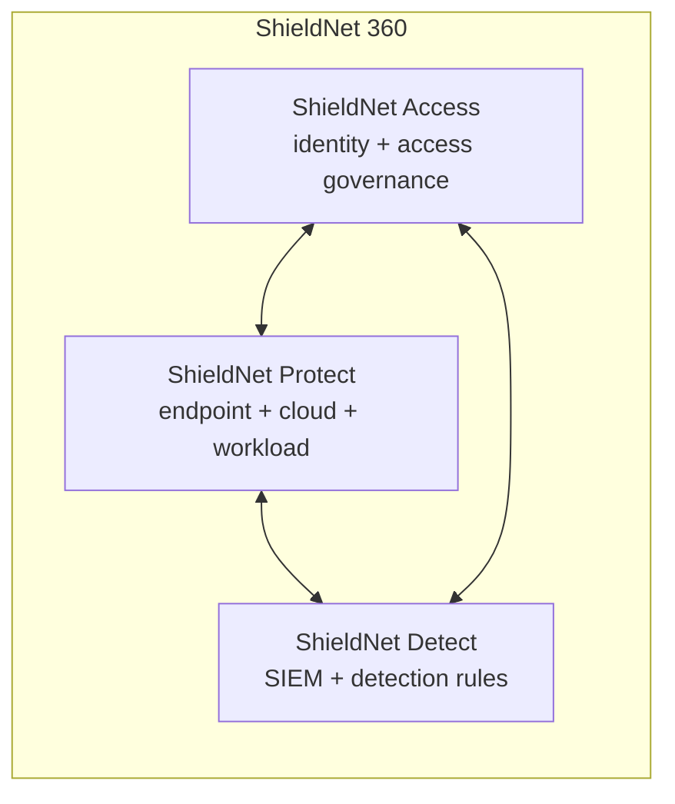

# Introducing ShieldNet Access: Unified Zero Trust Access for the Modern SME

If you run a 50-person company today, you probably touch more software in a single quarter than a 5,000-person enterprise did a decade ago. Marketing has a CRM, a marketing-automation platform, a survey tool, and three social schedulers. Engineering has a code host, a CI provider, an issue tracker, a registry, a feature-flag service, and an observability stack. Finance has an accounting tool, a payments tool, a payroll tool, an expense tool, and a tax tool. Every department brings its own SaaS, every SaaS has its own admin UI, and every admin UI has its own idea of what a "user" is.

You are the person who has to keep track of who can do what — and you also have a real job.

ShieldNet Access is the access management product inside the ShieldNet 360 ecosystem. It is built for the team that does not have a dedicated identity engineer, does not have a six-figure budget for a legacy IAM suite, and does not have time to write SAML metadata by hand on a Friday afternoon. This post is the master introduction to a 10-part deep dive: we'll set the scene, walk through the four product pillars, name the technology choices underneath, and point you at the right post for the kind of reader you are.

## The problem we set out to solve

Three numbers describe the situation most SMEs are in today.

**50 to 200.** That is the typical count of SaaS apps a 50-to-500-person company is paying for. Some are central — the company-wide identity provider, the code host, the chat platform. Most are departmental — a tool one team picked up because it solved a problem on a Tuesday, and nobody ever removed.

**Three to four.** That is the typical ratio of SaaS *licenses* to *employees*. People leave, accounts don't. Roles change, permissions stay. A user who was an intern two summers ago still has admin access to the survey tool because nobody knew to check.

**Two to three.** That is the typical number of full-time-equivalent IT or security staff at the same company. Often zero of them are dedicated to identity. Most are sharing the job with helpdesk, vendor management, and "fixing the printer".

Compliance frameworks — SOC 2, ISO 27001, GDPR, HIPAA — assume the opposite. They assume a named access-review owner, a documented joiner-mover-leaver process, an auditable trail of approvals, and a tested revocation procedure. Auditors arrive expecting all four. The mismatch between what frameworks assume and what small teams can sustain is the gap that ShieldNet Access closes.

## Where ShieldNet Access fits in ShieldNet 360

ShieldNet 360 is the broader security platform. It is organised around three pillars, each named for the verb the customer cares about:

- **ShieldNet Access** — this product. It answers *who can do what, when, and for how long*. It owns app connections, the access lifecycle, access rules, and the AI assistant.
- **ShieldNet Protect** — endpoint, cloud, and workload protection. It answers *what is happening on the things people use*.
- **ShieldNet Detect** — SIEM and detection rules. It answers *is something bad happening right now*.

The three products share a single tenancy model, a single audit pipeline, a single notification system, and — for technical evaluators — a single set of agent frameworks. ShieldNet Access is the access-governance pillar. The other two pillars are referenced in post 10, which closes the loop from runtime detection back into access revocation.

## The four pillars of ShieldNet Access

ShieldNet Access exposes one cohesive product surface, but internally it is organised around four pillars. Every feature lands in exactly one.

### Pillar 1 — App Connections

App connections are how ShieldNet Access talks to the rest of your software stack. There are more than 200 of them, organised into five tiers:

| Tier | Category | Example apps |
|------|----------|--------------|
| 1 | Core Identity (10) | Microsoft Entra ID, Google Workspace, Okta, Auth0, generic SAML, generic OIDC |
| 2 | Cloud Infrastructure (25) | AWS, Azure, GCP, Cloudflare, Tailscale, DigitalOcean |
| 3 | Business SaaS (55) | Slack, Microsoft Teams, GitHub, Salesforce, HubSpot, Zoom |
| 4 | HR / Finance / Legal (50) | BambooHR, Workday, QuickBooks, NetSuite, DocuSign |
| 5 | Vertical / Niche (70) | Industry-specific SaaS — healthcare, real estate, ERP, education, e-commerce |

Each app connection brings a defined set of capabilities — sync who's in the directory, push permissions out, pull permissions back, federate single sign-on, and stream audit logs. Post 02 takes the tour.

### Pillar 2 — Access Lifecycle

The access lifecycle is the workflow that runs every time someone gets access to something. It is a deterministic state machine — requested → reviewing → approved → provisioning → provisioned → active → check-up → revoked — with optional AI hooks at the well-defined transitions.

The lifecycle is the same whether the request comes from a self-service form, a manager-driven joiner flow, or an auto-generated mover diff. We use the same engine for new hires, for role changes, and for departures, which is the only way to make audit evidence consistent. Post 06 covers the business view (joiners, movers, leavers) and post 09 walks the end-to-end product surface.

### Pillar 3 — Access Rules

An access rule is what we call a policy. (In SN360 language: *access rule* in the UI, *policy* in code identifiers.) Access rules say things like "everyone on the Engineering team can use GitHub" or "members of the Finance team can use QuickBooks during business hours from corporate devices".

What makes our access rules different is the draft-and-promote workflow. Every rule starts as a draft. A draft never touches the live network — instead, it goes through a simulation that shows you exactly who gains access, who loses access, and which existing rules it conflicts with. You see a structured before-and-after report ("47 people will gain SSH access to prod-db-01; 3 people will lose access to staging-finance-app") *before* you turn the rule on. Post 04 is the full walk-through.

### Pillar 4 — AI Assistant

ShieldNet Access ships with five server-side AI skills that act as decision-support — not as decision-makers — for the access team:

- **Access risk assessment** scores every access request as low / medium / high, with structured factors that explain the score.
- **Access review automation** auto-certifies low-risk grants during a campaign so reviewers only see the ones that need attention.
- **Access anomaly detection** flags unusual usage of active grants — sudden volume, off-hours access, geographic outliers, unused high-privilege grants.
- **Connector setup assistant** translates "I want to connect Slack" into the right wizard answers.
- **Policy recommendation** suggests access rules given your current team structure and historical access patterns.

The AI is best-effort: if the agent is unreachable, ShieldNet Access falls back to a medium risk level and routes through manager approval. The product never blocks because the AI is offline. Post 05 is the technical deep dive.

## The technology stack underneath

For technical evaluators reading this post first: ShieldNet Access is built on a small number of opinionated choices.

- **OpenZiti** is the zero-trust dataplane. It is a software-defined overlay network with identity-aware routing and no inbound listening ports on protected resources. Every promoted access rule writes a `ServicePolicy` to the OpenZiti controller; the controller is the enforcement plane. Post 03 covers the integration in detail.
- **Keycloak** is the single sign-on broker. We never re-implement OIDC. Every app connection that exposes SSO is federated through Keycloak — one realm, many identity providers.
- **PostgreSQL** is the source of truth for app connections, identities, access requests, grants, rules, and check-ups. The same `ztna` schema hosts every table.
- **Go (Gin + GORM)** is the language of the backend services — `ztna-api` (the HTTP API), `access-connector-worker` (the queue worker for sync / provision / revoke jobs), and `access-workflow-engine` (the multi-step orchestrator).
- **Python (FastAPI + LangGraph stubs)** is the language of the AI agent. `cmd/access-ai-agent` hosts the five Tier-1 skills over an A2A (Agent-to-Agent) protocol.
- **SCIM v2.0** is the protocol for inbound user lifecycle from the company directory (joiner / mover / leaver) and outbound provisioning to SaaS apps that support it.

The clients — iOS, Android, Desktop (Electron extension), and Web — are thin REST consumers. There is no on-device AI inference on any client. Every AI call is a REST call. This is a deliberate, explicit, audited-in-CI rule, and it is one of the reasons the SDK surface is so small. Post 09 covers the client architecture from the product side.

## A guided tour of this series

The deep-dive series is organised so you can read in order, or skip to the post that matches your role:

- **[01 — Why SMEs Need Zero Trust](./01-why-smes-need-zero-trust.md)** *(Business)* — the pain points, the failure modes of legacy IAM tools, and what zero trust means when you don't have an identity engineer.
- **[02 — 200+ App Connections, One Control Plane](./02-200-app-connections.md)** *(Product)* — the connector catalogue, the guided setup wizard, and per-connection capabilities.
- **[03 — Inside the Zero Trust Overlay](./03-zero-trust-overlay.md)** *(Technical)* — how access rules turn into network-layer enforcement.
- **[04 — Access Rules Without the Risk](./04-access-rules-safe-test.md)** *(Product)* — the draft-simulate-promote workflow.
- **[05 — AI-Powered Access Intelligence](./05-ai-powered-access-intelligence.md)** *(Technical)* — the A2A protocol, the five skills, and the best-effort fallback.
- **[06 — Automating the Employee Lifecycle](./06-jml-automation.md)** *(Business)* — joiners, movers, leavers, and the death of the offboarding spreadsheet.
- **[07 — Access Check-Ups](./07-access-checkups.md)** *(Product)* — continuous certification without the spreadsheet.
- **[08 — The Connector Architecture](./08-connector-architecture.md)** *(Technical)* — interfaces, registry, credential management, and pagination patterns across 200 providers.
- **[09 — From Request to Revoke](./09-request-to-revoke.md)** *(Product)* — the full lifecycle from the user's perspective.
- **[10 — Runtime Detection Meets Access Control](./10-runtime-detection-meets-access.md)** *(Technical)* — how ShieldNet Access closes the loop with the rest of ShieldNet 360.

## A note on language

You will notice that the public surface of the product — the admin UI, the mobile apps, the desktop extension, the audit log — speaks in plain English. We call them *access rules*, not *policies*. *App connections*, not *connectors*. *Access check-ups*, not *access certification campaigns*. *Risk level*, not *risk score*. *Single sign-on*, not *federated SAML/OIDC SSO*.

This is not cosmetic. It is enforced by a CI check that grepped every user-facing string for technical terms before it shipped. The whole point of the product is that the people doing access — operations leads, people-managers, founders — should never have to learn our internal vocabulary. The product meets them where they are.

In this series, business and product posts use the SN360 language column exclusively. Technical posts use the engineering vocabulary but always name the SN360 equivalent on first use, so you can match what you see in the code with what you see in the UI.

## Where to start

If you read one more post after this one, read it based on your role:

- **SME founder, operations lead, or people-manager** → start with [01 — Why SMEs Need Zero Trust](./01-why-smes-need-zero-trust.md). It frames the problem the way your auditors do.
- **IT generalist setting up access for a 50-to-500-person team** → start with [02 — 200+ App Connections](./02-200-app-connections.md). It is the most product-y of the bunch and ends with a checklist for your first ten connections.
- **Technical evaluator or partner** → start with [03 — Inside the Zero Trust Overlay](./03-zero-trust-overlay.md). It is the deepest post on the network-layer enforcement that makes ShieldNet Access different from a CASB or a SCIM gateway.

In every post you will see references to source paths in this repository. Those are the canonical implementation points — when the post and the code disagree, the code wins, and we update the post. That is also the rule for the proposal, architecture, and phases documents, and it is the reason this series lives in the same repository as the platform itself.

Welcome to ShieldNet Access. Let's get into the details.
