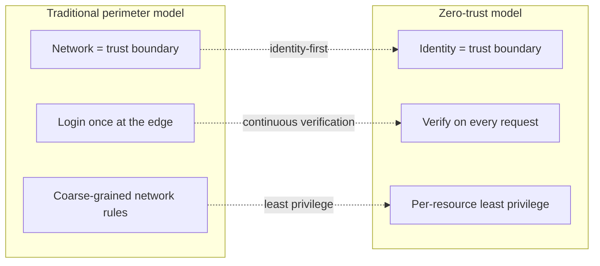

# Why SMEs Need Zero Trust — And Why Legacy Tools Fall Short

Zero trust was supposed to be the security model for everyone. The original 2010 paper, the 2020 NIST publication, every vendor keynote since — the framing was always universal. *Never trust, always verify. Identity is the new perimeter. Least privilege, continuous verification.*

The reality has been less universal. Zero trust, as a sold product, has been a Fortune 500 story. The tools that implement it are priced for organisations with seven-figure security budgets and complex enough to need a full identity-engineering team. For the company on the other end of the size distribution — fifty employees, two part-time IT generalists, fifteen SaaS apps just in marketing — zero trust has been a slide deck, not a product.

This post is for the people on that other end of the distribution. We will walk through the five pain points small and medium-sized companies feel most acutely, explain why VPN-shaped IAM tools fail to address them, define zero trust in plain language, and show how ShieldNet Access is built for the scale of company that hasn't had a zero-trust answer until now.

## Five pain points every growing company feels

### 1. SaaS sprawl

You start with five tools. A year later you have fifty. The pattern is always the same: a department finds a problem, a department finds a SaaS that solves the problem, a department signs up, the credit-card statement shows another monthly charge nobody remembers approving. SaaS *sprawl* is not a security problem in itself — every one of those tools is doing useful work — but it is the substrate on which every other pain point sits.

The two numbers that matter:

- **Average SaaS apps per 100 employees: 110+.** Most companies cross "more apps than people" between years two and three.
- **Average SaaS licenses per active user: 3 to 4×.** The ratio between *paid seats* and *seats anyone is actually using* is the cleanest measure of the leak.

The leak is the licenses people aren't using. Some of those are inactive employees. Some are active employees whose role changed. Some are inactive trials nobody got around to cancelling. The total bill is the same.

### 2. Shadow IT

Shadow IT is what we call the SaaS the central team doesn't know about. It is usually a department head saying "we tried it for a project, we never told anyone, it became indispensable, here's how it works".

Shadow IT is rarely malicious. It is almost always a faster path to a real outcome. But it has three security consequences nobody enjoys explaining to an auditor:

- The team doesn't appear in any inventory, so it is not in any access review.
- The login is usually shared, because shared logins were the easiest way to get started.
- The data is real customer data, but the SaaS isn't covered by your data-processing agreements.

The fix isn't "ban shadow IT". The fix is making it cheap enough to *light up* a new SaaS through the access platform that nobody bothers to go around it.

### 3. Manual onboarding and offboarding

Day one of a new hire involves provisioning between six and twenty accounts. Day last of a departing employee involves revoking between six and twenty accounts. In between, every role change, team move, project assignment, contractor extension, and parental-leave return triggers another batch of changes.

What this looks like in practice at a 50-to-500-person company:

- A shared spreadsheet called "onboarding-checklist-final-v3-actually-final".
- A Slack channel called `#access-requests` where people drop "hey can you add me to ...".
- One person — usually the office manager or the head of operations — who is the unspoken keeper of "who has access to what".

The failure mode is not "we forgot to add Maria to GitHub on day one". The failure mode is "we forgot to remove Eric from the production AWS account on day last, six months ago, and now Eric is at a competitor". The single-largest source of audit findings at small companies is *orphaned access* — accounts that are still active for people who no longer work at the company.

### 4. Audit failures

Every compliance framework — SOC 2, ISO 27001, GDPR, HIPAA, PCI DSS — requires the same four things from your access programme:

1. A named access-review owner.
2. A documented joiner-mover-leaver process.
3. An auditable trail of approvals.
4. A tested revocation procedure.

What an auditor wants to see is a *report*. A report that says: "These are the people who have access to this resource. These are the people who *should* have access to this resource. These are the rows that don't match." A report that they can re-run on demand, that pulls live data, and that has a verifiable timestamp.

Most SME access programmes can produce a version of that report — but only by manually collating data from ten different admin consoles. Each console has a different definition of "user", different definitions of "admin", different ways of exposing audit logs. Producing the report for the first time takes a week. Producing it the *next* time it's due takes another week. By the time you're done, the underlying state has drifted.

### 5. VPN limitations

The default access-control answer at small companies is "VPN, plus the SaaS app's own admin UI". The VPN is supposed to control network access, the SaaS admin UI is supposed to control application access, and the gap between the two is supposed to take care of itself.

The gap is where the problems live. Three of them:

- **VPN access is binary.** Once you're on the corporate network, you can talk to anything on the corporate network. There is no per-resource enforcement.
- **VPN access doesn't know about identity.** It knows about IP addresses and certificates. Mapping "this IP is the laptop belonging to the user Maria, who is on the Engineering team, who should be able to reach prod-db-01 but not prod-payroll-02" is something every VPN administrator has hand-rolled at least once.
- **VPN access doesn't follow the user.** The user opens the laptop in a coffee shop, the VPN times out, the user wants to use the SaaS app, the SaaS app is on the public internet, the VPN was never the right tool for the job.

Modern SaaS-first companies need a model where access is per-resource, identity-first, and *follows the user* regardless of the network they're on. That is what zero trust is.

## What zero trust actually means

Zero trust is built on three principles. Each one is a *change* from a more traditional model.

- **Identity-first.** Trust is anchored on *who the user is*, not *which network they're on*. Joining the office WiFi gives you nothing. Logging in as the user you actually are gives you what your role allows.
- **Continuous verification.** Every request gets evaluated. Not just at login, not just at the edge — every API call, every connection to a resource. If your role changes, your access changes. If the system detects an anomaly, your session can be paused.
- **Least privilege.** You get the minimum access you need to do your job, scoped to the resource you need to do it on, for the time you need to do it. No standing access to anything you don't currently need.

The phrase that summarises all three: *just enough access, just in time, just-in-context*.

## Why legacy IAM tools fail SMEs

So if zero trust is the right model, why isn't every SME running a zero-trust product already? Three reasons.

### Cost

Legacy IAM suites are priced for enterprises. The list price is typically in the high five figures per year for the entry tier, and the entry tier is usually missing the modules a small company actually needs (lifecycle, governance, access reviews). The fully loaded annual cost for a 100-person company on an enterprise IAM suite is routinely in the high six figures. That number is wrong for the budget of a small company, and it is wrong for the value the small company gets out of it.

### Complexity

Legacy IAM suites are designed for a customer with an in-house identity engineer. The configuration model assumes you can read SAML metadata, that you understand SCIM, that you have an opinion on whether your IdP should issue OAuth tokens with audience-restriction. SMEs don't have that engineer. The product is shipped as a toolkit that needs assembling, and the assembly takes weeks of consulting time.

### Enterprise-first design

The default workflows in legacy IAM are built for an enterprise organisational shape: thousands of employees, dozens of departments, a formal HR system as the source of truth, a multi-region directory federation. Small companies don't fit that shape. They have flat org charts, fast-changing teams, project-based access, and contractor-heavy workforces. The shape of access at a 50-person company is *not* a smaller version of the shape at a 5,000-person company.

The combined effect of all three is that small companies *do not buy* the legacy IAM suites that would solve their problem. Instead, they buy nothing — and the access programme stays in the spreadsheet.

## How ShieldNet Access is different

ShieldNet Access is built for the company on the wrong end of the size distribution. Four design choices follow from that:

### Wizard-first user experience

Every workflow that an operator hits — connecting an app, creating an access rule, running an access check-up, onboarding a new hire — is a wizard, not a configuration form. The wizard asks you the smallest set of questions it can. Defaults are conservative. The assistant suggests answers based on what your peers in similar-sized companies do.

### Plain-language explanations everywhere

The product surface uses SN360 language. We never say "policy" in a UI — we say "access rule". We never say "connector" — we say "app connection". We never say "access certification campaign" — we say "access check-up". Every admin who has been forced to learn vendor-specific vocabulary has lost an hour they didn't have. We give them that hour back.

The plain-language rule is enforced by a CI check. Every public-facing string is grep'd for technical terms before it ships. The translation table is in `docs/overview.md` §8 — it is part of the design contract.

### AI-assisted governance

The five Tier-1 AI skills are not a moonshot. They are decision-support tools that do the work a busy operator doesn't have time for:

- **Risk assessment** on every access request, so you don't have to evaluate fifty requests a week the same way.
- **Auto-certification** of low-risk grants, so a quarterly access check-up gets shorter, not longer, as the company grows.
- **Anomaly detection** on active grants, so a sudden surge in usage from a single user reaches you in minutes, not after the next quarterly review.
- **Setup assistant** for app connections, so wiring up Salesforce is a conversation, not a configuration manual.
- **Policy recommendation** that suggests sensible access rules based on your team structure, so you don't start from a blank page.

All five skills run server-side. None of them blocks a critical path — if the AI is unreachable, the workflow falls back to a sensible default (medium risk level, manager approval, no auto-certification). The AI is the helpful colleague, never the gatekeeper.

### Built for 10 to 500 employees

Every default value, every wizard, every onboarding flow is sized for a company in this range. We don't ask whether you have a separate access-review committee, because you don't. We don't ask which region of the directory federation a user belongs to, because there's only one. We don't ask you to pick an enrollment flow, because we picked a sensible one for you.

When you outgrow the defaults — when you do reach the point where you have an access-review committee, multiple regions, separate environments — every default is editable. But the path to *getting started* is short, deliberately.

## What this looks like in practice

The first week with ShieldNet Access at a typical 80-person company looks like this:

- **Day 1.** Connect the company directory (one app connection — usually Microsoft Entra ID, Google Workspace, or Okta). All users and groups land as Teams in ShieldNet Access. Single sign-on starts working through Keycloak.
- **Day 2.** Connect the four to six most-used SaaS apps (Slack, GitHub, Salesforce, Zoom, etc.). Each connection is a guided wizard — three to five questions, automatic credential encryption, immediate test of the connection.
- **Day 3.** Define the first three access rules: "everyone has Slack", "Engineering has GitHub", "Sales has Salesforce". Each rule starts as a draft. The simulator shows who gains and who loses access. You promote when the diff matches your expectations.
- **Day 4.** Schedule the first access check-up — every 90 days, scoped to high-risk grants, auto-certify the low-risk ones. The next one runs without anyone having to remember.
- **Day 5.** Set up the joiner-mover-leaver flow. The directory connection drives it automatically — new hires land in their default teams, role changes trigger atomic permission moves, departures revoke everything synchronously.

By the end of the first week, the spreadsheet is gone. The Slack channel called `#access-requests` becomes a place where the bot posts approvals instead of where humans negotiate them. The next time the auditor asks for the access report, you generate it from the UI in fifteen seconds.

## What's next

The rest of this series gets specific. If you want the wizard-by-wizard walk through, read [02 — 200+ App Connections](./02-200-app-connections.md). If you want to see what JML automation looks like in practice, read [06 — Automating the Employee Lifecycle](./06-jml-automation.md). And if you want the spreadsheet to actually go away, read [07 — Access Check-Ups](./07-access-checkups.md) — that is the post about the workflow that finally gets quarterly reviews to run on time.

Zero trust is not a slide deck. It is a model, and the model needs to be implemented at the scale of company that actually has the problem. ShieldNet Access is that implementation for everyone who isn't a Fortune 500 — and there are a lot more of those companies than there are Fortune 500s.
