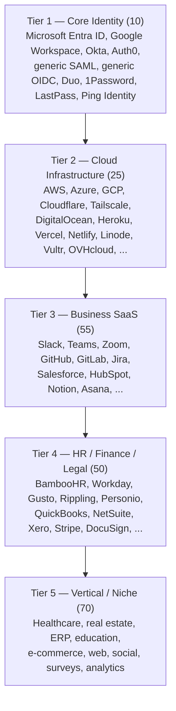
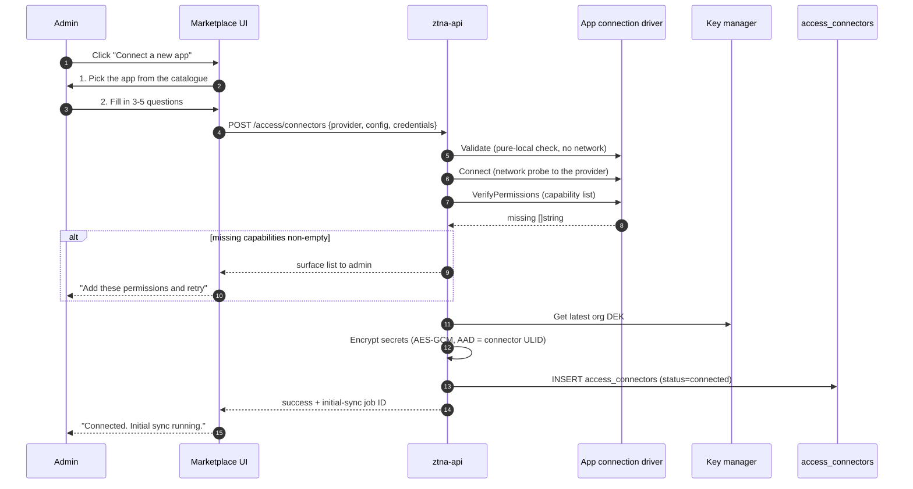
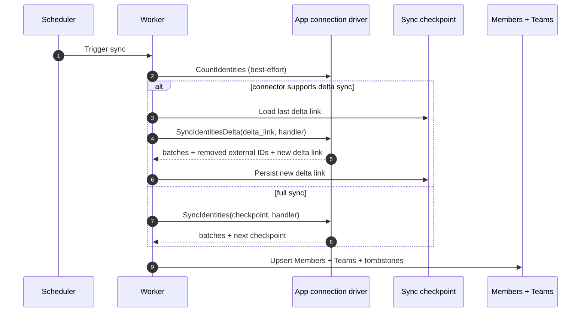

# 200+ App Connections, One Control Plane

A small company today does not have a single source of truth for "who works here". They have ten sources of truth, and they all disagree. The HR system says one thing. The company directory says another. Slack has a different list. GitHub has another. The shared inbox has its own. The marketing automation tool has somehow stopped syncing entirely.

ShieldNet Access is the control plane that talks to all of them. We call them *app connections* — one app connection per external system, each one a guided setup wizard, each one giving you a defined set of capabilities. There are more than 200 of them in the catalogue today. This post is the guided tour: the five-tier taxonomy, the categories, the wizard, the credential model, and what every app connection actually does for you on day one.

## The five-tier taxonomy

We organise the catalogue into five tiers, ordered by how often a typical SME needs the connection.

The tiering is not a hierarchy of importance. It is a sequencing of typical adoption order. Most SMEs connect Tier 1 first — the company directory and the single-sign-on broker — because every downstream connection benefits from doing identity once. Then Tier 2 (cloud infrastructure) and Tier 3 (the SaaS tools the team actually uses every day). Tier 4 and Tier 5 are usually connected as compliance work or vertical-specific projects come up.

As of this writing, the catalogue is at **200 / 200 across all five tiers** — Tier 1 10/10, Tier 2 25/25, Tier 3 55/55, Tier 4 50/50, Tier 5 70/70. Advanced capabilities — provision, revoke, list entitlements — are real for 49 of the top 50 most-used connections and stubbed for the long tail; we ship those incrementally as customer demand justifies it.

## What "an app connection" actually gives you

Every app connection lands one or more of the following capabilities. The set per connection is documented in the marketplace UI and in `docs/LISTCONNECTORS.md`.

| Capability | What it does | Example use |
|------------|--------------|-------------|
| **Identity sync** | Pulls users and groups from the app into ShieldNet Access as Members and Teams. Supports both full sync and delta sync where the provider exposes it. | "Show me everyone who has a Slack account, grouped by Slack channels they're in." |
| **Access provisioning** | Pushes a new permission out to the app on demand. Used by access rules and the lifecycle engine. | "Grant Maria the Salesforce 'Standard User' role." |
| **Access revocation** | Pulls a permission back from the app on demand. Used by leaver flows and check-up decisions. | "Remove Eric from the GitHub 'admins' team." |
| **Entitlement review** | Pulls the current set of permissions for a user from the app, used during access check-ups. | "What does Maria currently have on Salesforce?" |
| **Single sign-on** | Federates the app's SSO through Keycloak. Users log in once, the SaaS trusts the assertion. | "Maria logs in through the company SSO portal, gets into Slack without typing a Slack password." |
| **Access audit logs** | Streams sign-in and permission-change events from the app into the audit pipeline. | "When was the last time Eric signed into the QuickBooks admin console?" |

Not every app connection has every capability. The simplest connections — generic SAML, generic OIDC — only do SSO. The Tier 1 identity connections do everything *except* push their own permissions out (because they are the company directory, not a downstream SaaS). Tier 2 cloud connections do identity sync, provision, revoke, and entitlement review but typically not SSO federation. The Tier 3 SaaS connections are where the full grid lights up.

## Tour by category

The five-tier taxonomy is the shipping order. The category groupings are the *shopping* order — how operators actually navigate the marketplace.

### Identity and SSO

Tier 1, ten apps. Every other app connection presumes this category is set up.

- **Microsoft Entra ID** — Microsoft Graph for identity sync (full + delta) and SCIM v2 push outbound. The most-installed app connection in the catalogue.
- **Google Workspace** — Admin SDK Directory API. Identity sync (full + delta), group sync, SCIM v2 push.
- **Okta** — Okta API for sync, system log polling for delta, SCIM v2 push.
- **Auth0** — Management API for sync, Auth0 logs API for delta, SCIM v2 push.
- **Generic SAML / Generic OIDC** — for the dozens of SaaS that don't have a custom API but do expose SAML metadata or OIDC discovery. SSO-only.
- **Duo Security, 1Password, LastPass, Ping Identity** — for the secondary identity and credential systems many SMEs run alongside their primary directory.

### Cloud infrastructure

Tier 2, twenty-five apps. Where the production resources live.

- **Hyperscalers** — AWS IAM (SigV4 auth), Azure RBAC (Microsoft Graph + OAuth2), GCP IAM (cloudresourcemanager).
- **Network and CDN** — Cloudflare, Tailscale.
- **Platform-as-a-Service** — Heroku, Vercel, Netlify, DigitalOcean, Linode, Vultr, OVHcloud, Alibaba Cloud, CloudSigma, Wasabi.
- **DevOps adjacencies** — Docker Hub, JFrog, SonarCloud, CircleCI, LaunchDarkly, Terraform, Travis CI.

### Collaboration

Tier 3 part one, the place where every team spends most of their day.

- **Chat and meetings** — Slack, Microsoft Teams, Zoom, Discord, Slack Enterprise.
- **Knowledge and docs** — Notion, Confluence (via Jira), Basecamp, Quip.
- **Project management** — Asana, Monday.com, Trello, ClickUp, Wrike, Teamwork, LiquidPlanner, Smartsheet.
- **Design and whiteboards** — Figma, Miro.
- **Tables and forms** — Airtable, Typeform, SurveyMonkey, SurveySparrow, Jotform, Wufoo.
- **File storage** — Dropbox, Box, Egnyte.

### DevOps

Tier 3 part two, the engineering pipeline.

- **Source and CI** — GitHub, GitLab, CircleCI, Travis CI.
- **Issue trackers** — Jira, Linear (via Slack), Sentry.
- **Observability** — Datadog, New Relic, Splunk, Grafana, Sumo Logic, Mezmo.
- **Incident response** — PagerDuty.
- **Quality and security** — Snyk, SonarCloud.

### HR and people operations

Tier 4 part one, the source of truth for who actually works here.

- **Core HR** — BambooHR, Workday, Gusto, Rippling, Personio, HiBob, Namely, Zenefits, Deel.
- **Payroll-adjacent** — Paychex, Paypal-Payroll.

### Finance and operations

Tier 4 part two.

- **Accounting and ERP** — QuickBooks Online, Xero, FreshBooks, NetSuite, Wave.
- **Payments** — Stripe, PayPal, Square.
- **Subscriptions and billing** — Recurly, Chargebee.
- **Document signing** — DocuSign.

### Security and compliance

Tier 3 / Tier 4 cross-cut.

- **Endpoint and EDR** — CrowdStrike, SentinelOne.
- **Vulnerability** — Tenable.
- **Security awareness** — KnowBe4.

### GenAI

A growing category, treated like any other app connection.

- Identity-sync providers — OpenAI organisations, Anthropic workspaces, and the long tail of model-hosting platforms that have organisational identities to govern. The same access-rule and access-check-up workflows apply.

### Vertical and niche

Tier 5. Healthcare (Practice Fusion, Kareo, Zocdoc), real estate (Yardi, Buildium, AppFolio), education (Coursera, LinkedIn Learning, Udemy Business), e-commerce (Shopify, WooCommerce, BigCommerce, Magento), websites (WordPress, Squarespace, Wix), and the long tail of analytics, marketing, and customer-support tools.

## The guided setup wizard

Every app connection is set up the same way: through a wizard, in the marketplace, never by hand-editing a config file.

The wizard has the same five steps regardless of the connection:

The five steps:

1. **Pick the app.** The marketplace surface is a searchable list with category filters. Most operators recognise the app they want by logo.
2. **Answer three to five questions.** A typical wizard asks for the API URL (defaulted), the admin user or API token, the workspace ID, and the set of capabilities you want from this connection (sync identities, push permissions, federate SSO).
3. **Validate locally.** Before any network call, the connection driver runs a `Validate` step that is pure-local — schema checks, format checks, "did you paste the API token without the trailing newline". Errors here surface as 4xx without ever touching the database.
4. **Probe the provider.** A `Connect` step makes a single authenticated request to the provider to verify the credentials work. A separate `VerifyPermissions` step lists the API scopes required for the capabilities you selected and reports any missing ones.
5. **Persist.** The secrets are encrypted under the per-organisation data encryption key (DEK) with the connector ULID bound as additional authenticated data (AAD). The row is inserted with `status=connected`. An initial identity sync is enqueued.

The whole wizard is typically two to three minutes per connection. If you have already federated the company directory, the second and subsequent app connections can usually skip the "who are the admins" step entirely — we infer it from the directory.

## Credentials, encrypted properly

Every secret you give us — API tokens, client secrets, signing keys, refresh tokens — is encrypted before it lands in the database. The encryption rules:

- **AES-GCM with a per-organisation data encryption key.** The DEK is rotated independently of any individual credential. The cipher is `AES-256-GCM`.
- **AAD bound to the connector ULID.** The encrypted blob is cryptographically tied to its row. Copy-pasting the ciphertext to a different connector renders it undecryptable.
- **The DEK itself is wrapped under a master key.** The master key lives in a KMS-equivalent secret backend (production) or a local dev-only secrets manager (development).
- **Decryption is scoped to one job execution.** Workers decrypt secrets only at the moment they're used, and never write them to logs, metrics, or audit envelopes.
- **Key-version pinning.** Each row records the DEK version used to encrypt it. When the org rotates its DEK, old ciphertext stays readable; re-encryption is lazy and offline.

If you ever wonder how a connection's credentials are handled, the full chapter is in `docs/PROPOSAL.md` §4. The TL;DR is that the model is the same one ShieldNet 360 has been using in the connector framework for years — proven pattern, reused unchanged.

## Identity sync, full and delta

The first job an app connection runs after a successful setup is an identity sync. The connector pulls every user and every group out of the provider and lands them in ShieldNet Access as Members and Teams.

Sync comes in two flavours:

- **Full sync.** Enumerate every page of users and every page of groups. Used for the initial sync, and on a periodic schedule (default 7 days, configurable through `ACCESS_FULL_RESYNC_INTERVAL`) for connections that don't have a delta API.
- **Delta sync.** Pull only the changes since the last sync, using whatever delta primitive the provider exposes — Microsoft Graph delta query, Okta system log polling, Auth0 logs API. Used for the connections in Tier 1 that support it.

Both flows are paginated. The connector returns pages via a callback. The platform owns the queue, the retries, and the storage; the connector is just a description of how to read pages.

The platform applies a **30% tombstone safety threshold** — if a single sync would mark 30% or more of existing rows as removed, the tombstone pass aborts and surfaces a warning. This is the platform's defence against an upstream provider's bad-data day.

## A day-one checklist

If you are reading this post because you have just signed up for ShieldNet Access and are about to start, the recommended order for the first five connections:

1. **Your company directory.** Microsoft Entra ID, Google Workspace, or Okta. This is the source of truth for who works at the company.
2. **Your primary chat platform.** Slack or Microsoft Teams. Once SSO is federated, your users stop having a separate Slack login.
3. **Your code host.** GitHub or GitLab. Closing the loop between "joined the company" and "got the GitHub invite" is a noticeable productivity win in week one.
4. **Your primary cloud.** AWS, Azure, or GCP. Push the platform's access rules through to cloud-provider IAM and you can stop maintaining a parallel set of IAM users.
5. **Your CRM or your code editor.** Salesforce, HubSpot, or whichever tool you spend most of your day in.

After those five, the next twenty are usually obvious to the operator. The marketplace search and the category filters make finding "the SaaS my team mentioned in last week's standup" a ten-second affair.

## What's next

The architectural detail behind every app connection — the `AccessConnector` interface, the optional capability interfaces, the registry pattern, the pagination strategies for 200 different providers — is the subject of [08 — The Connector Architecture](./08-connector-architecture.md). If you are evaluating ShieldNet Access from the technical side, that is the post to read next.

If you are evaluating from the product side, the next post to read is [04 — Access Rules Without the Risk](./04-access-rules-safe-test.md). Once you have your first five connections in place, the next thing you want to do is define the access rules that govern how Members reach Resources across them — and the draft-simulate-promote workflow is what makes that change safe.
