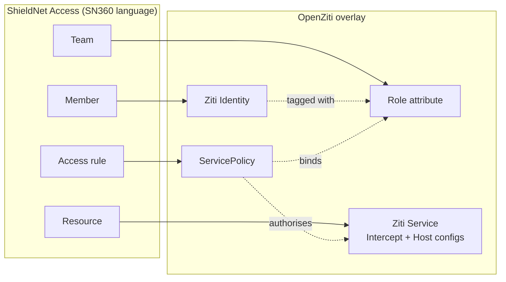
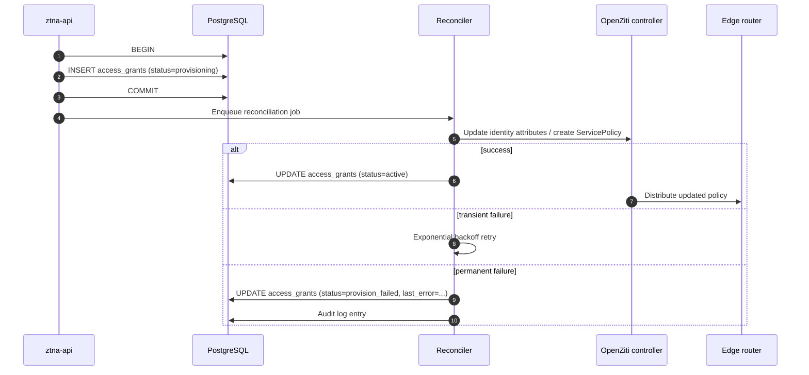
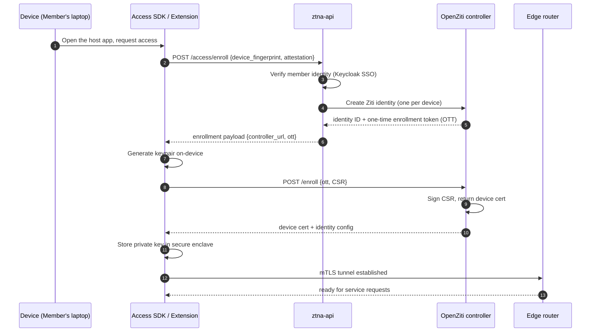
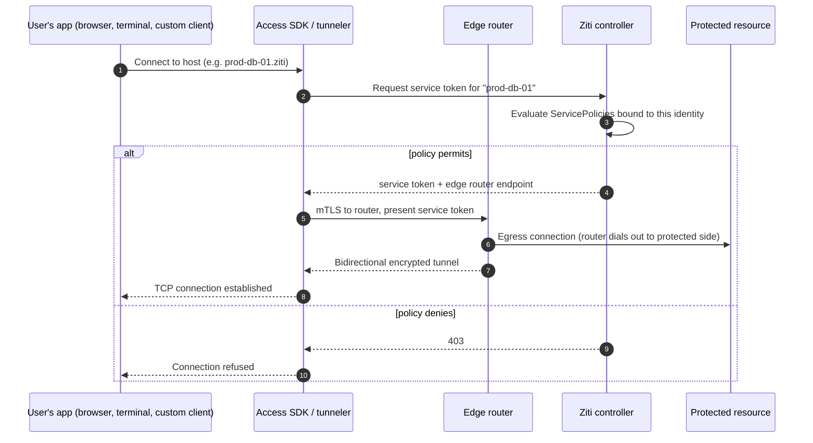

# Inside the Zero Trust Overlay: How ShieldNet Access Enforces Least-Privilege at the Network Layer

ShieldNet Access is two things at once. It is an *access governance* product — request flows, approvals, check-ups, lifecycle automation, AI risk review — and it is a *network enforcement* product. The governance layer makes decisions; the network layer carries them out.

The network enforcement is built on [OpenZiti](https://openziti.io/), an open-source zero-trust dataplane. This post is the technical deep dive on that integration: why we chose OpenZiti, how the SN360-language entities map onto Ziti primitives, the dual-consistency pattern that keeps the database and the overlay in sync, and the device enrollment flow that gives every endpoint a cryptographic identity.

This post uses engineering vocabulary throughout — but on first use of each user-facing term, we note the SN360 language. Members are *people* in the UI. Teams are *groups* (the company directory's nomenclature). Resources are *apps and systems*. Access rules are what the UI calls our policies.

## Why OpenZiti

The market has converged on three architectural options for zero-trust networking:

1. **A SaaS proxy** that terminates user sessions in the cloud and forwards them to private resources over a back-channel. The classic ZTNA-as-a-Service shape.
2. **A device-resident agent** that uses identity-bound tunnels to enforce per-resource policy.
3. **A self-hosted overlay** that you run inside your environment and route into / out of as required.

OpenZiti is the third shape, and it has properties that none of the others matches:

- **Software-defined.** No appliance, no special hardware. The controller is a Go binary, the routers are Go binaries, the SDKs are libraries you embed.
- **Identity-aware at the network layer.** Every connection is mTLS-authenticated against an identity that the controller has issued. The four-tuple of source IP / dest IP / src port / dst port is *not* what authorises a flow — the cryptographic identity is.
- **No open inbound ports on protected resources.** The protected side dials *out* to a router. There is nothing to scan, nothing to attack from the public internet.
- **Open source, self-hostable, no per-seat licensing.** The project is licensed under the Apache 2.0 license and has an active commercial steward.

The closest analogue in the broader zero-trust space is the original BeyondCorp model, with two differences. OpenZiti runs at L3/L4 instead of being purely HTTP-aware, which means it works for SSH, database protocols, and arbitrary TCP applications — not just web. And it does the cryptographic identity work for *every* connection rather than relying on a session cookie that lives in a browser.

The choice was a tradeoff. We pick up an operational dependency (the Ziti controller and a fleet of edge routers) in exchange for a network-layer enforcement mechanism that is robust to the failure modes of the SaaS-proxy shape (vendor takedowns, regional outages, edge-side rate limits). For a customer base that includes regulated industries — healthcare, finance, defence-adjacent — the self-hostability is non-negotiable.

## Mapping SN360 entities to OpenZiti primitives

The user-facing language and the OpenZiti primitives don't line up one-to-one. There is a deliberate translation layer in `ztna-business-layer/pkg/openziti/`. The mapping:

| ShieldNet Access (SN360 language) | OpenZiti primitive | Notes |
|------------------------------------|--------------------|-------|
| Member | Ziti Identity | One identity per member, per workspace. The identity is rotated on revocation. |
| Team | Role attribute on the identity | Teams become string tags. Membership changes are attribute updates. |
| Resource | Ziti Service + Intercept Config + Host Config | A resource is the triplet — service definition, client-side intercept, server-side host config. |
| Access rule (a policy in code) | ServicePolicy | The only object that authorises a flow. Drafts never create one. |
| Edge router | Edge Router | Deployed as a sidecar or as a node in a router fleet. |

The translation rules are strict in one direction and loose in the other. *Strict* in the direction "every promoted access rule has exactly one ServicePolicy". *Loose* in the direction "an identity can have many role attributes, a service can be selected by many service policies". The strictness is what gives us a clean audit answer to "why does this user have access to this resource right now" — there is always a single ServicePolicy to point at.

## Dual-consistency: PostgreSQL is the source of truth, OpenZiti is the enforcement plane

We hold two systems consistent. The relational source of truth is PostgreSQL (the `ztna` schema — `access_connectors`, `access_requests`, `access_grants`, `policies`, `teams`, etc.). The enforcement plane is OpenZiti. The two have to agree, but they don't have to agree synchronously.

The pattern we use is *dual-consistency with PostgreSQL as primary*:

- Writes always go to PostgreSQL first. The relational transaction commits, and that is the moment the platform considers the change to have happened.
- A separate reconciliation pass propagates the change to OpenZiti. The reconciler is idempotent — if it crashes halfway and restarts, it picks up where it left off.
- If the reconciler can't reach the OpenZiti controller, the change is *recorded as in-progress* on the database row. The audit log shows "provisioned but not enforceable" until reconciliation catches up.

This is the same dual-write pattern that the rest of ShieldNet 360 uses for its detection-rule deployments. The properties are well-understood: eventual consistency, durable retries, no lost writes, and a single audit trail.

This is also the reason draft access rules never touch the controller. A draft is a *database-only* concept — it exists as a row with `is_draft=true` and a populated `draft_impact` JSON column. Promotion is the only path that calls into OpenZiti to write a `ServicePolicy`. There is no "create live policy directly" code path; every live policy was a draft for at least one transaction. The test `TestPromote_DoesNotInvokeOpenZiti` in `policy_service_test.go` enforces this invariant — drafts that go through `Simulate` never produce a controller-side side effect.

## Device enrollment: how an endpoint gets a Ziti identity

A new device — phone, laptop, workstation — needs three things before it can participate in the overlay:

1. A *Ziti identity*, created on the controller.
2. A *one-time token* (OTT), used exactly once by the device to bootstrap.
3. A *device certificate*, signed by the controller in response to the device's CSR.

The flow is mediated by the SN360 client SDK on the device side and the SN360 `ztna-api` on the server side. The device never sees the controller's API key.

The device's private key never leaves the secure enclave (iOS keychain, Android Keystore, OS-level key store on desktop). The CSR contains the public key plus device-specific extensions (device fingerprint, attestation if available). The controller signs the cert and returns a Ziti identity config — the device now has everything it needs to dial out to an edge router and establish an mTLS tunnel.

Revocation is the inverse: the controller marks the identity as disabled. Any future tunnel attempt is rejected; existing tunnels are torn down within the controller's heartbeat interval. The PostgreSQL side records `disabled_at` and `disable_reason`. This is the call path used by the leaver flow in [06](./06-jml-automation.md) — when a user is offboarded, the OpenZiti `DisableIdentity` call is fired as a best-effort step after the per-resource revocations complete.

## The connection lifecycle: from request to flow

Once a member has a device identity and an active access grant, a single end-to-end connection looks like this:

A few properties of this flow are worth calling out:

- **The protected resource has no inbound ports.** The router *dials out* from inside the protected environment. There is nothing to scan from the public internet.
- **The decision is enforced at the router, not at the resource.** A misconfigured access rule cannot accidentally grant network access to a resource that the policy says is denied — the router does not even forward the connection.
- **Tokens are short-lived.** Service tokens are scoped to a single session and expire within minutes. Reconnecting forces re-evaluation against the current policy set.
- **The controller is consulted on every new flow.** This is the "continuous verification" property of zero trust — a flow established at 09:00 against a permissive policy that was tightened at 10:00 cannot survive past the next token refresh.

## Operational details

Three subjects are worth a paragraph each.

### Edge router placement

The recommended deployment topology is one edge router per protected environment — one per AWS VPC, one per Azure resource group, one per on-prem subnet. Routers are stateless from the persistence perspective; they hold tunnels, not data. A router fleet can be scaled horizontally; the controller picks the closest router for a given service request based on link metrics.

For SMEs that don't want to manage routers themselves, ShieldNet Access offers a managed router fleet — the customer's environment runs a single router as a Kubernetes deployment from `ztna-k8s-assets`, and that router federates into a shared edge fabric. The trust boundary is still the customer's controller (we never operate that on their behalf), but the link layer is shared.

### Controller HA and DR

The Ziti controller is stateless except for the PostgreSQL-backed identity store. We run two controllers in active-active mode behind a load balancer, both pointing at the same Postgres cluster. Disaster recovery is the same playbook as Postgres DR — PITR, periodic snapshots, region failover for customers on the multi-region tier.

The reconciler that propagates SN360 changes to the controller is an idempotent worker. It reads from a Redis-backed work queue, retries with exponential backoff on transient failures, and dead-letters after `N` permanent failures. A failed reconciliation surfaces as a warning banner on the relevant access rule or grant in the admin UI.

### Observability

Every connection through the overlay produces a Ziti event log entry. We pipe those events into the same Kafka topic that the rest of ShieldNet 360 uses for audit data — schema `ShieldnetLogEvent v1`. The audit envelope contains the source identity, the target service, the timestamp, the bytes-in / bytes-out for the session, and the policy that authorised it. This is the data that powers the [10 — Runtime Detection Meets Access Control](./10-runtime-detection-meets-access.md) closed-loop story.

## Code reference

If you want to read the integration code yourself:

- `ztna-business-layer/pkg/openziti/` — the Go client wrapper around the OpenZiti management API. `client.go` is the entry point.
- `ztna-business-layer/internal/services/access/policy_service.go::Promote` — the only path that calls into OpenZiti to write a `ServicePolicy`. Look for `ozClient.CreateServicePolicy`.
- `ztna-business-layer/internal/services/access/jml_service.go::HandleLeaver` — the path that calls `ozClient.DisableIdentity` as part of the offboarding flow. Best-effort: failures are logged but never roll back the leaver.
- `ztna-k8s-assets/` — the Helm charts for the controller and the router fleet. `controller/values.yaml` shows the configurable knobs.
- `ztna-business-layer/internal/services/access/policy_service_test.go::TestPromote_DoesNotInvokeOpenZiti` — the regression test that enforces the draft-never-touches-controller invariant.

For the broader design contract on policies, drafts, and simulation, see `docs/overview.md` §6. For the deployment topology, see `docs/overview.md` §10 and `docs/architecture.md` §11.

## What's next

The OpenZiti overlay is the *enforcement* half of the access-governance story. The *decision* half — risk scoring, workflow routing, AI-assisted auto-certification — runs against the same underlying entities but lives in a different set of services. [05 — AI-Powered Access Intelligence](./05-ai-powered-access-intelligence.md) covers the agent layer and the A2A protocol that ties governance and enforcement together. [08 — The Connector Architecture](./08-connector-architecture.md) covers how identity-sync data from app connections turns into the Members, Teams, and Resources that the overlay enforces against.

The single most important property of this design, from a technical-evaluator perspective, is that the database is always the source of truth. If the OpenZiti controller is unavailable, you can still inspect, audit, and modify access rules. If the database is unavailable, the overlay continues to enforce the *last known good* state until reconciliation can resume. The two systems hold each other up — and that is the property that makes the architecture safe enough to run zero trust at the scale of SMEs, who can't afford a five-nines posture but do need a four-nines one.
