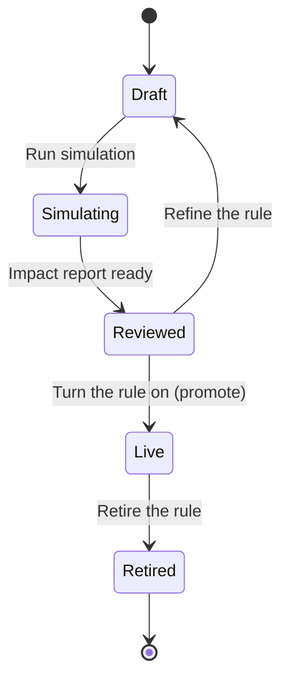
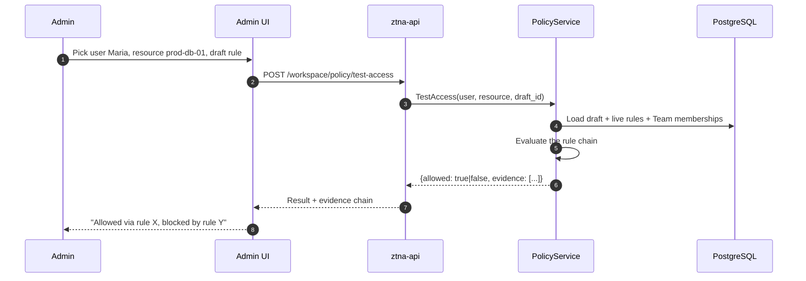
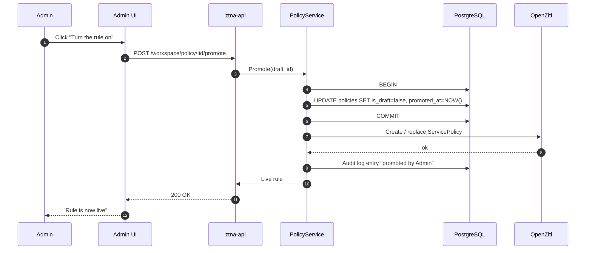

# Access Rules Without the Risk: Draft, Simulate, Promote

Every access admin has had this moment. You are about to change a rule. You think the change is right. You also know, in the back of your head, that you are about to find out who *else* this rule applies to — because rules in most systems live in opaque spreadsheets, and the only test environment is production.

The result is what we call *change paralysis*. Admins stop touching access rules because they cannot predict the impact. The rules drift further from what the company actually needs. The drift becomes the audit finding. The audit finding becomes the consultancy project. And nobody actually fixes the underlying problem, which is that the workflow itself is unsafe.

ShieldNet Access fixes the workflow. Every access rule starts as a draft. Drafts never touch the live network. You can simulate a draft against the current state of the world, see a structured impact report ("47 people gain access, 3 people lose access, conflicts with 2 existing rules"), let the AI flag the over-provisioning risks, and only *then* — one click — promote it to live. This post walks through the workflow end to end and ends with the under-the-hood mechanics for the curious.

## The problem we're solving

Three things have to be true for an access rule change to be safe:

1. You can see who gains access *before* it happens.
2. You can see who loses access *before* it happens.
3. You can see how the rule interacts with the rules already in place *before* it happens.

A spreadsheet does none of those things. A directly-edited policy DSL does none of those things. A "create rule and watch the alerts" approach does none of those things.

The solution we built is the access-rule analogue of a database migration's "dry run" — a deterministic, repeatable simulation that produces a structured report. The report is reviewable in the UI, exportable for change-management documentation, and re-runnable any time the underlying state changes.

## The lifecycle of an access rule

Every access rule moves through the same five stages.



- **Draft** — the rule exists as a database row with `is_draft = true`. It does not enforce anything. It does not appear in any audit log as a live rule.
- **Simulating** — a background job is computing the impact. Typically takes seconds; longer if the rule affects very large teams.
- **Reviewed** — the impact report is available. The admin can either refine the rule (return to Draft) or promote.
- **Live** — the rule has been promoted. A `ServicePolicy` exists in OpenZiti. The rule is enforcing on every connection.
- **Retired** — the rule has been turned off. The corresponding `ServicePolicy` has been removed.

There is no path that creates a Live rule directly. Every Live rule was a Draft for at least one transaction. This is the same invariant that the technical post in [03 — Inside the Zero Trust Overlay](./03-zero-trust-overlay.md) calls out — drafts never touch the network overlay, and there is an integration test that fails if anyone ever tries to add a code path that violates this.

## Step 1: drafting a rule

In the admin UI, creating an access rule starts with a wizard. The wizard asks the four questions every rule needs to answer:

- **Who?** A Team selector (or a member-attribute selector — "everyone with title containing 'Engineer'").
- **What?** A Resource selector (one or more, by tag, category, or explicit ID).
- **When?** Optional time windows ("business hours only", "weekdays only") or session-duration limits.
- **From where?** Optional context conditions — device managed, geography, MFA freshness.

The result is a draft row in the `policies` table with `is_draft = true`. Nothing else has happened yet. The row is reversible by a single DELETE.

Behind the scenes, the create-draft endpoint is `POST /workspace/policy` with `is_draft: true` in the body. The handler is `policy_handler.go`, the service method is `policy_service.go::CreateDraft`, and the migration that introduced the `is_draft`, `draft_impact`, and `promoted_at` columns is `internal/migrations/003_create_policy_tables.go`. Useful to know when you are debugging from logs; not necessary for everyday use.

## Step 2: simulating a draft

Simulation is the heart of the workflow. The admin clicks "Simulate impact". A job runs. A structured `ImpactReport` is produced. Three engines collaborate to produce it.

### ImpactResolver

The resolver answers three questions:

1. **Which Teams does this rule apply to?** Walk the Team-membership rules that match the draft's attribute selector. Return the list of Team IDs.
2. **Which Members are in those Teams?** Expand each Team to its current member list. Live snapshot — no caching. (If you change Team membership and re-run, the answer changes.)
3. **Which Resources does this rule target?** Walk the resource selector against the resource catalogue. Return the list of Resource IDs.

The resolver lives in `internal/services/access/impact_resolver.go`. It is a pure function over the database state; it has no side effects.

### ConflictDetector

The conflict detector takes the (member, resource) pairs from the resolver and asks: for each pair, which *existing* live access rules also touch this pair? It classifies each interaction as one of two kinds:

- **Redundant.** An existing rule already grants this access. The new rule adds nothing for this pair.
- **Contradictory.** An existing rule explicitly denies this access. The new rule would conflict; the resolution depends on rule precedence.

The output is a list of conflicts, each with the conflicting rule's ID, name, and kind. The detector lives in `internal/services/access/conflict_detector.go`.

### AI risk assessment

The AI agent's `access_risk_assessment` skill takes the impact report as input and produces a structured risk evaluation. The four signals it looks for:

- **Over-provisioning.** Granting more access than peers in the same job role. The agent compares the affected members' historical permission sets to the new permission set.
- **Separation-of-duties violations.** The same member gets approve-payment and execute-payment. Or read-customer-data and export-customer-data. Drawn from a configurable list of conflict pairs.
- **Privilege concentration.** Admin-level access granted to a Team larger than `N` people. Default `N` is 10; configurable per workspace.
- **Stale-policy risk.** The draft was authored more than `D` days ago without re-simulation. Default `D` is 14 days.

The agent returns a risk level (low / medium / high) and structured factors that explain it. If the agent is unreachable, the simulation completes without an AI risk section, *not* with a defaulted-medium answer — the simulator wants to be honest about which assessments it could and couldn't run.

### The ImpactReport

The combined output is a structured JSON document stored in `policies.draft_impact`. A typical one:

```jsonc
{
  "members_gaining_access": 47,
  "members_losing_access": 3,
  "new_resources_granted": 12,
  "resources_revoked": 0,
  "conflicts_with_existing_rules": [
    {
      "rule_id": "01J...",
      "rule_name": "Engineering — Production Database",
      "kind": "redundant"
    },
    {
      "rule_id": "01K...",
      "rule_name": "Finance — Restrict Staging Access",
      "kind": "contradictory"
    }
  ],
  "affected_teams": ["engineering", "platform-engineering"],
  "highlights": [
    "47 new people will gain SSH access to prod-db-01",
    "3 people will lose access to staging-finance-app",
    "Conflicts with 'Finance — Restrict Staging Access' (contradictory)"
  ],
  "ai_risk": {
    "level": "medium",
    "factors": [
      "Privilege concentration: 12 members would gain admin role",
      "Over-provisioning: 4 members are non-engineering"
    ]
  }
}
```

In the UI, this gets rendered as a before-and-after comparison. The admin sees a "people gaining access" tab, a "people losing access" tab, a "conflicts" tab, and an "AI risk review" tab. The same data is available through the API for change-management documentation.

## Step 3: the "what-if" tester

Sometimes the question is narrower than "what does this rule do to everyone". It is "can Maria access prod-db-01 under this draft?". The platform has a dedicated endpoint for that question — the *what-if* tester.



The evidence chain matters as much as the boolean answer. The endpoint returns the *list of rules* that were evaluated in order, the matches, and the final decision. It is the same evidence that an auditor would want to see — "why does this user have access to this resource right now" — produced on demand for a hypothetical change.

The handler is `POST /workspace/policy/test-access` in `policy_handler.go`. It does not require a full simulation to have run; it works against the live rule chain plus the candidate draft.

## Step 4: promoting a draft

Once the admin has reviewed the impact report and decided the change is right, they promote the draft. Promotion is one click in the UI, one HTTP call in the API.



Promotion is the *only* code path that creates an OpenZiti `ServicePolicy`. There is no direct "create live policy" code path. The test `TestPromote_DoesNotInvokeOpenZiti` in `policy_service_test.go` enforces the inverse: drafts never invoke the controller.

The promotion is also the moment an audit-log entry is written with the admin's identity, the rule ID, and the impact-report snapshot at promotion time. If the auditor asks "why was this rule turned on", the answer is in the audit log — including the data the admin saw at the time of decision.

## What this looks like in practice

A typical week of access-rule changes at a 100-person company:

- **Monday 09:00.** Finance asks: "Can we grant Accounting access to NetSuite?" Admin creates a draft. Simulates. Report shows 4 members gain access, no conflicts, low AI risk. Promotes. Done in 5 minutes.
- **Monday 14:30.** Engineering asks: "Can we widen production database access to the on-call rotation?" Admin creates a draft. Simulates. Report shows 8 members gain access, AI flags privilege concentration (admin role for >10 people). Admin refines the rule to scope to *read-only* access for the rotation, simulates again, AI risk drops to low. Promotes. Done in 12 minutes.
- **Tuesday 10:00.** Sales asks: "Can contractors access the customer CRM?" Admin creates a draft. Simulates. Report shows 6 members gain access, AI flags separation-of-duties (these contractors already have access to billing-report exports — a known SoD pair). Admin escalates to security review through the multi-level workflow. Conversation in Slack. Decision: scope to a sandbox customer list. Re-simulate, AI risk passes. Promote. Done over the course of a half-day, with a documented audit trail.

None of these stories involves a production outage. None of them involves "let's test it on the staging tenant first" (there is no staging tenant for access — every change is simulated against live state). None of them involves the admin opening the OpenZiti controller UI directly.

## Frequently asked questions

**What if I need to roll back a change?** Retire the live rule. The OpenZiti `ServicePolicy` is removed; the rule's row stays in the database with `retired_at` set. Members lose access on the next token refresh (typically within minutes). You can re-promote the rule later if needed — promotion is reversible.

**Does the simulation account for rule precedence?** Yes. The ConflictDetector evaluates draft + live rules in the order they would actually fire. The output is the *real* outcome under the candidate state, not a naive set-union.

**What if the AI agent is offline?** The simulation completes without the AI risk section. The impact report is still produced. The admin can promote, but the absence of an AI risk review is shown in the UI and in the audit log. Operators can configure a policy that requires AI-pass before promotion is allowed — by default it's advisory.

**Can I export the impact report?** Yes. The same JSON is downloadable from the admin UI, and the same shape is the response body from `GET /workspace/policy/:id`. Most customers attach it to their change-management ticket.

**How long does a typical simulation take?** Single seconds for rules affecting a handful of Teams. Tens of seconds for rules that touch the entire workspace. The simulator's heaviest cost is the Team-membership expansion; that is bounded by `O(members in affected Teams)`.

## Reference

- Service entry point: `internal/services/access/policy_service.go::CreateDraft`, `Simulate`, `Promote`, `TestAccess`.
- Impact resolver: `internal/services/access/impact_resolver.go`.
- Conflict detector: `internal/services/access/conflict_detector.go`.
- HTTP handler: `internal/handlers/policy_handler.go`.
- Integration test enforcing the invariant: `internal/services/access/policy_service_test.go::TestPromote_DoesNotInvokeOpenZiti`.
- Migration that introduced the draft columns: `internal/migrations/003_create_policy_tables.go`.
- Design contract: `docs/overview.md` §6.

## What's next

The "draft, simulate, promote" workflow is what makes ShieldNet Access *safe* to operate. The other half of the safety story is that the AI never blocks you — risk is a signal, not a gate. [05 — AI-Powered Access Intelligence](./05-ai-powered-access-intelligence.md) covers the agent layer and how the best-effort pattern keeps the platform from ever becoming captive to an AI failure mode.

If you want to see the same workflow but from the perspective of a single access request — request → risk assessment → workflow routing → approval → provisioning → active — read [09 — From Request to Revoke](./09-request-to-revoke.md). The patterns are the same; the surface area is different.

The thing to take away from this post is the principle. Every change should be testable before it's real. Every test should produce a structured report. Every report should be auditable. And every promotion should be one click — because the work happened before, not during.
