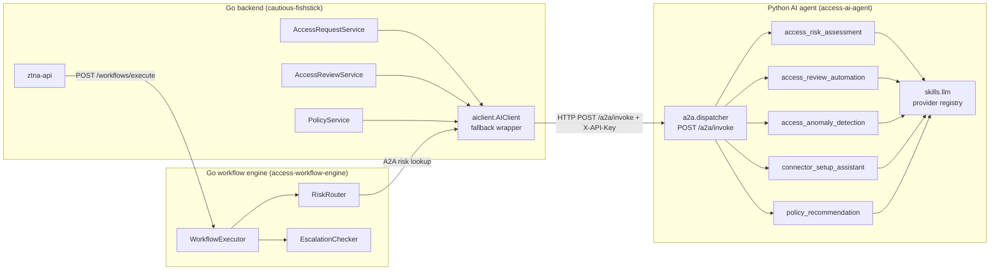
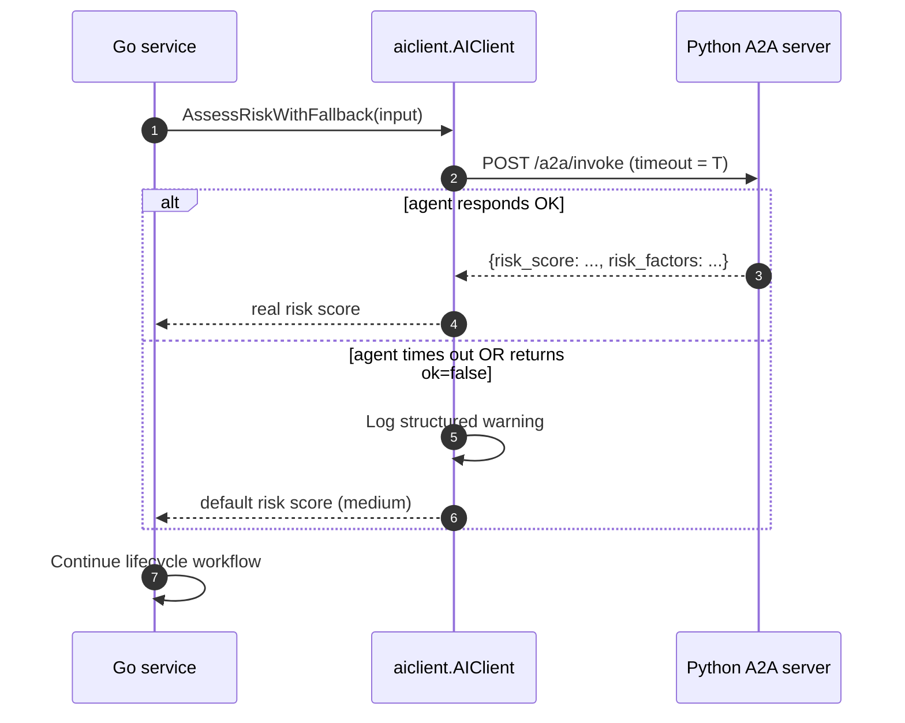
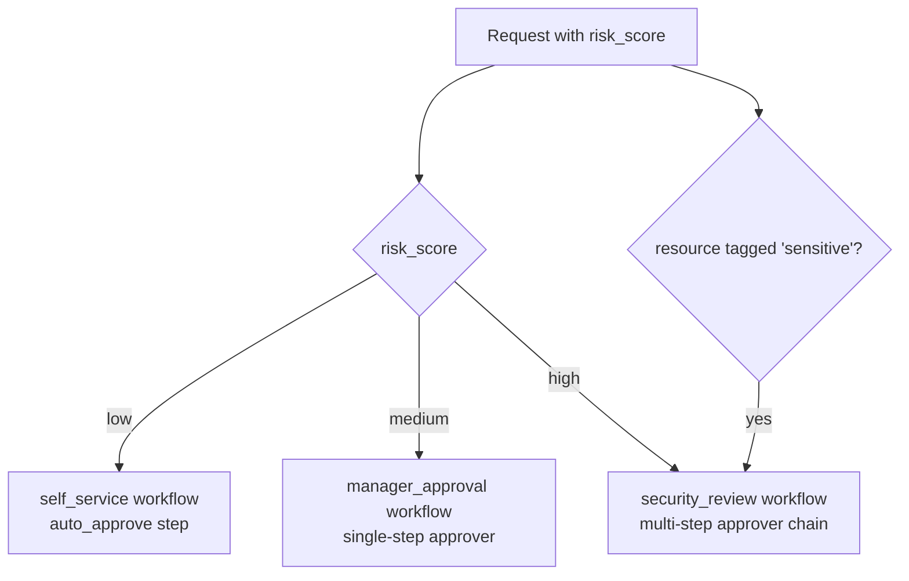
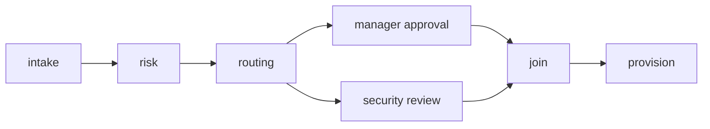

# AI-Powered Access Intelligence: Risk Scoring, Auto-Certification, and Anomaly Detection

The temptation with AI in a security product is to put the model on the critical path. Block the request until the LLM responds. Refuse to provision until the agent gives the green light. Make the AI the gatekeeper.

We don't do that. The AI inside ShieldNet Access is *decision-support*, not a decision-maker. Every AI hook is best-effort: if the agent is unreachable, the platform falls back to a sensible default and continues serving requests. The fallback is part of the design contract, not a bolt-on.

This post is the technical deep dive on the agent layer. It covers the architecture (Go backend ↔ Python A2A skill server), the five Tier-1 skills, the best-effort fallback pattern, the LangGraph-style workflow engine, and the strict rule that no inference ever happens on a client device. The audience is technical evaluators, integration partners, and engineers who will be reading the Go and Python source alongside the post.

For the user-facing column, *risk score* is rendered as *risk level* in the UI; we'll use *risk score* throughout this post because we are looking at it from the engineering side, and the database column name is `risk_score`.

## The architecture in one diagram

Three services talk to each other.



Three properties to call out:

- **The Go backend never talks to an LLM directly.** All inference is brokered through the Python agent. This is the same pattern `aisoc-ai-agents` uses for SOC agents, deliberately reused so the platform team operates one inference fabric, not three.
- **The Python agent never persists state.** It is a pure RPC server. State lives in PostgreSQL on the Go side.
- **The workflow engine is a separate process.** Multi-step orchestration is its own concern; the request service is not in the business of polling for approval timeouts.

The complete deployment map is in `docs/PROPOSAL.md` §10.

## The A2A protocol

A2A — Agent-to-Agent — is the lightweight RPC contract between Go callers and the Python skill server. It is not the headline; it is the plumbing that makes the headline possible.

The wire format:

```
POST /a2a/invoke HTTP/1.1
Host: access-ai-agent.internal:8080
X-API-Key: <shared secret>
Content-Type: application/json

{
  "skill": "access_risk_assessment",
  "request_id": "req_01J...",
  "context": {
    "workspace_id": "ws_01J...",
    "actor_user_id": "usr_01J..."
  },
  "input": {
    "resource": "prod-db-01",
    "role": "admin",
    "requester": {
      "user_id": "usr_01J...",
      "team_ids": ["engineering"]
    }
  }
}
```

The response is JSON, with a strict envelope:

```json
{
  "skill": "access_risk_assessment",
  "request_id": "req_01J...",
  "ok": true,
  "result": {
    "risk_score": "medium",
    "risk_factors": [
      "Resource tagged sensitive",
      "Admin role"
    ]
  }
}
```

If the skill fails, `ok` is `false` and `error` contains a structured error code. Crucially, *every Go caller treats a failure like a network failure*: it falls back to a default outcome and continues.

Three implementation notes:

- The auth is shared-secret. The agent runs inside the cluster-internal network — it is never reachable from the public internet.
- The `request_id` is forwarded into every log line on the Python side. Tracing across the boundary is one query.
- Skills are stateless and idempotent. Calling the same skill twice with the same input is safe.

The Go-side client is `internal/pkg/aiclient/client.go`. The fallback wrappers are in `internal/pkg/aiclient/fallback.go` (`AssessRiskWithFallback`, `DetectAnomaliesWithFallback`).

## The five Tier-1 skills

The Python agent hosts five skills today. Each one is registered with the dispatcher in `cmd/access-ai-agent/main.py`. All five share an LLM dispatcher (`skills.llm`) that calls into the configured provider with a deterministic-stub fallback when the LLM is unavailable.

### 1. access_risk_assessment

**Purpose.** Score policy changes and access requests on a low / medium / high scale, with structured `risk_factors`.

**Inputs.** A request or impact report. The skill is generic over both shapes.

**Outputs.** `{risk_score: low|medium|high, risk_factors: []string}`.

**Where it fires.** On every access request (`AccessRequestService.CreateRequest`) and on every policy simulation (`PolicyService.Simulate`).

**Failure mode.** On `requested → reviewing`, the request defaults to medium risk and routes through `manager_approval`. The defaulting is in `aiclient.AssessRiskWithFallback`.

The skill's LLM prompt asks for a structured JSON response. The deterministic-stub fallback uses heuristic rules — resources tagged `sensitive` raise the score, admin-level roles raise the score, requests from members in fewer than `N` Teams raise the score. The stub is enough to keep the product useful when the LLM provider is offline.

### 2. access_review_automation

**Purpose.** Auto-certify low-risk grants during an access check-up.

**Inputs.** A grant (user + resource + role + history of access events).

**Outputs.** `{decision: certify|escalate, reason: string}`.

**Where it fires.** On every grant enumerated by `AccessReviewService.StartCampaign` when auto-certification is enabled for the campaign.

**Failure mode.** On a failed call, the grant is *not* auto-certified — it routes to the reviewer as a `pending` decision. This is the safe fallback: when in doubt, ask a human.

Auto-certification is opt-out per resource category. A workspace that wants every grant in front of a human can disable it at campaign creation time.

### 3. access_anomaly_detection

**Purpose.** Flag unusual usage on active grants — sudden volume, off-hours, geographic outliers, unused high-privilege grants.

**Inputs.** A grant plus the time-series of its `last_used_at` events.

**Outputs.** `{anomalies: [{kind, severity, evidence}]}`.

**Where it fires.** Periodically from `AnomalyDetectionService.ScanWorkspace`, scheduled by the worker cron.

**Failure mode.** On a failed call, the scan logs the failure and continues with the next grant. No grant is marked anomalous defensively.

The Phase 5 expansion (PR #20) added a cross-grant baseline histogram, off-hours detection, geographic-outlier detection, and unused-high-privilege detection inside `cmd/access-ai-agent/skills/access_anomaly_detection.py`. These are heuristic detectors that run *alongside* the LLM call — the LLM produces a narrative, the heuristics produce the numeric thresholds.

### 4. connector_setup_assistant

**Purpose.** Guide admins through setup in natural language. Maps free-text questions to wizard answers.

**Inputs.** Free-text question + the partial state of the setup wizard.

**Outputs.** A structured suggestion: which field to fill in, with what value, with the reasoning surfaced to the admin.

**Where it fires.** From the admin-UI conversational surface; the backing API is the same `POST /a2a/invoke` plumbing.

**Failure mode.** On failure, the wizard reverts to its default behaviour (operator-driven, no suggestions).

### 5. policy_recommendation

**Purpose.** Suggest access rules given the current org structure (Teams + resources + historical access).

**Inputs.** A workspace's current Team list, resource catalogue, and a recent slice of access-grant data.

**Outputs.** A list of recommended access-rule drafts.

**Where it fires.** From the admin-UI "suggest a rule" surface (`POST /access/suggest`) and from the policy simulator's "what should I do?" affordance.

**Failure mode.** On failure, the surface shows a "no suggestions available right now" message. Operators continue authoring rules by hand.

## The best-effort pattern, formalised

The fallback pattern is the single most important property of the AI integration. The contract:



Three rules:

1. **The caller never blocks waiting for the agent past timeout `T`.** Default `T` is 2 seconds for the request path, 30 seconds for batch-style scans.
2. **The caller never raises an error to the user because the agent was unreachable.** A warning is logged and a metric is emitted; the user-visible outcome is the fallback path.
3. **The fallback is always *safe*.** "Safe" in the request path means "medium risk, manager approval". "Safe" in the auto-certification path means "do not auto-certify". "Safe" in the anomaly path means "do not mark anomalous".

This is in `internal/pkg/aiclient/fallback.go`. A representative function:

```go
func (c *Client) AssessRiskWithFallback(ctx context.Context, req RiskAssessmentInput) RiskResult {
    res, err := c.AssessRisk(ctx, req)
    if err != nil {
        // Structured warning; never returned to the caller.
        c.logger.Warn("ai risk assessment unavailable; defaulting to medium",
            "request_id", req.RequestID, "error", err)
        c.metrics.IncFallback("access_risk_assessment")
        return RiskResult{RiskScore: RiskMedium, RiskFactors: []string{"AI unavailable; defaulted"}}
    }
    return res
}
```

The caller code is uniform across the request service, the review service, and the policy service. No service has its own bespoke fallback logic; they all go through `AssessRiskWithFallback` and `DetectAnomaliesWithFallback`.

## The LangGraph-style workflow engine

The lifecycle engine — the state machine over `access_requests` rows — runs in `cmd/access-workflow-engine`. It is a separate Go service that hosts an HTTP server on `:8082` with two endpoints: `GET /health` and `POST /workflows/execute`.

The engine's responsibilities:

- Multi-step lifecycle workflows with phase transitions (`requested → reviewed → approved → provisioned`).
- Risk-based routing (`low → self_service / auto_approve`, `medium → manager_approval`, `high → security_review`, `resource tagged sensitive → security_review`).
- Escalation workflows with timeout-based auto-escalation.

### Risk-based routing

The `RiskRouter` is the smallest unit. Given a request and a risk score, it returns the right workflow type:



The router is `internal/services/access/workflow_engine/risk_router.go`. The implementation is a switch statement plus a tag-check. It is deliberately simple; we resisted the temptation to put a model in the middle of routing because routing has to be deterministic for the audit story.

### DAG execution

Phase 8 (`✅ shipped`) brought the LangGraph DAG runtime online. Workflow definitions can express fan-out / join across multiple approver branches via `WorkflowStepDefinition.Next` (the list of next steps) and `WorkflowStepDefinition.Join` (the join points). The executor walks the DAG topologically with goroutine-parallel branches, and the validator catches cycles / out-of-range references / self-loops with a Kahn's-algorithm check.



Each step's outcome is recorded in `access_workflow_step_history` (migration `009`) with a `branch_index` column (added in PR #23) so a multi-branch workflow's audit trail captures which branch produced which decision.

### Escalation

The `EscalationChecker` is a cron-driven worker inside `access-workflow-engine`. It scans for steps whose `escalation_at` timestamp is in the past, escalates them to the next approver in the chain (or to `security_review` if the chain is exhausted), and writes an `access_request_state_history` row.

The escalator is the path that fires email and Slack notifications. In PR #23, the workflow engine wires the Phase 5 `EmailNotifier` and `SlackNotifier` behind the `NOTIFICATION_SMTP_HOST` and `NOTIFICATION_SLACK_WEBHOOK_URL` env-var feature flags. Both notifiers are best-effort: a failed delivery is logged but never rolls back the state transition.

### Retry and DLQ

Phase 8 also brought a retry / dead-letter pattern for the step performer. Each step retries with exponential backoff (3 attempts, 100ms → 200ms → 400ms, capped at 5s). Steps that exhaust their retries land in a `failed_steps` view exposed via `ListFailedSteps`, where an operator can inspect, retry, or cancel.

## The no-on-device-inference rule

The clients — iOS SDK, Android SDK, Desktop Extension — are thin REST clients. The rule is strict and audited:

- No `CoreML` import on iOS.
- No `TensorFlow Lite` or `ONNX Runtime` on Android.
- No `onnxruntime` or native inference binaries in the Electron extension.
- No bundled model files of any kind.

Every AI call from a client goes over HTTPS to `ztna-api`, which delegates to the Python agent. The build-time check that enforces this rule is in the Phase 4 exit criteria — it grep's the build artefact for forbidden imports and bundle entries.

The reasons are:

1. **Compliance.** Many of our customers ship into regulated industries where on-device inference would require a model-classification analysis we don't want to fund.
2. **Audit.** The audit trail of an AI decision is on the server, where it can be retained and inspected. On-device inference would scatter that trail across thousands of devices.
3. **Update velocity.** The skill set evolves weekly. On-device models would be months stale by the time they reached every device.
4. **Cost.** On-device inference shifts compute to customers' devices; server-side inference lets us pool the compute and price predictably.

PROPOSAL §12.1 tracks the future "on-device fallback" optionality as a deferred decision. The SDK surface is designed so that adding a local fallback later is a non-breaking change — but adding it is not on any current roadmap.

## A real failure mode, walked through

Picture the Python agent's container crashing during a deploy. Three things happen:

1. `aiclient.AssessRiskWithFallback` times out. The Go side logs a warning, increments the `ai_fallback_total{skill="access_risk_assessment"}` Prometheus counter, returns medium risk.
2. New access requests route through `manager_approval`. The audit log on each request records `risk_factors: ["AI unavailable; defaulted"]`. The user-visible UX is unchanged — the manager gets the request and approves it.
3. Scheduled access check-ups continue. Auto-certification is disabled for the duration of the outage (because every grant's review-automation call fails to the safe path); all grants land in the reviewer's queue instead of being auto-certified.

When the agent comes back, the platform self-heals: the next access request gets a real risk score, the next campaign auto-certifies again. No data is lost; no request is stuck.

## Reference

- Go client: `internal/pkg/aiclient/client.go`, `fallback.go`.
- Python agent: `cmd/access-ai-agent/main.py` (stdlib `http.server` hosting `POST /a2a/invoke` and `GET /healthz`).
- Skills: `cmd/access-ai-agent/skills/access_risk_assessment.py`, `access_review_automation.py`, `access_anomaly_detection.py`, `connector_setup_assistant.py`, `policy_recommendation.py`.
- LLM dispatcher: `cmd/access-ai-agent/skills/llm.py` (provider registry; configured via `ACCESS_AI_LLM_*` env vars).
- Workflow engine: `cmd/access-workflow-engine/main.go`, `internal/services/access/workflow_engine/*.go`.
- Schema: `internal/migrations/008_access_workflow_templates.go`, `009_access_workflow_step_history.go`.

## What's next

The AI layer is the most-watched part of the platform from a security perspective — and the part most often misused in competing products. The thing to take away is that *AI in ShieldNet Access is never the gatekeeper*. The platform works without it. The platform works *better* with it. That asymmetry is the design.

If you want to see the AI layer in action from the user-facing side, [04 — Access Rules Without the Risk](./04-access-rules-safe-test.md) shows the risk-assessment skill fired against a policy simulation, and [07 — Access Check-Ups](./07-access-checkups.md) shows the review-automation skill auto-certifying low-risk grants.

For the closing-the-loop story — how anomaly detection on active grants ties into ShieldNet Detect's runtime detection rules — read [10 — Runtime Detection Meets Access Control](./10-runtime-detection-meets-access.md). That is where access intelligence stops being a feature and starts being part of the broader incident-response posture.
