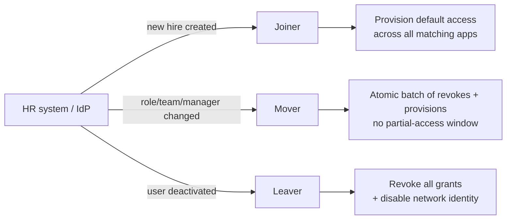
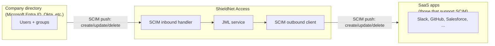

# Automating the Employee Lifecycle: How JML Eliminates Access Drift

There is a number every CFO of a 100-person company should know but most don't: the ratio of paid SaaS licenses to active employees. Across the SME segment, it sits between three-to-one and four-to-one. For every person on payroll, the company is paying for three to four logins somewhere — some inactive, some forgotten, some shared, some belonging to people who left two summers ago.

This is *access drift*. It is what happens when onboarding is manual, offboarding is a Slack message, and role changes are an inbox full of "hey can you add me to ...". Drift accumulates quietly. It is not a single dramatic security incident; it is a hundred small slow leaks that the company only sees on the day an auditor asks for a report.

ShieldNet Access closes the drift with a feature we call JML — Joiner / Mover / Leaver. JML automates the lifecycle of every employee's access from the first day to the last. This post is the business view: what each phase looks like in plain terms, what the platform does for you automatically, and how SCIM (the protocol that drives it) makes the spreadsheet obsolete.

## The drift problem, in numbers

A typical 100-person company at year three has:

- **300 to 400 active SaaS licenses.** Three to four per employee.
- **40 to 60 orphaned accounts.** Accounts active for people no longer at the company.
- **70 to 100 stale permissions.** Accounts active for current employees but with permissions from a previous role.

Three categories, all expensive in different ways. Orphaned accounts are a security problem (former employees retaining access). Stale permissions are a compliance problem (current employees with more access than their role warrants). And the *count* of unused licenses is a finance problem — most SMEs are over-paying for SaaS by 25-40%.

The single underlying cause is that *access changes are not driven by employment changes*. They are driven by tickets, Slack messages, and "I should remember to do that". Tickets get lost. Messages get archived. Memories fade.

JML inverts the model: employment changes drive access changes, automatically, every time.

## The three lifecycle events

We break the lifecycle into three events. Each one has a clear input, a clear output, and a clear set of guarantees.

### Joiner — day one for a new hire

When a new person is added to the company directory (Microsoft Entra ID, Google Workspace, Okta — whichever you've connected), ShieldNet Access notices within seconds and runs the joiner flow.

What happens automatically:

- The new member is added to the right Teams based on attributes the directory exposes (job title, department, manager, location).
- For every access rule that matches their Teams, an access request is created in the `approved` state.
- Every approved request is provisioned out to the right SaaS app — Slack invite sent, GitHub seat added, Salesforce license assigned, and so on across every app connection that has provisioning capability.
- Network identity is issued: the new member's devices can enroll into the OpenZiti overlay and start receiving the access their rules grant.

What this looks like from the new hire's side: they show up Monday morning, log into the company SSO portal, and discover that Slack, GitHub, Salesforce, and Notion are all waiting for them with the right level of access. No tickets to file. No DMs to send. No "can someone please add me to ..." standup.

What this looks like from the operations side: the first time you set up the rules, you spend twenty minutes defining "what does an Engineering new hire get?", "what does a Sales new hire get?", "what does an HR new hire get?". After that, every new hire of that kind gets it. Forever.

### Mover — role and team changes

The trickier event. A current employee moves teams, changes role, gets promoted, joins a project. The directory updates. ShieldNet Access notices and runs the mover flow.

What happens automatically:

- The platform computes the *diff* between the member's old Team membership and their new Team membership.
- For every access rule that applied to the old Teams but not the new ones, a revoke is queued.
- For every access rule that applies to the new Teams but not the old ones, a provision is queued.
- Both sets of operations run as a single atomic batch — so the member never sees a partial-access window where they've lost the old access but haven't gained the new yet.

The atomicity is the part that's hard to get right and the part that legacy IAM tools usually get wrong. The naive implementation revokes first, then provisions — leaving a window of seconds to minutes where the user has *less* access than either side of the change. The atomic implementation either both happen or neither happens; the user's experience is "I logged out at 5pm with the old access, I logged in at 9am with the new access, in between I was asleep".

In SN360 language, this is "the user's access never goes wrong because the platform is in the middle of a change". The audit log captures both sides of the diff, so the compliance trail is complete.

### Leaver — day last for a departing employee

The most-important event for security, and the one that legacy IAM tools most often handle wrong.

When a member is deactivated in the directory (resigned, terminated, end of contract, parental leave) the leaver flow runs synchronously:

- Every active grant for the member is revoked, across every app connection. SaaS seats are reclaimed. Cloud-provider IAM roles are removed. Source-code-host access is revoked.
- The member is removed from every Team.
- The member's network identity is disabled on OpenZiti — any existing tunnels are torn down within the controller's heartbeat interval.
- The member's SSO session in Keycloak is revoked, so any open browser session loses authentication on the next request.

What this looks like in practice: HR enters the termination in the HR system. The directory syncs it within seconds. ShieldNet Access runs the leaver flow within tens of seconds. By the time HR walks into the leaver's office to deliver the news, the access is gone.

What does *not* happen in our model:

- We do not delete the user. The audit history is preserved — we need it for the compliance report.
- We do not delete the user's data in downstream SaaS. That is a separate workflow (data-minimisation, GDPR right-to-erasure), driven from a different surface. JML is about *access*, not about *data*.

The leaver guarantee is the single most-cited reason customers buy ShieldNet Access. Auditors love it. Security teams love it. CFOs love it (because every retained-after-departure license is real money).

## How SCIM makes it work

SCIM — System for Cross-domain Identity Management, version 2.0 — is the protocol that drives JML. It is a small, well-defined REST API for synchronising user identities between systems. SCIM has been around for a decade and is widely supported by directory providers and by SaaS apps.

ShieldNet Access uses SCIM in both directions:

- **Inbound SCIM.** The company directory pushes user lifecycle events to ShieldNet Access. The endpoint is `POST /scim/Users` for creation, `PATCH /scim/Users/:id` for changes, `DELETE /scim/Users/:id` for deactivation. The handler classifies each event as joiner / mover / leaver and routes to the JML service.

- **Outbound SCIM.** For SaaS apps that support SCIM as a provisioning protocol, ShieldNet Access pushes user lifecycle events out. The same protocol, in the opposite direction. This is how a leaver event triggers the actual seat-reclamation in Slack, GitHub, Salesforce, and so on.

The advantage of SCIM is that it is *the* industry standard. No custom integration code for the long tail of SaaS providers that support it — Slack, GitHub, Salesforce, Box, Dropbox, Zoom, Atlassian, and dozens more all expose SCIM endpoints. The day one connection of a SCIM-capable app is a wizard with three fields (URL, token, capability scope) and then JML works automatically.

For the smaller set of SaaS apps that don't support SCIM, ShieldNet Access uses each app's native API through the app-connection driver. The JML flow is the same; the wire protocol is different.

## What an SME gets from JML

Five concrete outcomes, in plain terms.

### 1. Day-one productivity for every new hire

The single most-visible win. New hires used to spend their first day filing tickets and waiting. Now they spend their first day doing the job. The hours saved per new hire are typically 8 to 16 across the company (manager, IT, helpdesk, new hire themselves). At 30 new hires a year, that's 240 to 480 hours of productive time recovered.

### 2. Zero orphaned accounts on departure

The leaver flow runs synchronously the moment HR records a deactivation. The 40-to-60-orphaned-account number from the start of this post collapses to zero, within tens of seconds of the HR event, every time.

### 3. No more "I need access to ..." Slack messages

Role changes drive permission changes automatically. The internal motion of "ask IT to add me to X" disappears for the access that role changes should grant. The remaining one-off "I need access to X for a project" requests are handled by the access-request workflow in [09 — From Request to Revoke](./09-request-to-revoke.md), which is itself fully automated and auditable.

### 4. License savings

Most SMEs see a 15-30% reduction in their SaaS license spend in the first quarter of running JML. The reason is simple: the unused licenses that the leaver flow now reclaims used to renew month over month. The first time the JML revoke cycle catches up with the existing drift, the savings are immediate.

Anecdotally, one of our early customers — a 120-person professional-services firm — saved $87,000 in annual license costs in their first 90 days, just from the seat reclamation that JML produced.

### 5. A clean audit trail

Every JML event lands in the audit log: the directory event that triggered it, the access changes that resulted, the timestamp of each change, the identity of the system service that executed it. Auditors can run the access report on demand and see *exactly* who has access to what, and *exactly* why.

## A note on what JML does not do

Three things to be explicit about.

### JML is not a replacement for your HR system

The source of truth for "who works here" is your HR system, optionally federated through your directory. ShieldNet Access *consumes* that source of truth. We do not maintain a separate roster.

### JML is not "magic"

The quality of the joiner flow depends on the quality of the access rules you define up front. If your rules say "everyone gets everything", JML will provision over-permissive access very efficiently. The platform helps you author the right rules through the simulation workflow in [04](./04-access-rules-safe-test.md) and through the policy-recommendation skill, but ultimately the operator decides what "right" looks like for their company.

### JML is not instant in every case

The leaver flow runs synchronously and aims for tens-of-seconds end to end. The joiner flow is asynchronous — provisioning across 20 app connections takes longer to fan out, typically minutes. For high-stakes scenarios (a new senior hire who needs everything ready before a 9am board meeting), the operator can pre-provision the joiner the night before by manually triggering the flow.

## The five-minute setup for a new customer

For an operator setting up JML at a 100-person company, the first time:

1. **Connect the company directory.** Five minutes through the marketplace wizard (`docs/PROPOSAL.md` §3 is the connector list).
2. **Map directory attributes to Teams.** "Department = Engineering means join the engineering Team. Department = Finance means join the finance Team." Defaults are sensible; the operator reviews and tweaks.
3. **Define default access rules per Team.** "Engineering gets Slack + GitHub + Notion + AWS dev account." Five rules per Team, on average.
4. **Connect the top five SaaS apps.** Each one a three-minute wizard. The platform infers which apps the existing directory users currently have access to.
5. **Trigger an initial sync.** The platform reconciles current state against the rules and produces a *drift report* — "these 47 users have access they shouldn't; these 12 users are missing access they should have". The operator reviews and applies the cleanup in batches.

The five-step setup is typically a single half-day for an SME admin. After that, JML runs unsupervised.

## What's next

If you are reading the series in order, the next product post is [07 — Access Check-Ups](./07-access-checkups.md). Check-ups are the *continuous verification* half of the access story: JML keeps the wheel spinning, check-ups confirm the wheel is still going in the right direction.

If you are thinking about the technical side of JML — the SCIM handler, the atomic mover diff, the OpenZiti disable-identity call in the leaver — read [03 — Inside the Zero Trust Overlay](./03-zero-trust-overlay.md) for the network side and [09 — From Request to Revoke](./09-request-to-revoke.md) for the lifecycle FSM.

The thing to take away from this post: *access drift is solved by inverting the question*. Don't ask "what access should this user lose?". Ask "what does the directory say about this user, and what should follow from that?". The directory is the source of truth. JML carries that truth across to every app connection, every time, without anyone having to remember.
