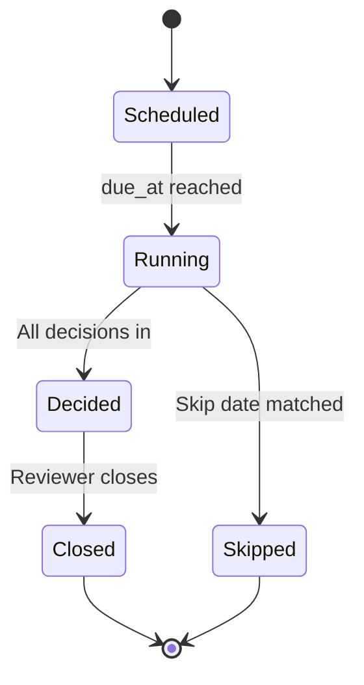
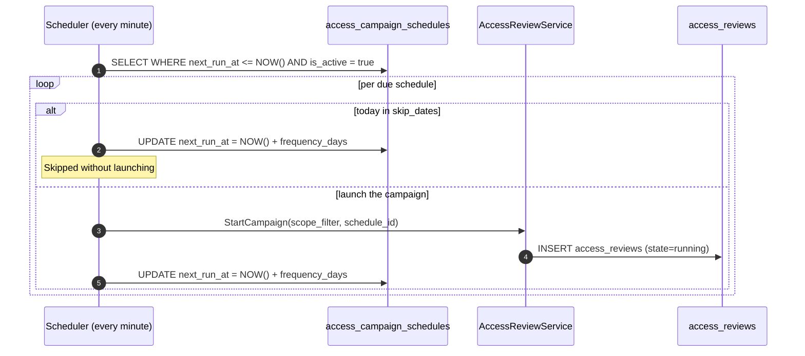
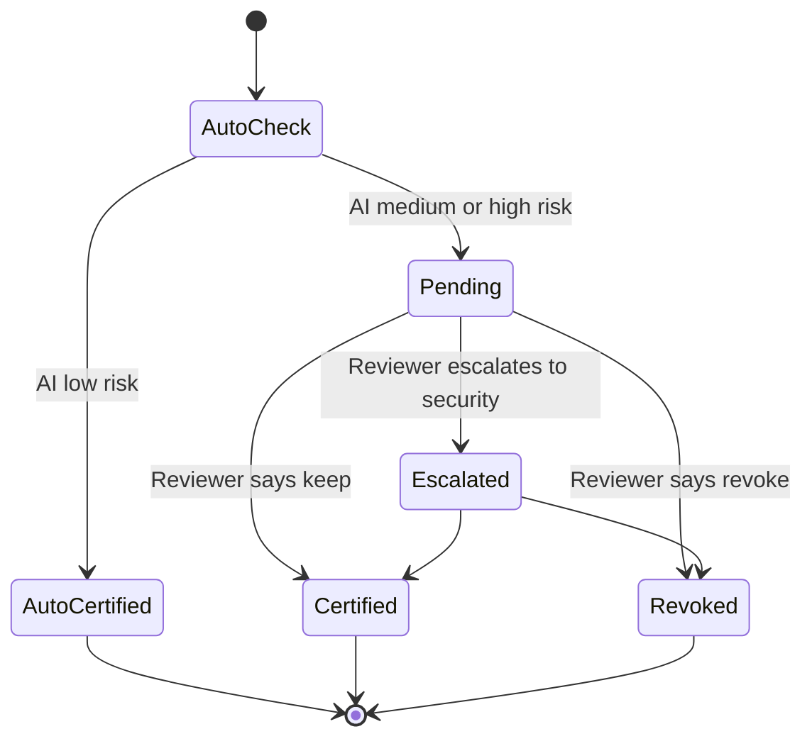
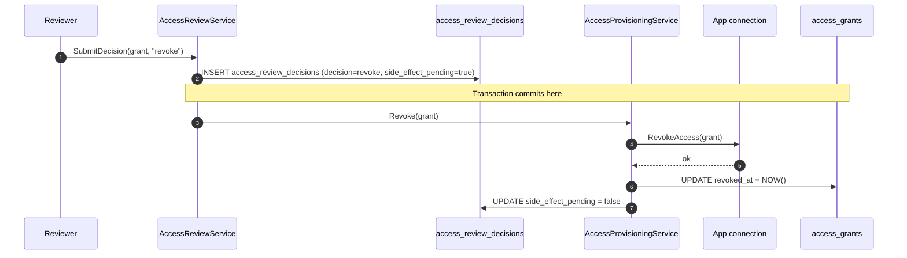

# Access Check-Ups: Continuous Certification Without the Spreadsheet

If you have ever sat in a quarterly access review meeting, you know the rhythm. Someone exports a CSV from a SaaS admin console. Someone else exports another CSV from the next SaaS. The CSVs get merged. The merged spreadsheet has 1,200 rows. Each row needs a decision — keep, revoke, escalate. The decisions get made over a half-day of "wait, who is this person?" and "I think they need this for the Acme project". The decisions get written back into ten different admin consoles by hand. The auditor accepts the screenshot of the spreadsheet as evidence. Everyone agrees never to do that again. Three months later, everyone does it again.

We call that workflow *the spreadsheet*. The product feature that replaces it is *access check-ups*. This post is the walkthrough.

## Why this matters

Three audit frameworks — SOC 2, ISO 27001, and most of the financial-services regulations — require periodic access reviews. The frequency varies (90 days is the most common, with some controls calling for 30-day cadence on high-risk systems). The shape is always the same: at a defined cadence, somebody confirms that everyone with access still needs it.

In small companies the reviews are painful for two reasons. First, the data is fragmented — every SaaS has its own admin console, with its own definition of "user" and "permission". Second, the reviewer is rarely the person who *granted* the access — they're a manager or a security lead with no memory of why a permission was originally given. The combination produces low-quality reviews and frustrated reviewers.

Access check-ups solve the fragmentation by collecting every grant from every app connection into one central campaign. They solve the no-memory problem by letting the AI auto-certify the low-risk grants — so the reviewer only sees the ones that need a real decision.

## The lifecycle of a check-up campaign

A campaign is a structured object with a defined start, a defined end, a set of decisions in between, and a metric trail.



- **Scheduled.** The campaign has been defined on a recurring schedule (every 90 days, every 30 days for sensitive systems, etc.) but has not yet started this run.
- **Running.** The campaign has launched. Grants are being enumerated. AI auto-certification is running. Reviewers are getting their decisions.
- **Decided.** Every grant has a decision. The campaign is ready to be closed.
- **Closed.** The campaign is final. The auto-revoke pass has executed any revoke decisions. The audit trail is sealed.
- **Skipped.** The scheduler advanced the next-run timestamp without launching the campaign, because today is in the campaign's skip-dates list (e.g. company-wide holiday weeks).

The campaign is the *Access check-up* in the SN360 language column. We use "access check-up" everywhere the user sees it; "access review" only appears in code identifiers and internal logs.

## Setting up a recurring campaign

In the admin UI, a new campaign starts with a wizard.

1. **What are we reviewing?** A scope filter. Examples: "every grant on Tier-1 cloud apps (AWS, Azure, GCP)", "every admin-level grant across the company", "every grant for the Engineering team", "every grant for resources tagged `sensitive`". The filter is a structured JSON document in `access_reviews.scope_filter`.

2. **How often?** A frequency in days (default 90, configurable through `ACCESS_REVIEW_DEFAULT_FREQUENCY`). The scheduler runs the campaign on this cadence, automatically.

3. **Who reviews?** The reviewer resolver. Most customers pick "manager of the granted user". Some pick "owner of the resource". The resolver runs at campaign-launch time, so reviewer assignments reflect current org structure.

4. **Auto-certify low-risk grants?** Default yes. The operator can disable per campaign.

5. **Skip dates.** Optional list of dates the campaign should be skipped (company-wide holiday weeks, end-of-fiscal-year freezes).

The wizard produces an `access_campaign_schedules` row. The scheduler picks it up.

## The scheduler

The scheduler is a cron-driven background worker — `CampaignScheduler` in `internal/cron/campaign_scheduler.go`. Its job is simple:



Skip dates ship in PR #20 as a JSON `YYYY-MM-DD` array on `AccessCampaignSchedule.SkipDates`. When today matches, the scheduler advances `NextRunAt` by `FrequencyDays` without launching a campaign.

This is the bit that makes "every 90 days" actually mean every 90 days. There is no human in the loop for the *starting* of a campaign. The campaign starts. The reviewer gets the notification. The review happens. Repeat.

## The decision flow

Once a campaign is running, every grant in scope gets exactly one decision. The decision lifecycle:



- **AutoCheck.** The first stop. The AI agent's `access_review_automation` skill is invoked. The skill returns either `certify` (low risk) or `escalate` (medium or high risk).
- **AutoCertified.** The grant is marked as certified by the platform. It does not appear in the reviewer's queue.
- **Pending.** The grant is in the reviewer's queue. The reviewer sees the grant, the user's recent activity on it, the access rule that grants it, and the AI's risk factors.
- **Certified.** The reviewer says keep. The grant continues unchanged.
- **Revoked.** The reviewer says revoke. The grant is queued for the auto-revoke pass.
- **Escalated.** The reviewer says "I'm not sure". The grant is routed to security review.

The reviewer's surface is one screen, with one decision per row, with a bulk-action shortcut. A typical campaign of 1,200 grants — with auto-certification at 80% — leaves about 240 grants for the reviewer. Decisions are typically two seconds per grant for the obvious ones, longer for the ones with AI-flagged factors. The whole campaign is reviewable in half an hour, not half a day.

## Auto-certification, in detail

The `access_review_automation` skill is the engine of the auto-certification. Its inputs:

- The grant being evaluated.
- The user's recent access patterns on the grant (when did they last use it, how often, from where).
- The user's current Team membership.
- The grant's risk factors (admin-level role, sensitive resource tag, exception-flagged status).

The skill returns one of two structured outputs:

```json
{ "decision": "certify", "reason": "Grant is recently used by a current Team member; resource not flagged sensitive." }
```

or

```json
{ "decision": "escalate", "reason": "Resource is tagged 'sensitive'; admin-level role; last used > 30 days ago." }
```

The wire-in is in `AccessReviewService.StartCampaign`. The skill runs synchronously for each grant during campaign launch. If the skill fails (the agent is unreachable), the grant lands as `pending` — the safe fallback. No grant is auto-certified defensively.

Operators can toggle auto-certification per resource category via `PATCH /access/reviews/:id` (PR #7). The toggle is also a workspace-level default — some customers want a human in the loop on every grant in their first quarter and then turn auto-certification on once they trust the AI's calibration.

## Revocation: from decision to action

A "revoke" decision is not the end of the story — the grant still needs to be reclaimed from the SaaS app. The platform handles this in two phases:

1. **Decision commit.** The reviewer's decision is written to `access_review_decisions` inside the campaign transaction. The grant's state is still `active` at this point; the decision is recorded but not yet executed.

2. **Auto-revoke pass.** A separate idempotent pass enumerates every `revoke` decision whose corresponding side-effect has not yet executed. For each one, it calls the access-provisioning service, which calls the app connection's `RevokeAccess`, which removes the seat from the SaaS app. The grant's row is updated with `revoked_at = NOW()`.



The two-phase pattern matters because the revoke side-effect can fail (network, transient SaaS outage, expired credentials). The decision row commits unconditionally; the side-effect is retried by the auto-revoke pass until it succeeds. The auditor's view is "the decision was certified by the reviewer at this timestamp, and the grant was revoked from the SaaS at this slightly later timestamp" — and that gap is observable.

Operators can call `POST /access/reviews/:id/auto-revoke` explicitly to drive the auto-revoke pass at campaign close. The pass is also part of the background reconciler.

## Campaign metrics

Every campaign exposes a metrics endpoint — `GET /access/reviews/:id/metrics` — that returns:

```json
{
  "total_decisions": 1247,
  "pending": 12,
  "certified": 187,
  "auto_certified": 1004,
  "revoked": 41,
  "escalated": 3,
  "auto_certification_rate": 0.806
}
```

The metrics are the campaign's executive summary. The two that matter most:

- **`auto_certification_rate`** — the fraction of decisions the platform made without a human. A healthy SME campaign sits between 60% and 90% auto-certification. Lower means the AI is over-cautious or the rules are too permissive; higher means the AI may be under-cautious. The operator monitors this as a quality metric.

- **`revoked`** — the count of grants the reviewer chose to revoke. A high count in the first campaign is healthy (you are catching the drift). A high count in the *fifth* campaign is a sign that something upstream is granting too much access — usually a too-permissive access rule that should be tightened.

The metrics are surfaced in the admin UI dashboard, in the per-campaign report, and in the API.

## Notifications

Reviewers don't poll the platform. The platform tells them when there's work to do. The notification system has four channels:

- **Email** via `EmailNotifier` over `net/smtp`. Configured through `NOTIFICATION_SMTP_HOST`.
- **Slack** via `SlackNotifier` over Incoming Webhook + Block Kit. Configured through `NOTIFICATION_SLACK_WEBHOOK_URL`.
- **In-app** — the reviewer's home screen shows pending decisions.
- **Web push** for the desktop client, via `WebPushNotifier` (push subscriptions stored in `push_subscriptions`, migration `010`).

All notifications are best-effort. Notification failures are logged but never roll back a campaign — campaign state always commits first; notifications are fired after the transaction (PHASES Phase 5). This is the same pattern as the rest of the platform: state of record commits before any external side-effect.

## A worked example

A 100-person company that has been on ShieldNet Access for six months. Their first quarterly campaign:

- **Scope.** Every active grant in the workspace. Approximate count: 1,250.
- **Auto-certify enabled.** Yes, default.
- **Reviewers.** Each grant's user's manager.

The campaign launches at 09:00 on a Monday. By 09:05, the AI has auto-certified 1,032 grants. By 09:10, the remaining 218 grants are queued for the 32 managers in the company; each manager sees an average of 6 grants in their inbox.

By Thursday, every manager has cleared their queue. The campaign has 187 certified, 1,032 auto-certified, 28 revoked, 3 escalated. The metrics dashboard shows the auto-certification rate at 82.6%.

The 28 revoked grants are queued for the auto-revoke pass. By Thursday afternoon, all 28 have been reclaimed from their respective SaaS apps; the next month's SaaS bill is correspondingly lower.

The auditor, asking for evidence of the quarterly review, gets a one-click export of the campaign metrics, the per-grant decision rows, and the corresponding audit-log entries. The whole quarterly access review takes the security lead less than two hours of personal time across the week.

## What a healthy campaign cadence looks like

A typical SME running ShieldNet Access at maturity:

- **Quarterly campaign** on every active grant. Auto-certify on. Default scope. Where most grants land.
- **Monthly campaign** on grants for resources tagged `sensitive`. Auto-certify off — every grant gets a human review.
- **Weekly campaign** on admin-level grants for cloud-infrastructure resources. Auto-certify off; reviewers are the resource owners.
- **Ad-hoc campaign** triggered by an incident — "review every grant for the user whose laptop was reported lost". One-time, scoped, run on demand.

The combination is what continuous certification means in practice. Routine grants get a routine review. High-risk grants get a frequent, careful review. Incidents trigger targeted reviews. The system is always making forward progress.

## Reference

- Service entry point: `internal/services/access/review_service.go::StartCampaign`, `SubmitDecision`, `CloseCampaign`, `AutoRevoke`, `GetCampaignMetrics`, `SetAutoCertifyEnabled`.
- Scheduler: `internal/cron/campaign_scheduler.go`.
- HTTP handler: `internal/handlers/access_review_handler.go`.
- Migrations: `internal/migrations/004_create_access_review_tables.go`, `005_create_access_campaign_schedules.go`, `010_push_subscriptions.go`.
- AI skill: `cmd/access-ai-agent/skills/access_review_automation.py`.
- Notifier adapter: `internal/services/access/notification_adapter.go`.
- Design contract: `docs/PROPOSAL.md` §5 and §7 (covers the AI integration), `docs/ARCHITECTURE.md` §6.

## What's next

If the spreadsheet is finally gone, the next thing to look at is the *daily* governance loop. [09 — From Request to Revoke](./09-request-to-revoke.md) covers the per-request lifecycle that complements the per-campaign certification rhythm. Together, the two surfaces — request and check-up — make sure both the *grants you're adding* and the *grants you already have* are governed continuously.

For the technical readers: the AI auto-certification path is part of the bigger AI story in [05 — AI-Powered Access Intelligence](./05-ai-powered-access-intelligence.md). The same A2A protocol that drives access-request risk scoring drives auto-certification — one fabric, multiple skills.

The big shift access check-ups create is cultural. Before, access reviews were a quarterly event you dreaded. After, they are a *continuous background process*. The spreadsheet is gone, the meeting is shorter, the auditor is happier — and the access drift never accumulates to begin with.
