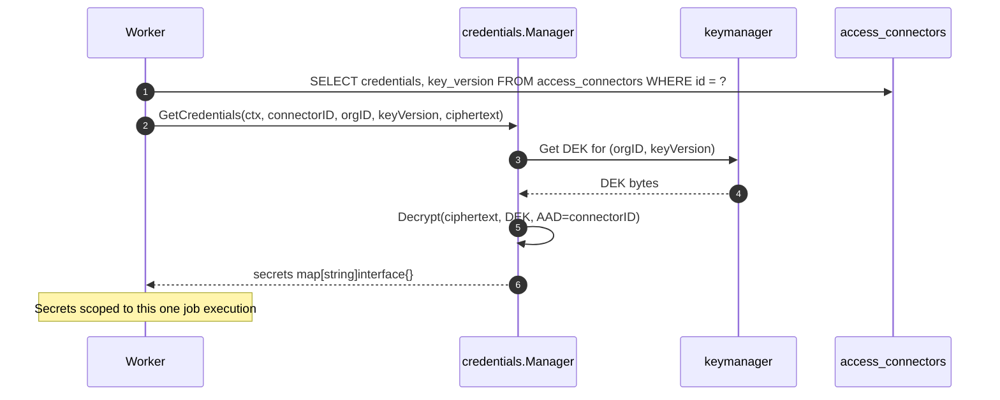
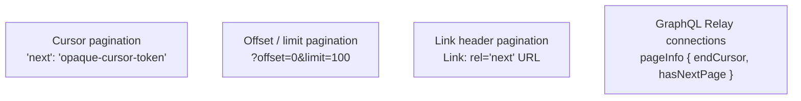

# The Connector Architecture: Building a Universal Access Fabric

Shipping the 200th app connection in our catalogue meant the framework around it had to work. A framework that works for ten connections often breaks for a hundred and definitely breaks for two hundred. Adding a new provider has to be *recipe-shaped work* — clear interfaces, predictable patterns, no cross-cutting surprises. If a connector takes a senior engineer a week, the catalogue cannot scale. If it takes them a day, it can.

This post is the technical deep dive on the connector architecture: the `AccessConnector` interface, the optional capability interfaces, the registry pattern, the credential model, the pagination strategies, and the idempotency contract. The audience is engineers who will read the Go source alongside the post — particularly partners building new connectors.

The user-facing column calls these *app connections*. The engineering column calls them *connectors*. We'll use both depending on which side of the boundary we're discussing.

## The principle: cross-cutting concerns live outside the connector

The first design decision was the boundary. A connector should know about *one* thing: how to talk to its provider. It should *not* know about:

- Credential storage (encryption, key management, rotation).
- Retries (transient failures, exponential backoff, dead-letter queues).
- Scheduling (full vs delta sync cadence, periodic refresh).
- Persistence (database transactions, tombstoning).
- Observability (metrics, traces, audit envelopes).

Those are all *platform* concerns. They live in the `access` service layer of `cautious-fishstick`. The connector is a stateless driver — give it credentials, ask it a question, get an answer or a structured error.

This means a new connector is roughly 500 to 1,500 lines of Go: an `init()` block, a `Validate` method, a `Connect` method, one or two pagination loops, and a handful of mappings from the provider's response shape to our canonical `Identity` and `Entitlement` types. The platform handles the rest.

## The AccessConnector interface

The contract is in `internal/services/access/types.go`. Edited for readability:

```go
type AccessConnector interface {
    // Lifecycle
    Validate(ctx, config, secrets) error
    Connect(ctx, config, secrets) error
    VerifyPermissions(ctx, config, secrets, capabilities) (missing []string, err error)

    // Identity sync
    CountIdentities(ctx, config, secrets) (int, error)
    SyncIdentities(ctx, config, secrets, checkpoint, handler) error

    // Access provisioning
    ProvisionAccess(ctx, config, secrets, grant AccessGrant) error
    RevokeAccess(ctx, config, secrets, grant AccessGrant) error

    // Access review
    ListEntitlements(ctx, config, secrets, userExternalID) ([]Entitlement, error)

    // SSO metadata
    GetSSOMetadata(ctx, config, secrets) (*SSOMetadata, error)

    // Credential metadata
    GetCredentialsMetadata(ctx, config, secrets) (map[string]interface{}, error)
}
```

Ten methods. Two of them (`Validate`, `Connect`) are the lifecycle entry points called by the wizard. One (`VerifyPermissions`) is the capability check called by the wizard. Two (`CountIdentities`, `SyncIdentities`) are the identity sync. Two (`ProvisionAccess`, `RevokeAccess`) are the provisioning RPCs. One (`ListEntitlements`) is the access-check-up support. The last two (`GetSSOMetadata`, `GetCredentialsMetadata`) are metadata accessors.

The failure semantics are spelled out in `docs/PROPOSAL.md` §2.1, but the highlights:

- **`Validate`** must not do network I/O. It is the format-and-shape check. Errors here are 4xx without ever touching the database.
- **`Connect`** does a network probe. Errors abort the row insert; the connector is never persisted in a half-configured state.
- **`ProvisionAccess`** and **`RevokeAccess`** are one-shot RPC-style operations. *They must be idempotent on `(grant.UserExternalID, grant.ResourceExternalID)`.* 4xx errors are permanent failures and are surfaced to the operator. 5xx errors are retried with exponential backoff.
- **`SyncIdentities`** is the streaming pagination loop. Pages are delivered to the handler. Returning a non-nil error from the handler aborts the sync.
- **`ListEntitlements`** is best-effort. Per-user failures do not fail the campaign.

### Canonical record shapes

The records are minimal:

```go
type Identity struct {
    ExternalID  string
    Type        IdentityType  // user | group | service_account
    DisplayName string
    Email       string
    ManagerID   string        // resolved post-import
    Status      string        // active | disabled | suspended
    GroupIDs    []string
    RawData     map[string]interface{}
}

type AccessGrant struct {
    UserExternalID     string
    ResourceExternalID string
    Role               string
    Scope              map[string]interface{}
    GrantedAt          time.Time
    ExpiresAt          *time.Time
}

type Entitlement struct {
    ResourceExternalID string
    Role               string
    Source             string   // direct | group | inherited
    LastUsedAt         *time.Time
    RiskScore          *int     // populated by AI agent later
}
```

Provider-specific extras go in `RawData`. Production connectors typically set `RawData` to nil for memory reasons — the platform layer mostly needs the canonical fields. The `RiskScore` field is left for the AI layer to fill in; the connector returns `nil`.

## Optional capability interfaces

Not every provider supports every capability. Some providers are SSO-only. Some have a delta sync, most don't. Some support inbound SCIM, some require provider-native APIs.

To avoid forcing every connector to stub out methods it can't implement, we use *optional capability interfaces*. The connector satisfies the base `AccessConnector`, and *additionally* satisfies one or more optional interfaces:

```go
type IdentityDeltaSyncer interface {
    SyncIdentitiesDelta(deltaLink string, handler func(batch, removedIDs, nextLink, finalDeltaLink) error) error
}

type GroupSyncer interface {
    CountGroups(ctx, config, secrets) (int, error)
    SyncGroups(ctx, config, secrets, checkpoint, handler) error
    SyncGroupMembers(ctx, config, secrets, groupID, handler) error
}

type AccessAuditor interface {
    FetchAccessAuditLogs(ctx, config, secrets, since time.Time, handler func(events) error) error
}

type SCIMProvisioner interface {
    PushSCIMUser(ctx, config, secrets, user SCIMUser) error
    PushSCIMGroup(ctx, config, secrets, group SCIMGroup) error
    DeleteSCIMResource(ctx, config, secrets, id string) error
}
```

The platform's worker code uses Go's type-assertion idiom:

```go
if syncer, ok := connector.(IdentityDeltaSyncer); ok {
    err = syncer.SyncIdentitiesDelta(deltaLink, handler)
} else {
    err = connector.SyncIdentities(checkpoint, handler)
}
```

The result is that adding a delta-sync capability to an existing connector is a pure addition — no breaking change to the base interface, no flag day across the catalogue. The optional interfaces are defined in `internal/services/access/optional_interfaces.go`.

## The registry pattern

The lookup pattern is the SN360 standard: a process-global `map[string]AccessConnector`, populated by `init()` blocks in each provider package.

```mermaid
flowchart TB
    subgraph PKG["Provider packages"]
        P1[microsoft/connector.go<br/>init() { Register('microsoft', &MicrosoftConnector{}) }]
        P2[okta/connector.go<br/>init() { Register('okta', &OktaConnector{}) }]
        P3[github/connector.go<br/>init() { Register('github', &GitHubConnector{}) }]
        P4[... 200 more]
    end

    subgraph BIN["cmd binaries"]
        B1[cmd/ztna-api/main.go<br/>_ 'microsoft'<br/>_ 'okta'<br/>_ 'github'<br/>...]
        B2[cmd/access-connector-worker/main.go]
        B3[cmd/access-workflow-engine/main.go]
    end

    subgraph REG["Global registry"]
        MAP[map string AccessConnector]
    end

    PKG -->|init() side-effect| MAP
    BIN -->|blank import| PKG
```

The registry primitives are `RegisterAccessConnector(provider string, c AccessConnector)` and `GetAccessConnector(provider string) (AccessConnector, error)` in `internal/services/access/factory.go`. The map is process-global. Lookups are by lowercased provider key (`"microsoft"`, `"google_workspace"`, `"okta"`).

The blank-import wiring in `cmd/ztna-api/main.go` looks like this:

```go
import (
    _ "cautious-fishstick/internal/services/access/connectors/microsoft"
    _ "cautious-fishstick/internal/services/access/connectors/google_workspace"
    _ "cautious-fishstick/internal/services/access/connectors/okta"
    _ "cautious-fishstick/internal/services/access/connectors/auth0"
    // ... 196 more
)
```

Every binary that needs a connector at runtime imports the package for its side-effect. We have three binaries that do — `ztna-api`, `access-connector-worker`, and `access-workflow-engine`. They share the same blank-import list.

### Testing the registry

Production code never re-registers. Tests legitimately swap registry entries — the pattern is in `internal/services/access/testing.go`:

```go
func SwapConnector(t *testing.T, provider string, c AccessConnector) {
    t.Helper()
    previous := getRegistry()[provider]
    setRegistry(provider, c)
    t.Cleanup(func() { setRegistry(provider, previous) })
}
```

This is the SN360 `t.Cleanup` pattern, copied verbatim. Tests that need to inject a mock connector call `SwapConnector(t, "microsoft", mock)`; the cleanup restores the previous instance at test end. There is also a `MockAccessConnector` that implements every method as a configurable stub for the common case.

## Credential management

Credentials are AES-GCM ciphertext at rest. The full chapter is `docs/PROPOSAL.md` §4; the implementation lives in `internal/pkg/credentials/manager.go`. The key rules:

- **Per-organisation data encryption key (DEK).** Fetched via `keymanager.KeyManager.GetLatestOrgDEK(orgID)`. The DEK is rotated independently of any individual credential.
- **AES-GCM AAD = connector ULID.** The AAD binds the ciphertext to its `access_connectors` row. Copy-pasting between connectors renders the ciphertext undecryptable.
- **Master key wraps the DEK.** The master key lives in a KMS-equivalent backend; the DEK is wrapped by it. Production uses cloud KMS; development uses a local `secrets.Manager`.
- **Lazy re-encryption on DEK rotation.** Each row records `key_version`. Old ciphertext stays readable; rotation does not require a synchronous re-encrypt pass.

At runtime:



Decrypted secrets are scoped to one job execution and never persisted to logs or metrics. `GetCredentialsMetadata` is called only during `Connect` and on demand by the renewal cron — so the platform never decrypts secrets just to know an expiry date.

### Failure modes

The credential layer has three failure modes worth knowing about:

- **Connect succeeds but encryption fails.** The row is never inserted. The operator gets a 500 with a sanitized error (no PII or token fragments).
- **Decrypt fails at job time.** The handler logs the connector ID and marks the job failed. The operator must rotate or reconnect.
- **DEK missing for a `key_version`.** The platform refuses to decrypt rather than degrade silently. Surfaces as a hard failure on the connector page.

The hard-failure-rather-than-degrade rule is the canonical SN360 stance: we never invent a credential, we never fall through to plaintext, we never operate on stale ciphertext.

## Pagination across 200 providers

The most-varied piece of work in a new connector is the pagination loop. Providers do not agree on a single pagination convention. We have seen at least four common shapes:



Plus various per-provider variants — Microsoft Graph's `@odata.nextLink`, OVHcloud's signed `next` URL, Alibaba's `Marker`/`IsTruncated`, Make's square-bracket `pg[offset]`/`pg[limit]`, Twilio's `nextPageUri`, GA4's `pageToken`. The connector implementation is just enough code to translate the provider's pagination idiom into a single platform-side callback that delivers a batch and a `nextCheckpoint`.

A representative loop, simplified:

```go
func (c *Connector) SyncIdentities(ctx context.Context, cfg, secrets map[string]any, checkpoint string, handler func(batch []*Identity, nextCheckpoint string) error) error {
    pageToken := checkpoint
    for {
        page, next, err := c.fetchUserPage(ctx, cfg, secrets, pageToken)
        if err != nil {
            return err
        }
        if err := handler(toIdentities(page), next); err != nil {
            return err
        }
        if next == "" {
            return nil
        }
        pageToken = next
    }
}
```

The shared utilities — HTTP client with retry, JSON envelope unmarshalling, request signing for AWS / OVH / Alibaba — live in `internal/services/access/connectors/_shared/`. Reusing them is the difference between a 500-line connector and a 1,500-line connector.

### Delta sync

For providers that expose a delta API (Microsoft Graph, Okta system log, Auth0 logs API), the connector additionally implements `IdentityDeltaSyncer`. The contract is:

- The handler is invoked once per provider page.
- The last page sets `finalDeltaLink` and an empty `nextLink`. Callers persist `finalDeltaLink` in `access_sync_state`.
- A 410 Gone from the provider MUST be returned as `access.ErrDeltaTokenExpired`. The service catches it, drops the stored delta link, and falls back to a full enumeration.

The 410-gone fallback is one of those rules you only appreciate the third time a provider expires a delta token without warning. Coding it as a sentinel error means every connector handles the case the same way.

## The idempotency contract

`ProvisionAccess` and `RevokeAccess` are one-shot RPCs *that must be idempotent*. The platform retries 5xx errors. If the first attempt timed out and the side-effect actually succeeded, the second attempt cannot create a duplicate.

The idempotency contract:

- **Key.** `(grant.UserExternalID, grant.ResourceExternalID)`. Same user, same resource, same role — same outcome on the provider side regardless of how many times the call fires.
- **Provision pre-flight.** Most connectors do a "does this grant already exist?" probe before issuing the create. If yes, the call returns success without re-creating. Cheaper than relying on the provider's 409 conflict response.
- **Revoke 404.** Treated as idempotent success. If the seat is already gone, the revoke succeeded; we just got to the call after someone else did.

The platform side guarantees the *intent* — "this grant should exist now" or "this grant should not exist now". The connector side guarantees the *outcome*. Retries are safe because the connector treats them as such.

## Adding a new connector — the recipe

For partners building new connectors, the bounded shape of work:

1. **Create the package.** `internal/services/access/connectors/<provider>/`. The directory name *is* the provider key (lowercased, snake_case).
2. **Implement `AccessConnector`.** The ten methods. Use the shared HTTP utilities. Use `RawData=nil` for production paths.
3. **Add the `init()` block.** `func init() { access.RegisterAccessConnector("<provider>", &Connector{}) }`.
4. **Blank-import in the three cmd binaries.** Add the line to `cmd/ztna-api/main.go`, `cmd/access-connector-worker/main.go`, `cmd/access-workflow-engine/main.go`.
5. **Write the lifecycle test.** `connector_flow_test.go` in the same package — Validate-without-network, Connect-with-mock-HTTP, SyncIdentities returning canonical Identities, ProvisionAccess + RevokeAccess idempotency check.
6. **Document the capabilities.** Add the connector row to `docs/LISTCONNECTORS.md`.

That is the recipe. A connector that follows it takes one to two days for a partner engineer who knows the provider's API. A connector that *doesn't* follow it ends up reinventing one or more of credential management, retry, scheduling, or pagination — and gets rejected in code review.

## Reference

- Base interface: `internal/services/access/types.go`.
- Optional interfaces: `internal/services/access/optional_interfaces.go`.
- Registry: `internal/services/access/factory.go`.
- Test helpers: `internal/services/access/testing.go`.
- Credential manager: `internal/pkg/credentials/manager.go`.
- Shared HTTP utilities: `internal/services/access/connectors/_shared/`.
- Connector catalogue: `docs/LISTCONNECTORS.md`.
- Design contract: `docs/PROPOSAL.md` §2–§4.

## What's next

The connector architecture is the *plumbing* under the user-facing 200+ app connections in [02 — 200+ App Connections](./02-200-app-connections.md). If you read the product post first and want to know what's actually happening when the wizard says "connected", the answer is the contract spelled out here.

For the runtime story — how a connector's `SyncIdentities` output ends up as a network-layer enforcement decision — read [03 — Inside the Zero Trust Overlay](./03-zero-trust-overlay.md). For the lifecycle story that calls `ProvisionAccess` and `RevokeAccess`, read [09 — From Request to Revoke](./09-request-to-revoke.md).

The single principle to take away: every connector is interchangeable from the platform's point of view. They all implement the same interface; they all participate in the same registry; they all get the same credential management, retry, and audit treatment. That uniformity is what lets a small team maintain a 200-connection catalogue.
