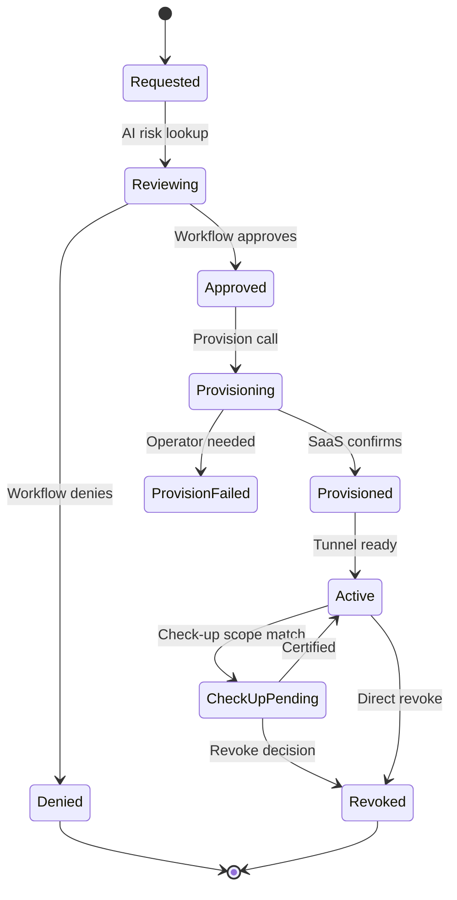
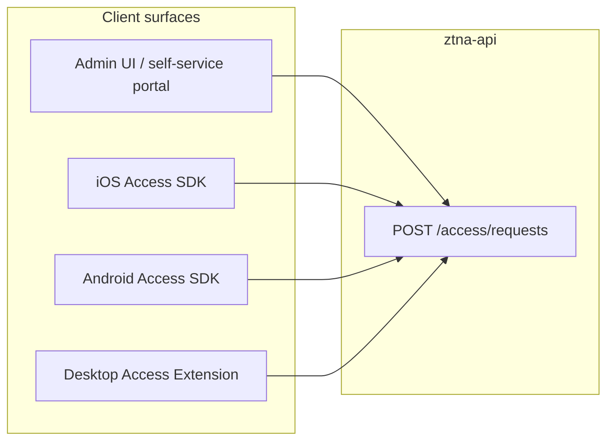
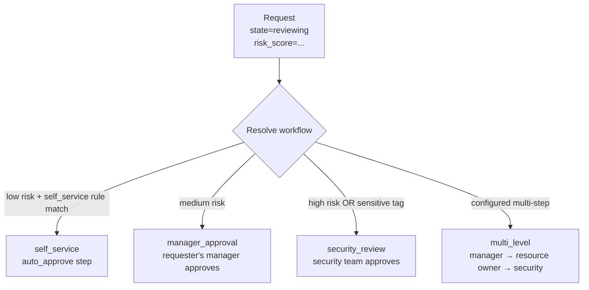
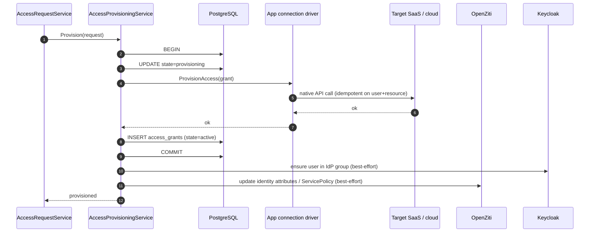

# From Request to Revoke: Making Access Governance Invisible

The end-state for an access governance product is *invisibility*. The user opens their laptop, asks for what they need, and gets it. The manager glances at a notification, approves with one tap, and moves on. The auditor opens a dashboard, sees a clean trail, and closes the tab.

What sits underneath that invisibility is a deterministic lifecycle — a state machine, a workflow router, a provisioning engine, and a client surface that meets users on web, iOS, Android, and the desktop. This post walks the whole journey from a single access request to its eventual revocation. It is a product post: we're focused on what the user sees, what the manager sees, what the auditor sees, and how those three views stay consistent.

The SN360 language is everywhere in this post. The user-facing column says "access request", "approval", "access check-up", "revoke". The engineering column has its own vocabulary — *access grant lifecycle state transition*, *access request FSM*, *provisioning service* — but we'll lean on the SN360 column except where the engineering term is genuinely clearer.

## The lifecycle in one diagram

Every access request takes the same trip through the same eight states.



The states are deliberately named for human readability. "Reviewing" is not "AI pending"; it is the moment the system is *thinking about* whether the request should proceed. "Active" is not "post-provisioning state with valid network identity"; it is the period when the user can actually use the access.

The state machine is implemented in `internal/services/access/request_state_machine.go`. It is a pure-logic FSM — no side effects, no I/O, no database calls. Side effects happen in the surrounding service layer; the FSM only validates that a proposed transition is allowed.

Why a state machine? Two reasons. First, audit. Every transition writes an `access_request_state_history` row with the from-state, the to-state, the actor, the reason, and the timestamp. The audit log *is* the state-history table. Second, recovery. If the platform crashes mid-flow, the state row tells the next process which step to resume from.

## Step 1 — Request

The flow starts when someone asks for something. The shape of the ask depends on the surface:

- **Web (Admin UI).** An access manager files a request on behalf of someone, or an end user files a request for themselves through the self-service portal.
- **iOS or Android Access SDK.** The host app — the company's mobile app — exposes a "Request access" affordance. The SDK calls `POST /access/requests` with the structured ask.
- **Desktop Extension.** The Electron-based desktop client has an IPC surface that the host app calls. The IPC handler calls the same REST endpoint.



Every surface speaks the same REST API. The clients are thin REST consumers — no business logic, no AI inference, no policy evaluation. The whole product surface is the same regardless of which device the user is on.

The request body has four fields the user fills in:

- The resource (e.g. "the production database", "the customer CRM", "the cloud admin console").
- The role (e.g. "read-only", "developer", "administrator").
- A justification (free text, optional for low-risk requests, required for high-risk).
- An end date (optional; ad-hoc grants get a sensible default; never granted indefinitely without an explicit decision).

The handler is `POST /access/requests` in `internal/handlers/access_request_handler.go`. It validates the body, resolves the requester from the JWT, and calls `AccessRequestService.CreateRequest`. The service inserts a row in `access_requests` with state = `requested`.

## Step 2 — Reviewing (AI risk lookup)

The moment the request lands, the system asks the AI agent for a risk level. The call is `aiclient.AssessRiskWithFallback` — best-effort, with a default of medium risk if the agent is unreachable.

The risk level is written back to `access_requests.risk_score` along with structured `risk_factors`. The request transitions to state `reviewing`. The state-history row records the AI's output as the reason.

This is the only place in the flow where the AI agent participates directly in the request path. Everything downstream — the workflow routing, the approval, the provisioning — is rule-based.

## Step 3 — Workflow routing

Once the risk level is set, the `WorkflowService.ResolveWorkflow` call decides which approval chain the request should travel.



Four workflow types are built in:

- **`self_service`** — auto-approve when there is an active access rule that already grants the requested role. Plus a sanity check that AI risk is low.
- **`manager_approval`** — single-step approval routed to the requester's manager, resolved through the SN360 manager-link pass.
- **`multi_level`** — multiple approvers in sequence (manager → resource owner → security).
- **`security_review`** — automatic routing for high-risk requests or resources tagged sensitive.

Workflows are configurable per workspace. A typical SME configuration: `self_service` for everyday SaaS requests, `manager_approval` for elevated access, `security_review` for cloud admin or any resource tagged sensitive.

When the workflow type is decided, the request is handed off to the workflow engine. The engine writes step rows to `access_workflow_step_history` (migration `009`), notifies the approvers, and waits.

## Step 4 — Approval (or denial)

The approvers see the request in their queue. The queue surface depends on where they spend their day:

- **Slack.** A Block Kit message with "Approve" and "Deny" buttons. Configured through `NOTIFICATION_SLACK_WEBHOOK_URL`. Approving from Slack writes the same audit-log row as approving from the web UI.
- **Email.** A structured message with magic-link approve / deny buttons. Configured through `NOTIFICATION_SMTP_HOST`.
- **Admin UI.** The classic approval inbox. One row per pending request.
- **Mobile / desktop.** The host app surface, through the Access SDK. Push notifications drive the prompt.

Approval is `POST /access/requests/:id/approve`. The handler is `internal/handlers/access_request_handler.go`; the service method is `AccessRequestService.ApproveRequest`. The request transitions to `approved`. The audit-log row captures the approver, the timestamp, and any comment.

Denial is the inverse — `POST /access/requests/:id/deny`. The request transitions to `denied`, which is terminal. The requester gets a notification with the deny reason.

Cancellation is `POST /access/requests/:id/cancel`. Available to the requester at any state before `provisioning`. Useful when the user realises they didn't actually need the access.

## Step 5 — Provisioning

Once approved, the request transitions to `provisioning` and `AccessProvisioningService.Provision` runs. The provisioning is atomic against the database and idempotent against the app connection.



Three things happen in a defined order:

1. The connector pushes the permission out to the SaaS app. This is the actual side-effect that matters — the user can now sign in to Slack, see the channel, push to GitHub, query the cloud console.
2. The grant row is inserted in the database. This is the moment the platform considers the access *real*.
3. Best-effort propagation to Keycloak (group membership) and OpenZiti (identity attributes, service-policy effective set). Failures here are surfaced as warnings on the grant but never roll back step 1 or step 2.

The atomicity rules are spelled out in `docs/overview.md` §5. The connector retry policy is in `docs/overview.md` §2.1 — 4xx errors are permanent, 5xx errors are retried with exponential backoff.

If provisioning fails permanently, the request transitions to `provision_failed`. This is the only state in the lifecycle that requires operator intervention — usually a credential rotation on the connector or a permission scope change.

## Step 6 — Active

Once provisioning has completed, the request transitions to `active` and the corresponding `access_grants` row is the canonical record of the live entitlement. The user has the access. The audit log has the full chain of approvals.

The active phase is the longest in the lifecycle. A grant might be active for hours (a temporary contractor access), weeks (a project assignment), months (a permanent role), or years (a standing entitlement). Throughout the active phase:

- The grant's `last_used_at` is updated by signals from the underlying app connection and the OpenZiti overlay.
- The anomaly-detection skill scans the grant periodically. Unusual usage — sudden volume, off-hours, unused-high-privilege — produces an anomaly record that can prompt an early check-up.
- Any access rule change that affects this grant triggers a re-evaluation.

## Step 7 — Access check-up

At some point the grant comes up in an access check-up campaign. The campaign mechanics are covered in [07 — Access Check-Ups](./07-access-checkups.md); the lifecycle effect is what we care about here.

The campaign's per-grant decision flows back into the request lifecycle:

- **Certified.** The grant returns to `active` unchanged.
- **Revoked.** The grant moves to `revoked` (described in step 8).
- **Escalated.** A new request row is created with a `security_review` workflow type. The original grant stays active until that new request is decided.

The state-history row for the check-up decision records the campaign ID, the reviewer, the AI's input if auto-certified, and the rationale.

## Step 8 — Revoke

The terminal state. Three paths lead here:

1. **Check-up revoke.** The reviewer explicitly chose revoke during a campaign.
2. **Leaver flow.** The user was deactivated in the company directory. The JML service revokes every active grant for that user.
3. **Direct revoke.** An operator manually revokes from the admin UI ("we just lost the device, revoke everything for that grant").

The mechanics are the inverse of provisioning:

```mermaid
sequenceDiagram
    autonumber
    participant CALLER as Caller
    participant APS as AccessProvisioningService
    participant CON as App connection
    participant SAAS as Target SaaS
    participant DB as PostgreSQL

    CALLER->>APS: Revoke(grant)
    APS->>DB: UPDATE state=revoking
    APS->>CON: RevokeAccess(grant)
    CON->>SAAS: native revoke (idempotent; 404 = already gone)
    SAAS-->>CON: ok
    APS->>DB: UPDATE access_grants SET revoked_at = NOW()
    APS->>DB: UPDATE state=revoked
```

The connector's `RevokeAccess` is idempotent. A 404 from the SaaS is treated as success — if the seat is already gone, the revoke succeeded. The grant row is updated with `revoked_at = NOW()`. The state moves to `revoked`. Audit log captures the trigger (check-up, leaver, direct), the actor, the timestamp.

The user loses the access on the next token refresh on the underlying overlay — typically within minutes. There is no "the user keeps the access until they log out" gap.

## What the user sees

Across surfaces, the user experience is consistent. The request flow:

1. **iOS host app, lock screen.** "You need access to Production Database?" — the user taps the deep link. The Access SDK opens the request form.
2. **Form.** Resource picker, role picker, justification text box. The picker shows resources the user can *currently see* (the system never shows a resource the user has no path to). Three taps to submit.
3. **Notification.** "Request submitted. Risk: medium. Routed to your manager." The Access SDK polls or subscribes for state changes.
4. **Approval notification.** "Request approved by Maria Lopez. Provisioning…" Another state change.
5. **Active notification.** "Access ready. Open Production Database." The Access SDK exposes a deep-link to the resource — opening it triggers the OpenZiti tunnel through the SDK's tunneler.

The web surface looks similar: same fields, same flow, same notifications. The desktop extension is the same as iOS/Android with a slightly larger surface area for the request form.

## What the manager sees

The manager's job is to make decisions, not to learn a product. Their surface is one row per pending request, with everything they need on the row: who is asking, what they're asking for, the AI's risk level and factors, the requester's current Team membership, the justification, and two buttons — approve, deny. A manager who lives in Slack sees the same row as a Block Kit message with buttons inline; a manager who lives in email sees a magic-link approve/deny. The decision they make is the same one regardless of surface. The manager never has to touch the platform's vocabulary — they see "Maria is asking for access to the production database. The AI says this is medium risk because the resource is tagged sensitive. Approve or deny?".

## What the auditor sees

The auditor's view is the `access_requests` table joined to `access_request_state_history`, exposed through a reporting endpoint. For every request:

- The requester, the resource, the role, the justification.
- The AI's risk score and factors.
- Every state transition with the actor and the timestamp.
- The approver (or chain of approvers, for multi-level workflows).
- The provisioning result and the granted entitlement.
- Any subsequent check-up decisions and the eventual revocation.

The same data drives the executive dashboards: average time-to-approval, auto-approval rate, denial rate by workflow type, mean time-to-revoke after deactivation. The auditor reads them as governance metrics; the operator reads them as quality metrics.

## SN360 language alignment

Every public-facing string in the admin UI, mobile SDKs, desktop extension, and audit log uses the SN360 column from `docs/overview.md` §8 — "access" instead of "access grant", "turn the rule on" instead of "promote draft policy", "company directory" instead of "identity provider", "auto-sync users" instead of "SCIM provisioning", "risk level" instead of "risk score", "access check-up" instead of "access certification campaign", "app connection" instead of "connector". The translation table is enforced by a CI check that grep's user-facing message keys for the engineering vocabulary.

## Reference

- State machine: `internal/services/access/request_state_machine.go`.
- Request service: `internal/services/access/request_service.go`.
- Workflow service: `internal/services/access/workflow_service.go`.
- Provisioning service: `internal/services/access/provisioning_service.go`.
- HTTP handlers: `internal/handlers/access_request_handler.go`, `access_grant_handler.go`.
- State history: `internal/migrations/002_create_access_request_tables.go`.
- Workflow engine: `cmd/access-workflow-engine/main.go`, `internal/services/access/workflow_engine/*.go`.
- Design contract: `docs/overview.md` §5; flow diagram in `docs/architecture.md` §4.

## What's next

The request-to-revoke flow is the *daily* surface of the platform. The other half of the governance loop — the *cumulative* surface — is the access check-up workflow in [07](./07-access-checkups.md). Together, the two flows make sure the access state of the company is always accurate, every day and every quarter.

If you want to see how a request's risk score actually gets produced, read [05 — AI-Powered Access Intelligence](./05-ai-powered-access-intelligence.md). If you want to see how the leaver flow that revokes a user's grants is itself driven by directory events, read [06 — Automating the Employee Lifecycle](./06-jml-automation.md).

The takeaway: access governance becomes invisible when the lifecycle is deterministic, the workflow is automated, and the surface is consistent across every device a user might hold. That is the experience we build for. The state machine is in the background; the user just sees the access show up when they need it and disappear when they don't.
