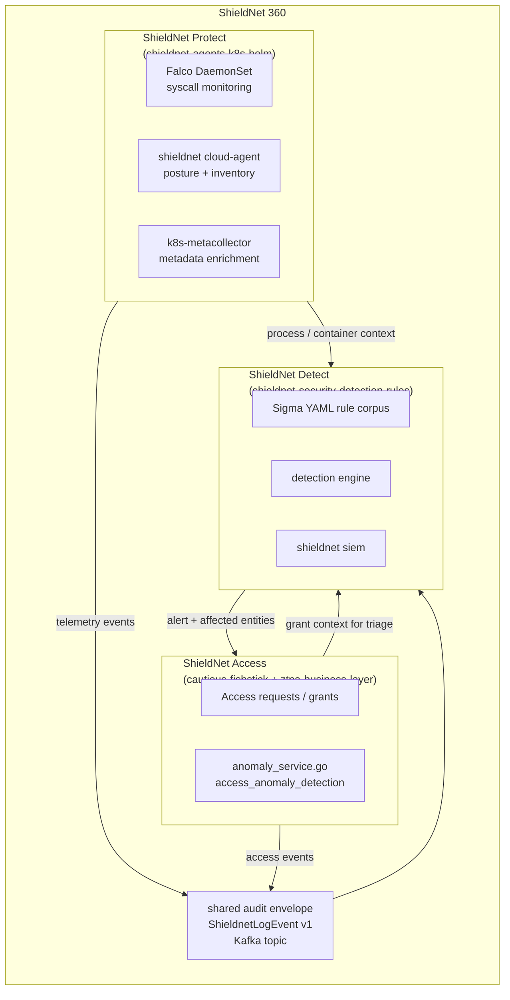
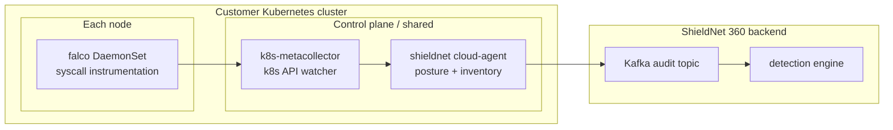
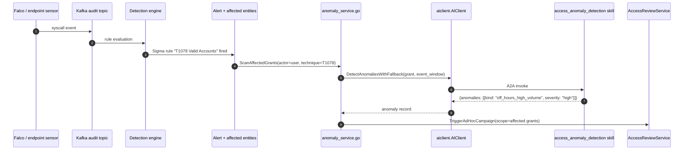

# Runtime Detection Meets Access Control: Closing the Loop with ShieldNet 360

ShieldNet Access does one job well: it answers *who can do what*. That answer is necessary, but it is not sufficient for an end-to-end security posture. You also need to know *what is happening on the things people use* (endpoint and cloud detection) and *is something bad happening right now* (SIEM and detection rules). Those are the other two pillars of ShieldNet 360 — ShieldNet Protect and ShieldNet Detect.

The interesting part is not that the three pillars exist; lots of products bundle the categories. The interesting part is the *closed loop* between them. A detection rule fires in ShieldNet Detect. An anomaly model in ShieldNet Access notices the affected user is doing something unusual with their grants. The access-revocation path in ShieldNet Access fires automatically — same lifecycle, same audit trail. The user's session is cut off before the human responder has finished reading the alert.

This post is the technical deep dive on that closed loop. It covers the Sigma-rule format we use for detection, the Falco-based K8s runtime architecture from `shieldnet-agents-k8s-helm`, the anomaly-detection bridge in `cautious-fishstick`, and the audit envelope that ties the three pillars together.

## The three pillars in one diagram



Three observations:

- All three pillars publish to a *shared* audit envelope. The schema is `ShieldnetLogEvent v1`, the transport is Kafka, the topic is partitioned by tenant.
- The detection engine in ShieldNet Detect is the *consumer* — it reads from the audit topic and applies the rule corpus.
- The closed loop is a *bidirectional* relationship. Detect signals into Access for the revoke path; Access signals into Detect for the grant-context-during-triage path.

## Detection rules: Sigma YAML

The detection rule corpus is in `shieldnet-security-detection-rules`. Rules are written in [Sigma YAML](https://sigmahq.io/), the de facto standard format for portable detection rules.

A representative rule:

```yaml
title: Suspicious access to production database from non-engineering team member
id: 2f3a... # ULID
status: stable
description: |
  Fires when an access event records a member of a non-engineering Team
  accessing prod-db-* resources. Correlates network-overlay event with
  the current Team membership of the actor.
references:
  - https://attack.mitre.org/techniques/T1078/
author: shieldnet360-detection-engineering
date: 2025-02-15
modified: 2025-08-01
tags:
  - attack.t1078        # Valid accounts
  - attack.persistence
  - shieldnet.access
logsource:
  category: access
  product: shieldnet-access
detection:
  selection:
    event.kind: connection_established
    target.resource_tag: "prod-db"
  filter:
    actor.team_attribute: "engineering"
  condition: selection and not filter
fields:
  - actor.user_id
  - actor.team_attribute
  - target.resource_external_id
  - event.timestamp
falsepositives:
  - On-call engineer with temporary access via a sealed glass-break request.
  - Member moved teams in the last hour and the cached attribute is stale.
level: high
```

The rule shape is standard Sigma — `logsource` to pick the source, `detection` to define the match condition, `falsepositives` to document expected exceptions. What is custom is the `logsource.product: shieldnet-access` — it tells the detection engine to apply this rule against access events specifically.

### MITRE ATT&CK mapping

Every rule is tagged with one or more MITRE ATT&CK technique IDs. The mapping is part of the schema; the detection-rules repo has a CI check that fails if a rule lacks an ATT&CK tag. The mapping serves two purposes:

- **Coverage reports.** "What ATT&CK techniques are we detecting?" is a one-query answer against the rule corpus.
- **Cross-pillar correlation.** When a rule fires, the alert carries the technique ID, and other pillars can use that for context — e.g. the access anomaly model upweights its risk score for grants belonging to actors recently associated with T1078 (Valid Accounts).

### Multi-platform coverage

The rule format is platform-agnostic but the rules themselves target a specific log source. The corpus is organised:

- **Windows endpoint.** ETW event channels, Sysmon events, PowerShell scripted execution.
- **Linux endpoint.** auditd, AppArmor / SELinux events, syslog.
- **Kubernetes runtime.** Falco events (syscalls inside containers).
- **Cloud.** AWS CloudTrail, Azure Activity Log, GCP Cloud Audit Logs.
- **ShieldNet Access.** Access events from `cautious-fishstick` (requests, grants, revocations, anomaly signals).

The unified detection-engine pipeline normalises every source into the `ShieldnetLogEvent v1` envelope before rule evaluation. The rule author writes against the normalised event shape, not against the raw source — which is what makes the corpus portable across log sources of the same category.

## K8s runtime security: Falco + cloud-agent + metacollector

The Kubernetes runtime tier of ShieldNet Protect runs three components. They're deployed by the `shieldnet-agents-k8s-helm` chart.



### Falco

A DaemonSet that runs on every node and instruments the kernel via eBPF (or the kernel module, depending on environment). Falco produces structured events for syscalls, file opens, network connections, container starts, and so on. The default ruleset covers the obvious badness (a reverse shell in a container, an unexpected `setuid`, `/etc/passwd` reads from a workload that has no business doing them); customer rules extend it.

The Falco event stream is rich but raw — it talks about PIDs, container IDs, and node names. Useful for forensics; not directly actionable for an analyst until it is enriched.

### k8s-metacollector

A second DaemonSet (or in our chart, a single deployment with a worker-per-node) that watches the Kubernetes API server and produces a real-time mapping of `(container ID) → (pod, namespace, owner workload, owner labels)`. The metacollector pushes the mapping into a sidecar that joins Falco events at the source.

The result is that Falco events arriving at the audit topic already carry their semantic context — *what pod did this happen in, which deployment owns it, what labels does it have*. The detection rules can fire on the labels (`label.tier=production`) instead of the IDs (`container_id=abc123...`).

### cloud-agent

A single deployment per cluster. Two responsibilities:

- **Cluster posture.** Periodic CIS-style checks, RBAC misconfiguration detection, NetworkPolicy completeness, etc. Posture findings are published to the audit topic with a structured score.
- **Inventory.** A current snapshot of cluster contents — namespaces, workloads, images, exposed services — published on a heartbeat. The inventory is what powers the "what resources do you have" view in the ShieldNet Access marketplace.

The cloud-agent is the *opinion* component. It reads the same events Falco produces but it makes recommendations — "this deployment runs as root", "this service is exposed without a NetworkPolicy" — that an analyst can act on.

## The bridge: access anomaly detection

The bridge between detection and access is the access anomaly detection skill (`access_anomaly_detection`), wired through `internal/services/access/anomaly_service.go`. It is the path that takes a detection event — fired by a Sigma rule against a runtime log source — and translates it into a candidate access action.



The translation happens in three steps:

1. **Identify affected grants.** Given the alert's actor (a user ID), enumerate the active grants for that user. The anomaly scan runs over each grant.
2. **Compute anomaly signals.** The skill produces structured anomaly records — off-hours usage, geographic outlier, sudden high-volume access, unused-high-privilege grants. The detection event is one input among several.
3. **Trigger an ad-hoc access check-up.** A targeted campaign is opened with the affected grants in scope. The campaign is high-priority — the reviewer is notified through every configured channel.

The skill itself runs heuristic detectors *alongside* the LLM call. The heuristics produce numeric thresholds (a cross-grant baseline histogram with a sigma threshold; off-hours boundaries from the workspace's business-hours config; geographic-outlier detection from a haversine distance against the user's recent location history); the LLM produces the narrative explanation that the reviewer reads. The split is the same one in the rest of the AI fabric — deterministic numbers from code, natural-language explanation from the model.

## The audit envelope: ShieldnetLogEvent v1

Three pillars publishing to one envelope only works if the envelope is well-defined. The schema is:

```json
{
  "schema_version": "v1",
  "tenant_id": "01J...",
  "event_id": "01K...",
  "event_kind": "access.request.created | falco.syscall | detection.rule_fired | ...",
  "occurred_at": "2026-05-11T06:49:00Z",
  "received_at": "2026-05-11T06:49:01Z",
  "actor": {
    "type": "user | service | system",
    "user_id": "01L...",
    "team_attributes": ["engineering"]
  },
  "target": {
    "type": "resource | workload | host | rule",
    "external_id": "prod-db-01",
    "tags": ["sensitive", "production"]
  },
  "context": {
    "source_pillar": "access | protect | detect",
    "source_component": "request_service | falco_daemonset | detection_engine",
    "request_id": "...",
    "trace_id": "..."
  },
  "payload": { ... }                       // pillar-specific, with a schema_url
}
```

The envelope itself is small and uniform. The pillar-specific `payload` references a separate JSON schema URL so consumers can validate without knowing the producer in advance. The Kafka topic is partitioned by `tenant_id`, which gives single-tenant ordering guarantees within the pillar's events.

The envelope is the same `ShieldnetLogEvent v1` schema the rest of ShieldNet 360 has been using for several years. Reusing it for access events was a non-trivial integration win — every existing consumer of the topic already knew how to handle the envelope; we only had to add the new `event_kind` values for the access flows.

## Closing the loop: a full example

Picture the following sequence, every step real, every step audited:

1. **Detection.** A Falco sensor on a production K8s node fires on an unexpected `setuid` in a workload. The event lands on the audit topic.
2. **Rule evaluation.** A Sigma rule fires — "T1548 Abuse Elevation Control Mechanism" matched. The alert carries the actor (a service account, with the human owner resolved through the workload labels), the target workload, and the technique ID.
3. **Cross-pillar query.** The detection engine queries `cautious-fishstick` for the actor's active grants. The response is a structured list — "this user has access to prod-db-01 (admin), prod-api-01 (deploy), prod-secrets-01 (read)".
4. **Anomaly check.** The `access_anomaly_detection` skill runs against each grant. The off-hours detector flags one — prod-secrets-01, accessed three times in the last 20 minutes outside the user's normal pattern.
5. **Ad-hoc check-up.** A high-priority access check-up campaign is opened with prod-secrets-01 grant in scope. The reviewer — the workspace's security lead — gets a Slack notification with the alert context and the grant details.
6. **Decision.** The security lead revokes the grant. The standard revoke path executes: `RevokeAccess` on the connector, `revoked_at` written, the OpenZiti `ServicePolicy` updated.
7. **Tunnel torn down.** Within minutes (the OpenZiti heartbeat interval), any active tunnel for that grant is closed. The user's session loses access to prod-secrets-01 mid-flow.
8. **Audit envelope.** Every step above produced a `ShieldnetLogEvent v1`. The full chain — detection event, rule firing, anomaly record, campaign creation, revoke decision, side-effect — is a single auditable timeline.

End-to-end elapsed time, with auto-routing enabled, is typically two to five minutes from detection to revocation. The human responder's job is the *decision* in step 6; everything else is mechanical.

## Reference

- Detection rules: `shieldnet-security-detection-rules/` — Sigma corpus, MITRE-tag CI check, schema versioning.
- K8s deployment: `shieldnet-agents-k8s-helm/` — Falco DaemonSet, cloud-agent deployment, metacollector worker.
- Anomaly bridge: `cautious-fishstick/internal/services/access/anomaly_service.go`.
- AI skill: `cautious-fishstick/cmd/access-ai-agent/skills/access_anomaly_detection.py`.
- AI fallback wrapper: `cautious-fishstick/internal/pkg/aiclient/fallback.go::DetectAnomaliesWithFallback`.
- Audit envelope: shared `ShieldnetLogEvent v1` schema in the `shieldnet360-backend` repo.
- Lifecycle revoke path: `cautious-fishstick/internal/services/access/provisioning_service.go::Revoke`.

## What's next

This is the last post in the series. The technical readers who have followed all eleven posts have walked through the access governance product end-to-end: the master intro in [00](./00-introducing-shieldnet-access.md), the business case in [01](./01-why-smes-need-zero-trust.md), the product surface in [02](./02-200-app-connections.md) / [04](./04-access-rules-safe-test.md) / [07](./07-access-checkups.md) / [09](./09-request-to-revoke.md), and the architecture deep dives in [03](./03-zero-trust-overlay.md) / [05](./05-ai-powered-access-intelligence.md) / [08](./08-connector-architecture.md) — and now this post, which puts ShieldNet Access in the broader ShieldNet 360 picture.

The closing thought: the access governance pillar is only as valuable as the *signals it receives* and the *actions it can take*. ShieldNet 360 supplies both. The detection signal in ShieldNet Detect tells you *something is wrong*; the access lifecycle in ShieldNet Access lets you *do something about it*. The closed loop is what turns the platform from a set of dashboards into a real-time security posture.

If you are evaluating ShieldNet Access as a standalone product, the answer is "yes — it works on its own, and it is the right product for the access-governance pillar at SME scale". If you are evaluating it as part of ShieldNet 360, the answer is "the integration is the point — every pillar gets more useful when it can borrow the others' context".

Either way, the architecture is the same. Cross the boundary on the audit envelope. Use the SN360 language column on the public surface. Keep the AI as decision-support, never as a gatekeeper. And make sure every code path that touches a side-effect — provision, revoke, ServicePolicy, OpenZiti — has the same atomicity, idempotency, and audit story.

That is the closed loop. Thanks for reading.
