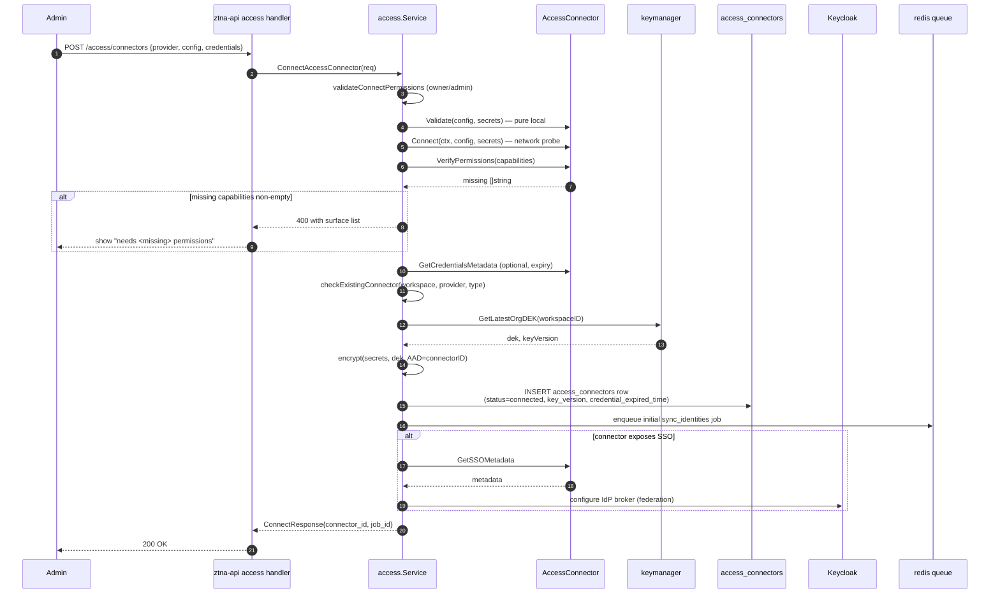
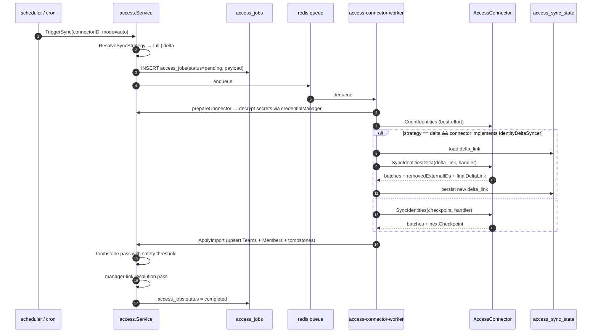
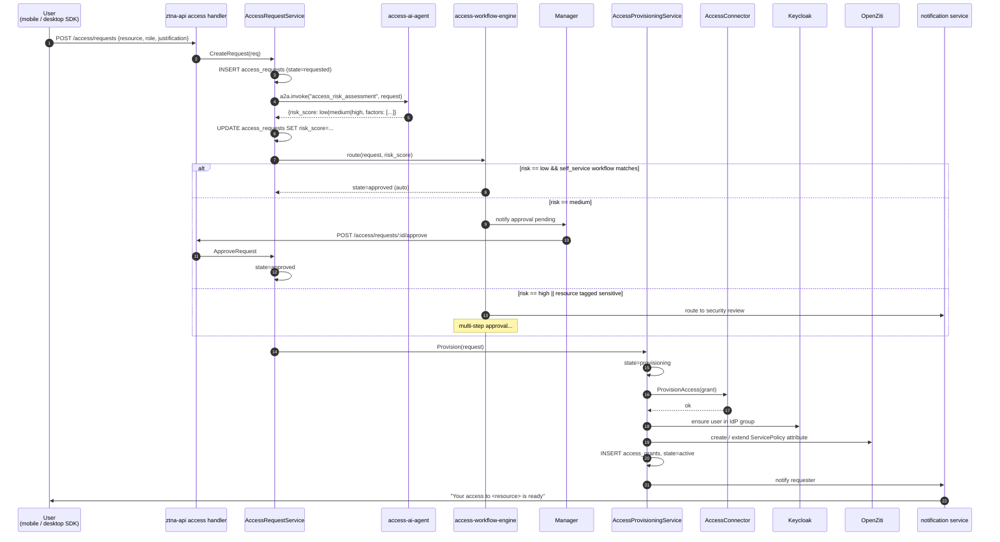
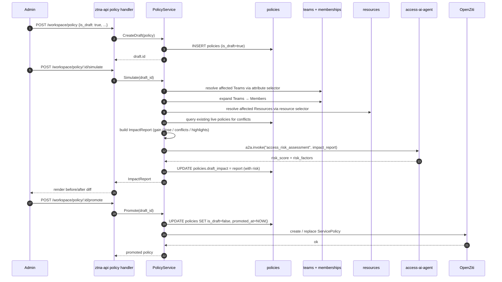
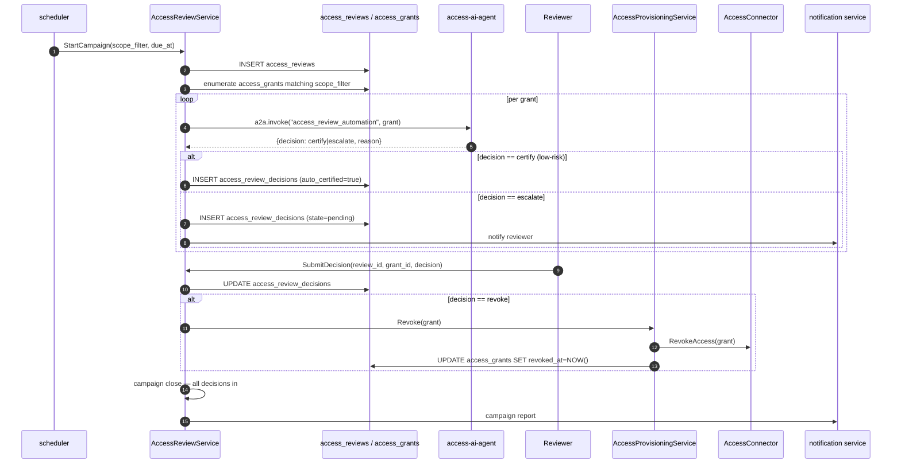
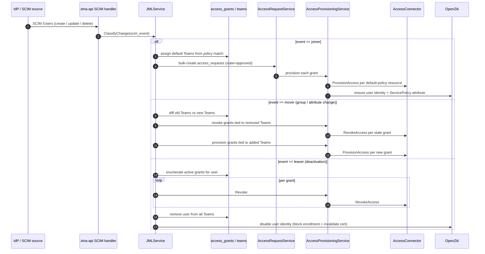
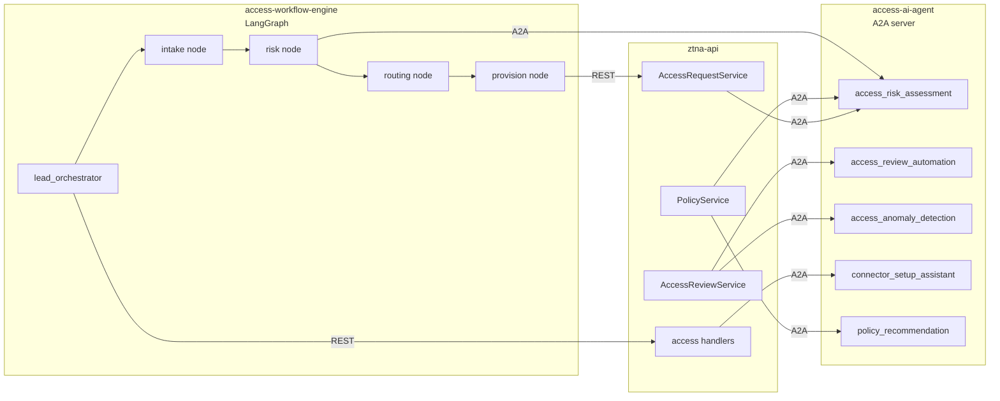
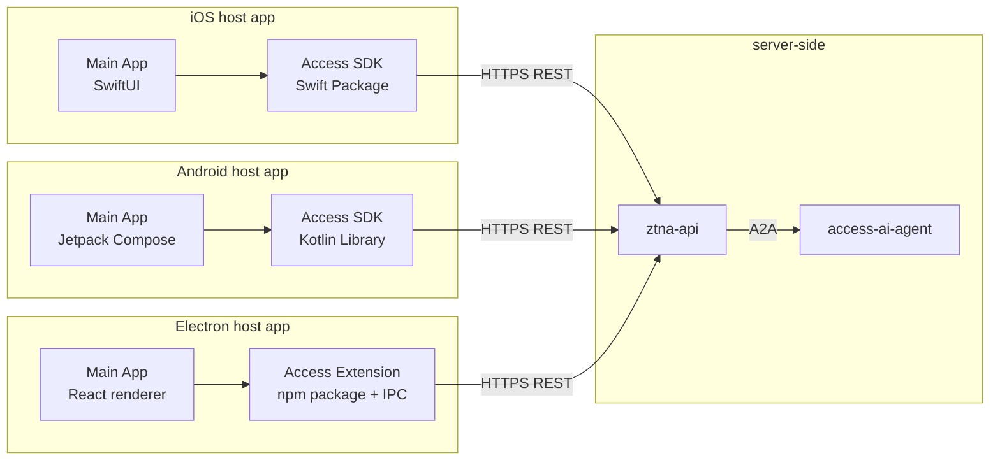

# ShieldNet 360 Access Platform — Architecture & Data Flow

This document captures the *target* architecture for the access platform. It is aspirational (what we are building) rather than descriptive — see `PROGRESS.md` for what is and isn't implemented yet. For the design contract see `PROPOSAL.md`.

The diagrams below use Mermaid and intentionally avoid colors so they render identically across GitHub, VS Code, and most IDE preview panes.

---

## 1. High-level component map

```mermaid
flowchart LR
    subgraph Browser
        UI[Admin UI<br/>React / Next.js]
    end

    subgraph Mobile
        IOS[iOS App + Access SDK]
        AND[Android App + Access SDK]
    end

    subgraph Desktop
        DESK[Electron App + Access Extension]
    end

    subgraph ZTNAAPI["ztna-api<br/>Go service"]
        AH[access handlers]
        PH[policy handlers]
        SVC[access service]
        PSVC[policy service]
        REG[(access connector registry<br/>process-global map)]
        SVC -->|GetAccessConnector provider| REG
    end

    subgraph Connectors["internal/services/access/connectors"]
        M365[microsoft/]
        GW[google_workspace/]
        OKTA[okta/]
        AUTH0[auth0/]
        SAML[generic_saml/]
        OIDC[generic_oidc/]
        DUO[duo/]
        ONEPW[onepassword/]
        LASTPW[lastpass/]
        PING[ping_identity/]
        AWS[aws/]
        AZURE[azure/]
        GCP[gcp/]
        CF[cloudflare/]
        TS[tailscale/]
        DO[digitalocean/]
        HEROKU[heroku/]
        VERCEL[vercel/]
        NETLIFY[netlify/]
        VULTR[vultr/]
        LINODE[linode/]
        OVH[ovhcloud/]
        ALIBABA[alibaba/]
        CSIGMA[cloudsigma/]
        WASABI[wasabi/]
        SLACK[slack/]
        MSTEAMS[ms_teams/]
        ZOOM[zoom/]
        NOTION[notion/]
        ASANA[asana/]
        MONDAY[monday/]
        FIGMA[figma/]
        MIRO[miro/]
        TRELLO[trello/]
        AIRTABLE[airtable/]
        SMARTSHEET[smartsheet/]
        CLICKUP[clickup/]
        DROPBOX[dropbox/]
        BOX[box/]
        SF[salesforce/]
        HUBSPOT[hubspot/]
        ZOHO[zoho_crm/]
        PIPEDRIVE[pipedrive/]
        GH[github/]
        GL[gitlab/]
        JIRA[jira/]
        PD[pagerduty/]
        SENTRY[sentry/]
        ZD[zendesk/]
        FD[freshdesk/]
        HS[helpscout/]
        CS[crowdstrike/]
        S1[sentinelone/]
        SNYK[snyk/]
        BAMBOO[bamboohr/]
        GUSTO[gusto/]
        RIPPLING[rippling/]
        PERSONIO[personio/]
        HIBOB[hibob/]
        WORKDAY[workday/]
        QUICKBOOKS[quickbooks/]
        XERO[xero/]
        STRIPE[stripe/]
        FRESHBOOKS[freshbooks/]
        EGNYTE[egnyte/]
        TERRAFORM[terraform/]
        DOCKERHUB[docker_hub/]
        JFROG[jfrog/]
        SONARCLOUD[sonarcloud/]
        CIRCLECI[circleci/]
        LAUNCHDARKLY[launchdarkly/]
        DATADOG[datadog/]
        NEWRELIC[new_relic/]
        SPLUNK[splunk/]
        GRAFANA[grafana/]
        FRONT[front/]
        INTERCOM[intercom/]
        PAYCHEX[paychex/]
        DEEL[deel/]
        ZENEFITS[zenefits/]
        NAMELY[namely/]
        PAYPAL[paypal/]
        WAVE[wave/]
        TRAVISCI[travis_ci/]
        MEZMO[mezmo/]
        SUMOLOGIC[sumo_logic/]
        DRIFT[drift/]
        CRISP[crisp/]
        LIVECHAT[livechat/]
        GORGIAS[gorgias/]
        LOOM[loom/]
        DISCORD[discord/]
        SLACKENT[slack_enterprise/]
        BASECAMP[basecamp/]
        QUIP[quip/]
        WRIKE[wrike/]
        TEAMWORK[teamwork/]
        LIQUIDPLANNER[liquidplanner/]
        KNOWBE4[knowbe4/]
        GONG[gong/]
        SALESLOFT[salesloft/]
        MAILCHIMP[mailchimp/]
        KLAVIYO[klaviyo/]
        APOLLO[apollo/]
        COPPER[copper/]
        INSIGHTLY[insightly/]
        CLOSE[close/]
        ACTIVECAMPAIGN[activecampaign/]
        CONSTANTCONTACT[constant_contact/]
        BRAZE[braze/]
        MIXPANEL[mixpanel/]
        SEGMENT[segment/]
        TYPEFORM[typeform/]
        SURVEYMONKEY[surveymonkey/]
        EVENTBRITE[eventbrite/]
        NAVAN[navan/]
        SAPCONCUR[sap_concur/]
        COUPA[coupa/]
        ANVYL[anvyl/]
        BILLDOTCOM[billdotcom/]
        EXPENSIFY[expensify/]
        SAGEINTACCT[sage_intacct/]
        PLAID[plaid/]
        BREX[brex/]
        RAMP[ramp/]
        CLIO[clio/]
        IRONCLAD[ironclad/]
        DOCUSIGN[docusign/]
        DOCUSIGNCLM[docusign_clm/]
        MYCASE[mycase/]
        PANDADOC[pandadoc/]
        PANDADOCCLM[pandadoc_clm/]
        HELLOSIGN[hellosign/]
        MERAKI[meraki/]
        FORTINET[fortinet/]
        ZSCALER[zscaler/]
        CHECKPOINT[checkpoint/]
        PALOALTO[paloalto/]
        NORDLAYER[nordlayer/]
        PERIMETER81[perimeter81/]
        NETSKOPE[netskope/]
        SOPHOSCENTRAL[sophos_central/]
        SOPHOSXG[sophos_xg/]
        HACKERONE[hackerone/]
        HIBP[hibp/]
        BITSIGHT[bitsight/]
        TENABLE[tenable/]
        QUALYS[qualys/]
        RAPID7[rapid7/]
        VIRUSTOTAL[virustotal/]
        MALWAREBYTES[malwarebytes/]
        FORGEROCK[forgerock/]
        BEYONDTRUST[beyondtrust/]
        KEEPER[keeper/]
        WAZUH[wazuh/]
        OPENAI[openai/]
        GEMINI[gemini/]
        ANTHROPIC[anthropic/]
        PERPLEXITY[perplexity/]
        MISTRAL[mistral/]
        MIDJOURNEY[midjourney/]
        JASPER[jasper/]
        COPYAI[copyai/]
        APPFOLIO[appfolio/]
        BIGCOMMERCE[bigcommerce/]
        BUILDIUM[buildium/]
        CHARGEBEE[chargebee/]
        COURSERA[coursera/]
        KAREO[kareo/]
        LINKEDINLEARNING[linkedin_learning/]
        MAGENTO[magento/]
        NETSUITE[netsuite/]
        PRACTICEFUSION[practice_fusion/]
        RECURLY[recurly/]
        SHOPIFY[shopify/]
        SQUARE[square/]
        SQUARESPACE[squarespace/]
        UDEMYBUSINESS[udemy_business/]
        WIX[wix/]
        WOOCOMMERCE[woocommerce/]
        WORDPRESS[wordpress/]
        YARDI[yardi/]
        ZOCDOC[zocdoc/]
        BUFFER[buffer/]
        FULLSTORY[fullstory/]
        GA4[ga4/]
        GHOST[ghost/]
        HEAP[heap/]
        HOOTSUITE[hootsuite/]
        IFTTT[ifttt/]
        JOTFORM[jotform/]
        MAKE[make/]
        RINGCENTRAL[ringcentral/]
        SENDGRID[sendgrid/]
        SPROUTSOCIAL[sprout_social/]
        SURVEYSPARROW[surveysparrow/]
        TWILIO[twilio/]
        VONAGE[vonage/]
        WUFOO[wufoo/]
        ZAPIER[zapier/]
        FUTURE[next provider]
    end

    subgraph Worker["access-connector-worker<br/>Go binary"]
        H_SI[sync_identities handler]
        H_PA[provision_access handler]
        H_RA[revoke_access handler]
        H_LE[list_entitlements handler]
        H_AUD[access_audit handler]
    end

    subgraph AI["access-ai-agent<br/>Python A2A server"]
        SK_RA[access_risk_assessment]
        SK_RV[access_review_automation]
        SK_AN[access_anomaly_detection]
        SK_CS[connector_setup_assistant]
        SK_PR[policy_recommendation]
    end

    subgraph WF["access-workflow-engine<br/>LangGraph (Phase 8)"]
        WFHTTP["HTTP server :8082<br/>GET /health<br/>POST /workflows/execute"]
        WFEX[WorkflowExecutor]
        WFDAG["executeDAG<br/>(fan-out + join)"]
        WFRR[RiskRouter]
        WFEC[EscalationChecker cron]
        WFHTTP --> WFEX
        WFEX --> WFDAG
        WFEX --> WFRR
        WFEX --> WFEC
    end

    subgraph Storage["postgres / redis / kafka"]
        PG[(access_connectors<br/>access_requests<br/>access_grants<br/>access_reviews<br/>access_workflows<br/>policies)]
        REDIS[(redis<br/>queue + staging)]
        KAFKA[(kafka<br/>access_audit_logs)]
    end

    subgraph IDP["identity / dataplane"]
        KC[Keycloak]
        OZ[OpenZiti<br/>controller]
    end

    UI --> AH
    UI --> PH
    IOS --> AH
    AND --> AH
    DESK --> AH

    AH --> SVC
    PH --> PSVC
    SVC --> REG
    REG --- M365 & GW & OKTA & AUTH0 & SAML & OIDC & DUO & ONEPW & LASTPW & PING & FUTURE
    SVC --> PG
    PSVC --> PG
    SVC -->|enqueue| REDIS
    REDIS --> Worker
    H_SI --> SVC
    H_PA --> SVC
    H_RA --> SVC
    H_LE --> SVC
    H_AUD --> KAFKA

    SVC -->|A2A| AI
    PSVC -->|A2A| AI
    WF -->|A2A| AI
    WF -->|REST| SVC
    WF -->|REST| PSVC

    SVC --> KC
    PSVC --> OZ
```

Reference points:

- Registry + factory: `internal/services/access/factory.go` (implemented; mirrors `shieldnet360-backend/internal/services/connectors/factory.go:9-32`).
- AccessConnector interface: `internal/services/access/types.go` (implemented; extends `shieldnet360-backend/internal/services/connectors/types.go:21-145`).
- Optional capability interfaces: `internal/services/access/optional_interfaces.go` (implemented — `AccessAuditor.FetchAccessAuditLogs(ctx, cfg, secrets, sincePartitions, handler)` ships alongside the canonical `AuditLogEntry` shape in `internal/services/access/types.go` and the `ErrAuditNotAvailable` sentinel for graceful tenant ineligibility. **The `sincePartitions` argument is the partition-keyed cursor map**: single-endpoint connectors emit `access.DefaultAuditPartition` (`""`) so they keep one cursor; multi-endpoint connectors (e.g. Microsoft Entra ID `signIns` vs `directoryAudits`) emit a distinct key per partition so each cursor advances independently. The worker (`internal/workers/handlers/access_audit.go`) JSON-encodes the cursor map into `access_sync_state.delta_link`; legacy bare-RFC3339 cursors migrate transparently into `{DefaultAuditPartition: ts}` on the next run.
- Mock + registry-swap test helper: `internal/services/access/testing.go` (implemented).
- SSO federation service: `internal/services/access/sso_federation_service.go` (`KeycloakClient` interface + `HTTPKeycloakClient` + `SSOFederationService.Configure` / `ConfigureBroker` mapping `SSOMetadata` to Keycloak SAML / OIDC IdP config; wired into `ConnectAccessConnector` for **50 connectors** with explicit broker tests in `sso_federation_service_test.go`: Microsoft Entra ID, Google Workspace, Generic SAML, Generic OIDC, Okta, Ping Identity (PR #25 originals), BambooHR, Workday, Zendesk, Dropbox Business, Salesforce, GitHub, Auth0, GitLab, Jira, Slack Enterprise, MS Teams (PR #25 batch 2), Cloudflare Access, Rippling, ForgeRock, Keeper, OpenAI Enterprise (PR #29 batch 3), AWS IAM Identity Center, Azure Entra ID, GCP Workforce Identity Federation (PR #31 batch 4), **SAP Concur, Coupa, LinkedIn Learning, Udemy Business (all SAML), RingCentral (OIDC) — batch 5 via the new shared helper `internal/services/access/sso_metadata_helpers.go::SSOMetadataFromConfig(configRaw, defaultProtocol)` that reads `sso_metadata_url` / `sso_entity_id` / `sso_login_url` / `sso_logout_url` from the connector's `configRaw` and returns `nil` when the metadata URL is blank, so callers gracefully downgrade to `ErrSSOFederationUnsupported`; HubSpot, Notion, Box, PagerDuty, Sentry (all SAML) — batch 6 via the same `SSOMetadataFromConfig` helper; JFrog, LaunchDarkly, New Relic, Splunk Cloud, Sumo Logic (all SAML) — batch 8 (PR #34); Datadog, Freshdesk, Front, Asana, Monday.com (all SAML) — batch 9 (PR #35); Figma, Miro, Airtable, Smartsheet, ClickUp (all SAML) — batch 10 (PR #36)**. Zoom returns `ErrSSOFederationUnsupported` (no native SSO metadata API).
- Connector health endpoint: `internal/handlers/connector_health_handler.go` ships `GET /access/connectors/:id/health` (the Phase 7 connector-health-dashboard exit criterion). `ConnectorHealthService.GetConnectorHealth` joins `access_connectors` and `access_sync_state`, returns per-kind last-sync timestamps (`identity` / `group` / `audit`), credential expiry, and a `stale_audit` flag set when the audit cursor has not advanced in >24h.
- Audit pipeline integration coverage: `internal/workers/handlers/access_audit_integration_test.go` exercises cursor persistence across runs, independent multi-partition cursors (Microsoft `directoryAudits` + `signIns`), and backward-compat migration from legacy bare-RFC3339 cursor format.
- Kafka audit pipeline: `internal/services/access/audit_producer.go` (`AuditProducer` interface, `KafkaAuditProducer` serializing to `ShieldnetLogEvent v1` envelope per `PROPOSAL.md` §10.1 and publishing to the `access_audit_logs` topic, `NoOpAuditProducer` for dev/test) + worker handler at `internal/workers/handlers/access_audit.go` (loads per-connector cursor from `access_sync_state` kind=`audit`, calls `FetchAccessAuditLogs`, publishes batches via the producer, persists cursor advance monotonically on partial failure, soft-skips `ErrAuditNotAvailable`). Wired into `cmd/access-connector-worker/main.go` via `BuildAuditProducer(cfg)`. Configured by `ACCESS_KAFKA_BROKERS` + `ACCESS_AUDIT_LOG_TOPIC` env vars in `internal/config/access.go`.
- HTTP API spec: `internal/handlers/swagger_handler.go` serves the embedded OpenAPI 3.0 spec at `/swagger`, `/swagger.json`, `/swagger.yaml`. Spec lives at `docs/swagger.json` + `docs/swagger.yaml` and is regenerated by `scripts/generate-swagger.sh` (supports `--check` for CI drift detection). SN360 user-facing language enforced by `scripts/check_sn360_language.sh` (driven from `go test` via `scripts/check_sn360_language_test.go`).
- Phase 0–1 Tier 1 connectors (all 10 implemented — minimum capabilities): `internal/services/access/connectors/microsoft/`, `internal/services/access/connectors/google_workspace/`, `internal/services/access/connectors/okta/`, `internal/services/access/connectors/auth0/`, `internal/services/access/connectors/generic_saml/`, `internal/services/access/connectors/generic_oidc/`, `internal/services/access/connectors/duo/`, `internal/services/access/connectors/onepassword/`, `internal/services/access/connectors/lastpass/`, `internal/services/access/connectors/ping_identity/`. All ten now compose the generic `SCIMClient` via a per-package `scim.go` (`PushSCIMUser` / `PushSCIMGroup` / `DeleteSCIMResource` delegating to the shared `internal/services/access/scim_provisioner.go`); the tier-1 SCIM coverage closes the Phase 6 outbound exit criterion.
- Phase 7 Cloud Infrastructure connectors (9 implemented — minimum capabilities, PR #9): `internal/services/access/connectors/aws/` (hand-rolled SigV4 IAM `ListUsers` / `GetAccountSummary` / `ListAccessKeys`; `aws/sigv4.go` is the SigV4 helper), `internal/services/access/connectors/azure/` (Microsoft Graph `/users` + `$count` + app-secret expiry via OAuth2 client_credentials), `internal/services/access/connectors/gcp/` (`cloudresourcemanager.projects:getIamPolicy` flattening using JWT-from-service-account), `internal/services/access/connectors/cloudflare/` (`/accounts/{id}/members` page-numbered), `internal/services/access/connectors/tailscale/` (HTTP Basic with API key as username, `/api/v2/tailnet/{tailnet}/users`), `internal/services/access/connectors/digitalocean/` (`/v2/customers/my/teams/{uuid}/users` cursor-paginated), `internal/services/access/connectors/heroku/` (Heroku Platform API `/teams/{name}/members`), `internal/services/access/connectors/vercel/` (`/v2/teams/{teamId}/members` since-cursor pagination), `internal/services/access/connectors/netlify/` (`/api/v1/{account_slug}/members`).
- Phase 7 Collaboration connectors (10 of 10 implemented — minimum capabilities, PR #9 + PR #10): PR #9 ships `internal/services/access/connectors/slack/` (`auth.test` for credentials metadata, `users.list` cursor pagination, Enterprise-Grid SAML metadata when `enterprise_id != ""`), `internal/services/access/connectors/ms_teams/` (Graph `/teams/{id}/members` via OAuth2 client_credentials, Entra-ID SAML federation metadata URL), `internal/services/access/connectors/zoom/` (Server-to-Server OAuth `account_credentials` grant against `https://zoom.us/oauth/token` with TTL caching, `/users?status=active` page-token pagination), `internal/services/access/connectors/notion/` (`/v1/users` with `start_cursor` / `has_more` pagination, `Notion-Version: 2022-06-28` header, type=`bot` → `IdentityTypeServiceAccount`), `internal/services/access/connectors/asana/` (`/workspaces/{gid}/users?limit=100` with `offset` / `next_page.offset` pagination); PR #10 ships `internal/services/access/connectors/monday/` (GraphQL `query { users { id name email } }` with page-number pagination), `internal/services/access/connectors/figma/` (`/v1/teams/{team_id}/members` with `X-Figma-Token` header + cursor pagination), `internal/services/access/connectors/miro/` (`/v2/orgs/{org_id}/members` with cursor pagination), `internal/services/access/connectors/trello/` (`/1/organizations/{org_id}/members` with `key`/`token` query-string auth), `internal/services/access/connectors/airtable/` (`/v0/meta/enterpriseAccount/{enterprise_id}/users` with offset pagination).
- Phase 7 CRM connectors (4 of 4 implemented — minimum capabilities, PR #10): `internal/services/access/connectors/salesforce/` (SOQL `SELECT Id, Name, Email, IsActive FROM User` over `/services/data/v59.0/query` with `nextRecordsUrl` cursor pagination + Salesforce SAML metadata at `{instance_url}/identity/saml/metadata`), `internal/services/access/connectors/hubspot/` (`/settings/v3/users` with `paging.next.after` cursor), `internal/services/access/connectors/zoho_crm/` (`/crm/v5/users` with page/per_page pagination + `Authorization: Zoho-oauthtoken …`), `internal/services/access/connectors/pipedrive/` (`/v1/users` with `api_token` query-string auth + `additional_data.pagination.next_start`).
- Phase 7 DevOps connectors (5 of 5 implemented — minimum capabilities, PR #10): `internal/services/access/connectors/github/` (`/orgs/{org}/members` with RFC 5988 `Link rel="next"` pagination + GitHub Enterprise SAML metadata at `https://github.com/organizations/{org}/saml/metadata`), `internal/services/access/connectors/gitlab/` (`/api/v4/groups/{group_id}/members/all` with `X-Next-Page` header pagination + optional self-hosted `base_url` + GitLab group SAML metadata at `{base_url}/groups/{group_id}/-/saml/metadata`), `internal/services/access/connectors/jira/` (Atlassian Cloud `/rest/api/3/users/search` over `https://api.atlassian.com/ex/jira/{cloud_id}` with `email:api_token` Basic auth + `startAt`/`maxResults` pagination + Atlassian Access SAML metadata at `{site_url}/admin/saml/metadata`), `internal/services/access/connectors/pagerduty/` (`/users` with `Authorization: Token token=…` + offset/limit pagination + `more` flag), `internal/services/access/connectors/sentry/` (`/api/0/organizations/{org_slug}/members/` with `Link rel="next"; results="true"` cursor pagination).
- Phase 7 Support connectors (3 of 3 implemented — minimum capabilities, PR #10): `internal/services/access/connectors/zendesk/` (`/api/v2/users.json` with `email/token:api_token` Basic auth + `next_page` URL pagination + Zendesk SAML metadata at `https://{subdomain}.zendesk.com/access/saml/metadata`), `internal/services/access/connectors/freshdesk/` (`/api/v2/agents` with `api_key:X` Basic auth + page-size-as-EOF pagination), `internal/services/access/connectors/helpscout/` (`/v2/users` with bearer token + HAL `_embedded.users` + `page.totalPages` pagination).
- Phase 7 Security / Vertical connectors (3 of 3 implemented — minimum capabilities, PR #10): `internal/services/access/connectors/crowdstrike/` (OAuth2 `client_credentials` at `/oauth2/token` then Falcon "query then hydrate" via `GET /user-management/queries/users/v1` + `POST /user-management/entities/users/GET/v1` with offset/limit pagination), `internal/services/access/connectors/sentinelone/` (`/web/api/v2.1/users` with `Authorization: ApiToken …` + `pagination.nextCursor`), `internal/services/access/connectors/snyk/` (`/rest/orgs/{org_id}/members?version=2024-08-25` with `Authorization: token …` + `links.next` cursor + relative-URL rewrite for hosted/test base URLs).
- Phase 7 Cloud Infra Tier 2 completion connectors (6 of 6 implemented — minimum capabilities, PR #11): `internal/services/access/connectors/vultr/` (`/v2/users` with `Authorization: Bearer …` + cursor `meta.links.next`), `internal/services/access/connectors/linode/` (`/v4/account/users` with `Authorization: Bearer …` + page/page_size and `pages` total pagination), `internal/services/access/connectors/ovhcloud/` (`/1.0/me/identity/user` with OVH application-key/consumer-key/secret signature headers + endpoint switch eu/ca/us), `internal/services/access/connectors/alibaba/` (RAM `ListUsers` action over `https://ram.aliyuncs.com/?Action=ListUsers` with HMAC-SHA1 signed querystring + `Marker`/`IsTruncated`), `internal/services/access/connectors/cloudsigma/` (`/api/2.0/profile/` HTTP Basic over `https://{region}.cloudsigma.com` — single-user identity), `internal/services/access/connectors/wasabi/` (IAM-compatible `ListUsers` at `https://iam.wasabisys.com/?Action=ListUsers` with AWS SigV4 signing — re-uses `internal/services/access/connectors/aws/sigv4.go`).
- Phase 7 Finance connectors (4 of 4 implemented — minimum capabilities, PR #11): `internal/services/access/connectors/quickbooks/` (`/v3/company/{realm_id}/query` with `SELECT * FROM Employee STARTPOSITION/MAXRESULTS` + OAuth2 bearer), `internal/services/access/connectors/xero/` (`/api.xro/2.0/Users` with `Authorization: Bearer …` + `Xero-Tenant-Id` header + offset pagination), `internal/services/access/connectors/stripe/` (Stripe Connect connected-account sync via `/v1/accounts` with `Authorization: Bearer {secret_key}` + `starting_after` cursor + `has_more`; merchants are modelled as `IdentityTypeServiceAccount` with `charges_enabled` / `payouts_enabled` mapping to `restricted` vs `active`. The previously documented `/v1/team_members` endpoint is not a public Stripe REST resource — see PR #12 for the corrected surface.), `internal/services/access/connectors/freshbooks/` (`/accounting/account/{account_id}/users/staffs` with `Authorization: Bearer …` + page/per_page pagination).
- Phase 7 HR connectors (6 of 6 implemented — minimum capabilities, PR #11): `internal/services/access/connectors/bamboohr/` (`/api/gateway.php/{subdomain}/v1/employees/directory` with HTTP Basic `api_key:x` + Bamboo SAML metadata at `{subdomain}.bamboohr.com/saml/metadata`), `internal/services/access/connectors/gusto/` (`/v1/companies/{company_id}/employees` with `Authorization: Bearer …` + page/per pagination), `internal/services/access/connectors/rippling/` (`/platform/api/employees` with cursor `nextCursor`/`next` + `/platform/api/me` probe), `internal/services/access/connectors/personio/` (OAuth2 client_credentials at `/v1/auth` -> `/v1/company/employees` with offset/limit + Personio attribute-wrapped JSON unwrap helpers), `internal/services/access/connectors/hibob/` (`/v1/people?showInactive=true` with `Authorization: Basic {api_token}`), `internal/services/access/connectors/workday/` (`/ccx/api/v1/{tenant}/workers` with offset/limit + `total` field + Workday SAML metadata at `/{tenant}/saml2/metadata`).
- Phase 7 Storage connectors batch C (1 implemented — minimum capabilities, PR #12): `internal/services/access/connectors/egnyte/` (`/pubapi/v2/users` with `Authorization: Bearer …` + offset/count pagination + SCIM-like `resources`/`totalResults`/`itemsPerPage` envelope).
- Phase 7 DevOps connectors batch B (6 of 6 implemented — minimum capabilities, PR #12): `internal/services/access/connectors/terraform/` (Terraform Cloud `/api/v2/organizations/{org}/organization-memberships` with `Authorization: Bearer …` + `page[number]`/`page[size]` + JSON:API `data`/`included`), `internal/services/access/connectors/docker_hub/` (`/v2/users/login` JWT exchange first, then `/v2/orgs/{org}/members` with `next` URL pagination), `internal/services/access/connectors/jfrog/` (`/access/api/v2/users` with `Authorization: Bearer …` + offset/limit + `pagination.total`), `internal/services/access/connectors/sonarcloud/` (`/api/organizations/search_members?organization={org}` with `Authorization: Bearer …` + `p`/`ps` 1-indexed page pagination + `paging.total`), `internal/services/access/connectors/circleci/` (`/api/v2/me/collaborations` with `Circle-Token: …` header — single-page list of collaborations), `internal/services/access/connectors/launchdarkly/` (`/api/v2/members` with raw API key in `Authorization` header + offset/limit + `totalCount`).
- Phase 7 Observability connectors (4 of 4 implemented — minimum capabilities, PR #12): `internal/services/access/connectors/datadog/` (`/api/v2/users` with `DD-API-KEY` + `DD-APPLICATION-KEY` headers + URL-encoded `page[number]`/`page[size]` + `meta.page.total_count` + Datadog Site config), `internal/services/access/connectors/new_relic/` (NerdGraph POST `/graphql` with `API-Key: …` + cursor pagination via `nextCursor` on `users` connection inside `authenticationDomains`), `internal/services/access/connectors/splunk/` (`/services/authentication/users?output_mode=json` with `Authorization: Bearer …` + `count`/`offset` + `paging.total` + `locked-out` status mapping), `internal/services/access/connectors/grafana/` (`/api/org/users` with `Authorization: Bearer …` or HTTP Basic — single-page response).
- Phase 7 Support connectors batch B (2 of 2 implemented — minimum capabilities, PR #12): `internal/services/access/connectors/front/` (`/teammates` with `Authorization: Bearer …` + `_pagination.next` URL cursor + `is_blocked` → `blocked` status mapping), `internal/services/access/connectors/intercom/` (`/admins` with `Authorization: Bearer …` — single-page response + `away_mode_enabled` → `away` status mapping).
- Phase 7 HR connectors batch B (4 of 4 implemented — minimum capabilities, PR #12): `internal/services/access/connectors/paychex/` (`/companies/{company_id}/workers` with OAuth2 `Authorization: Bearer …` + offset/limit + `content.metadata.pagination.totalItems`), `internal/services/access/connectors/deel/` (`/rest/v2/contracts` with `Authorization: Bearer …` + `page`/`page_size`; workers projected from `contract.worker.{id,first_name,last_name,email}` with dedupe across contracts), `internal/services/access/connectors/zenefits/` (`/core/people` with `Authorization: Bearer …` + `next_url` link pagination on `data.next_url` envelope), `internal/services/access/connectors/namely/` (`/api/v1/profiles` with `Authorization: Bearer …` + `page`/`per_page` + `meta.total_count` + subdomain-derived host).
- Phase 7 Finance connectors batch B (2 of 2 implemented — minimum capabilities, PR #12): `internal/services/access/connectors/paypal/` (OAuth2 `client_credentials` at `/v1/oauth2/token` with HTTP Basic `client_id:client_secret`, then `/v1/customer/partners/{partner_id}/merchant-integrations` with `page`/`page_size` + `total_items`; merchants modelled as `IdentityTypeServiceAccount`, `payments_receivable=false` ⇒ `restricted`), `internal/services/access/connectors/wave/` (Wave Financial GraphQL POST `/graphql/public` with `Authorization: Bearer …`; `businesses(first, after)` connection with `pageInfo.endCursor` / `hasNextPage` cursor; `IdentityTypeServiceAccount` mapping + `isArchived` / `isActive` status).
- Phase 7 Tier 3 SaaS connectors batch B (4 of 4 implemented — minimum capabilities, PR #11): `internal/services/access/connectors/smartsheet/` (`/2.0/users` with `Authorization: Bearer …` + page/pageSize/totalPages pagination), `internal/services/access/connectors/clickup/` (`/api/v2/team/{team_id}/member` with raw API token in `Authorization` header), `internal/services/access/connectors/dropbox/` (POST `/2/team/members/list_v2` then `/2/team/members/list/continue_v2` with `has_more`/`cursor` + `Authorization: Bearer …` + Dropbox Business SAML metadata at `https://www.dropbox.com/saml_login/metadata`), `internal/services/access/connectors/box/` (`/2.0/users?user_type=all` with `Authorization: Bearer …` + offset/limit + `total_count`).
- Phase 7 Tier 3 completion (16 of 16 implemented — minimum capabilities, PR #14; closes Tier 3 at 55/55): `internal/services/access/connectors/travis_ci/` (`/users` with `Authorization: token …` + offset/limit pagination via `@pagination`), `internal/services/access/connectors/mezmo/` (`/v1/config/members` with `Authorization: servicekey …` — single-page), `internal/services/access/connectors/sumo_logic/` (`/api/v1/users` with HTTP Basic `accessId:accessKey` + offset/limit + `X-Sumo-Client` header + deployment-based host routing using `isDNSLabel` validation), `internal/services/access/connectors/drift/` (`/v1/users/list` with OAuth2 `Authorization: Bearer …` — single-page), `internal/services/access/connectors/crisp/` (`/v1/website/{website_id}/operators/list` with HTTP Basic `identifier:key` + URL-path-escaped website_id), `internal/services/access/connectors/livechat/` (`/v3.5/agents` with PAT `Authorization: Bearer …` + page/page_size pagination), `internal/services/access/connectors/gorgias/` (`/api/users` with HTTP Basic `email:api_key` + page/per_page + `X-Gorgias-Account` header + DNS-label-validated account subdomain), `internal/services/access/connectors/loom/` (`/v1/members` with `Authorization: Bearer …` + `next_cursor` cursor pagination + URL-encoded cursor), `internal/services/access/connectors/discord/` (`/api/v10/guilds/{guild_id}/members` with `Authorization: Bot …` token + `after` snowflake cursor + `limit` param + numeric guild_id validation; bot users projected to `IdentityTypeServiceAccount`), `internal/services/access/connectors/slack_enterprise/` (SCIM `/scim/v2/Users` with `Authorization: Bearer …` + `startIndex`/`count` pagination + `application/scim+json`), `internal/services/access/connectors/basecamp/` (`/people.json` with OAuth2 `Authorization: Bearer …` + numeric account_id + Basecamp-required `User-Agent`), `internal/services/access/connectors/quip/` (`/1/users/contacts` with `Authorization: Bearer …` — single-page), `internal/services/access/connectors/wrike/` (`/api/v4/contacts` with `Authorization: Bearer …` + `nextPageToken` cursor + URL-encoded token + Person/Group identity-type mapping), `internal/services/access/connectors/teamwork/` (`/people.json` with HTTP Basic `api_key:xxx` + page/pageSize pagination), `internal/services/access/connectors/liquidplanner/` (`/api/v1/workspaces/{workspace_id}/members` with `Authorization: Bearer …` + URL-path-escaped numeric workspace_id — single-page), `internal/services/access/connectors/knowbe4/` (`/v1/users` with `Authorization: Bearer …` + page/per_page + region-based host routing with `isDNSLabel` validation + `archived_at` → `archived` status mapping).
- Phase 7 Tier 4 Sales / Marketing connectors (4 of 50 implemented — minimum capabilities, PR #14; first batch of Tier 4): `internal/services/access/connectors/gong/` (`/v2/users` with HTTP Basic `access_key:secret_key` + cursor `records.cursor` + URL-encoded cursor; both `key_short` and `secret_short` are 4+4-redacted in `GetCredentialsMetadata`), `internal/services/access/connectors/salesloft/` (`/v2/users` with `Authorization: Bearer …` + page/per_page + `metadata.paging.next_page`), `internal/services/access/connectors/mailchimp/` (`/3.0/lists/{list_id}/members` with HTTP Basic `anystring:api_key` + offset/count + datacenter-suffix-based host routing parsed from API-key suffix `…-us12` + URL-path-escaped list_id; alphanumeric list_id validation), `internal/services/access/connectors/klaviyo/` (`/api/accounts/` with `Authorization: Klaviyo-API-Key …` + JSON:API `page[cursor]` pagination extracted from `links.next` + `revision` header pinned; accounts modelled as `IdentityTypeServiceAccount`).
- Phase 7 Tier 5 Customer-Feedback / Social / Comm / Utility / Analytics batch (17 of 70 implemented — minimum capabilities, PR #19; closes Tier 5 at 70/70 and the platform total at 200/200): `internal/services/access/connectors/ghost/` (Ghost Admin `/ghost/api/admin/users/` with `Authorization: Bearer …` + `page`/`limit` + `users` envelope), `internal/services/access/connectors/surveysparrow/` (SurveySparrow `/v3/users` with `Authorization: Bearer …` + `page`/`per_page` + `data` envelope), `internal/services/access/connectors/jotform/` (Jotform `/user/sub-users` with `Authorization: Bearer …` + `offset`/`limit` + `content` envelope), `internal/services/access/connectors/wufoo/` (Wufoo `/api/v3/users.json` with HTTP Basic `api_key:` + DNS-label-validated `subdomain` + `Users` envelope), `internal/services/access/connectors/hootsuite/` (Hootsuite `/v1/me/organizations/{org}/members` with OAuth2 `Authorization: Bearer …` + URL-path-escape on `org_id` + cursor pagination + `data` envelope), `internal/services/access/connectors/sprout_social/` (Sprout Social `/v1/users` with `Authorization: Bearer …` + `page`/`per_page` + `data` envelope), `internal/services/access/connectors/buffer/` (Buffer `/1/user.json` single-page bearer probe), `internal/services/access/connectors/twilio/` (Twilio `/2010-04-01/Accounts/{sid}/Users.json` with HTTP Basic `sid:auth_token` + `Page`/`PageSize` + URL-path-escape on `sid` + `Users` envelope), `internal/services/access/connectors/sendgrid/` (SendGrid `/v3/teammates` with `Authorization: Bearer …` + `offset`/`limit` + `result` envelope), `internal/services/access/connectors/ringcentral/` (RingCentral `/restapi/v1.0/account/~/extension` with `Authorization: Bearer …` + `page`/`perPage` camelCase + `records` envelope), `internal/services/access/connectors/vonage/` (Vonage `/api/v1/users` with `Authorization: Bearer …` + `page`/`per_page` + `data` envelope), `internal/services/access/connectors/zapier/` (Zapier `/v1/team/members` with `Authorization: Bearer …` + `page`/`per_page` + `data` envelope), `internal/services/access/connectors/make/` (Make `/api/v2/users` with `Authorization: Token …` header + `pg[offset]`/`pg[limit]` square-bracket pagination + `users` envelope), `internal/services/access/connectors/ifttt/` (IFTTT `/v1/users` with `Authorization: Bearer …` + `page`/`per_page` + `data` envelope), `internal/services/access/connectors/ga4/` (Google Analytics 4 Admin `/v1beta/accounts/{account}/userLinks` with OAuth2 `Authorization: Bearer …` + URL-path-escape on `account` + `pageSize`/`pageToken` cursor + `userLinks` envelope), `internal/services/access/connectors/heap/` (Heap `/api/v1/users` with `Authorization: Bearer …` + `page`/`per_page` + `data` envelope), `internal/services/access/connectors/fullstory/` (FullStory `/api/v1/users` with `Authorization: Bearer …` + `page`/`per_page` + `data` envelope). All 17 register via the canonical `init() { access.RegisterAccessConnector(...) }` pattern and are blank-imported into all three cmd binaries (`cmd/ztna-api`, `cmd/access-connector-worker`, `cmd/access-workflow-engine`).
- Phase 8 completion (PR #20): `internal/services/access/workflow_engine/performer.go` ships `RealStepPerformer`, replacing `NoOpPerformer` in `cmd/access-workflow-engine/main.go`. `Approve` calls `AccessRequestService.ApproveRequest` with the system actor for `auto_approve`; `MarkPending` flips the request to `reviewing` for `manager_approval` / `security_review` / `multi_level`. `notification_escalator.go` ships `NotifyingEscalator` (replaces `loggingEscalator`): writes an `AccessRequestStateHistory` row recording the escalation event, then fans a best-effort `NotifyReviewersPending` to the escalation target — notification failures never roll back the state-history write. Default workflow templates land via `internal/migrations/008_seed_workflow_templates.go`: `new_hire_onboarding` (`auto_approve` for low-risk default-policy resources), `contractor_onboarding` (`manager_approval` → `security_review` with timeouts), `role_change` (`manager_approval` with `escalation_target=admin`), `project_access` (`manager_approval` with `timeout_hours=48`). Durable step state lands in `internal/models/access_workflow_step_history.go` + `internal/migrations/009_create_workflow_step_history.go`: `WorkflowExecutor.Execute` writes one row per step with `(request_id, workflow_id, step_index, step_type, status, started_at, completed_at, attempts, actor_user_id, notes)`. PR #23 adds the `branch_index *int` column (gorm `AutoMigrate` adds it on boot) so each parallel DAG branch keeps its own DLQ-addressable history row; `WorkflowExecutor.executeDAG` writes the branch index alongside per-branch step rows so `ListFailedSteps` can still distinguish failures by branch. Retry / DLQ logic ships in `internal/services/access/workflow_engine/retry.go`: `RetryPolicy` wraps each step with exponential backoff (3 attempts, 100ms → 200ms → 400ms cap 5s); the operator-facing `WorkflowExecutor.ListFailedSteps` returns the dead-letter view of failed `access_workflow_step_history` rows for triage.\n- Phase 5/6 wire-ins (PR #20): WebPush notification channel ships in `internal/services/notification/push_notifier.go` — `WebPushNotifier` POSTs the `pushEnvelope` JSON (`title`, `body`, `kind`, `link`) to each `PushSubscription.Endpoint` with `Authorization: vapid …` and `TTL: 60`; failures are logged but never roll back the parent transaction. `internal/models/push_subscription.go` + `internal/migrations/010_create_push_subscriptions.go` add the `push_subscriptions` table (`id`, `workspace_id`, `user_id`, `endpoint`, `p256dh_key`, `auth_key`, `user_agent`, `created_at`). Scheduled-campaign skip dates ship via `AccessCampaignSchedule.SkipDates` (JSON `YYYY-MM-DD` array): `internal/cron/campaign_scheduler.go` advances `NextRunAt` by `FrequencyDays` without launching a campaign when today (in the schedule's `Timezone`) matches a skip date. AI auto-certification wire-in: `ReviewAutomator.Recommend` calls `AIClient.InvokeSkill("access_review_automation", grantContext)` for every enrolled grant when `auto_certify_enabled=true`; certify verdicts flip the decision to `auto_certified=true`, escalate / error verdicts leave the decision pending. OpenZiti `DisableIdentity` wire-in: `JMLService.SetOpenZitiClient` (`internal/services/access/jml_service.go`) installs the OpenZiti REST client; `HandleLeaver` calls `DisableIdentity(ctx, externalID)` after team membership removal, with connector failures logged but not propagated.\n- Phase 8 workflow orchestration scaffold (PR #19): the previously-stub `cmd/access-workflow-engine/main.go` is replaced with a real Go HTTP server listening on `ACCESS_WORKFLOW_ENGINE_LISTEN_ADDR` (default `:8082`) exposing `GET /health` and `POST /workflows/execute`. The engine's brain lives in `internal/services/access/workflow_engine/`: `executor.go` (`WorkflowExecutor.Execute(ctx, req)`) loads the named workflow from `access_workflows`, decodes its `steps` JSON via `DecodeSteps`, and dispatches each step into one of four handlers in `steps.go` — `auto_approve` (calls `Performer.Approve`, returns `StepApprove`), `manager_approval` (calls `Performer.MarkPending`, returns `StepPending`), `security_review` (same shape — pends without auto-approving), and `multi_level` (pends the first level whose role hasn't yet decided, surfaces `escalate` once all levels are exhausted). `router.go` (`RiskRouter.Route(risk, tags)`) maps `low → self_service`, `medium → manager_approval`, `high → security_review`, with the `sensitive_resource` resource tag overriding any lower bucket up to `security_review` and unknown buckets defaulting to `manager_approval` for safety. The router is wired into `WorkflowService.ResolveWorkflowWithRisk(ctx, req)` which prefers a DB-defined `AccessWorkflow` row but synthesizes a router-driven `WorkflowResolution{SyntheticType, Reason}` if none exists. `escalation.go` (`EscalationChecker.Run(ctx)`) polls `access_requests` filtering on `status = pending`, walks each request's current step, and if the step is `manager_approval`/`security_review` past `timeout_hours` OR a `multi_level` step where the active level has been pending past its per-level `timeout_hours`, calls `Escalator.Escalate(ctx, req, wf, fromRole, toRole)` once. The binary instantiates a logging-only `Escalator` and runs the checker every minute on a separate context cancellable via SIGINT/SIGTERM. The `access_workflows.steps` JSON schema is extended with `timeout_hours` (int), `escalation_target` (string), and `levels[]` (`[]WorkflowStepLevel{Role, TimeoutHours}`) fields — all backward-compatible with the original Phase 2 short form.
- Phase 7 Tier 5 Security / IAM / GenAI batch (20 of 70 implemented — minimum capabilities, PR #17; brings Tier 5 to 33/70 and total to 163/200): `internal/services/access/connectors/hackerone/` (HackerOne `/v1/organizations/{org_id}/members` with `Authorization: Bearer …` + `page`/`per_page` + URL-path-escape on numeric `org_id`), `internal/services/access/connectors/hibp/` (Have I Been Pwned `/api/v3/subscription/status` with `hibp-api-key` header — audit-only; `SyncIdentities` invokes `handler(nil, "")` with no network I/O), `internal/services/access/connectors/bitsight/` (BitSight `/ratings/v2/portfolio/users` with `Authorization: Token …` header — audit-only; `SyncIdentities` returns empty), `internal/services/access/connectors/tenable/` (Tenable.io `/users` with dual-key `X-ApiKeys: accessKey=…;secretKey=…` header + offset/limit + `enabled` bool → active/disabled), `internal/services/access/connectors/qualys/` (Qualys VMDR `/api/2.0/fo/user/?action=list&truncation_limit=N` with HTTP Basic + mandatory `X-Requested-With` header + XML `USER_LIST_OUTPUT` decoding + `id_min` cursor pagination + platform allow-list `us1`/`us2`/`us3`/`us4`/`eu1`/`eu2`/`in1`/`ae1`/`uk1`/`ca1`/`au1` OR explicit `base_url` validated as HTTPS / no userinfo / no path / DNS-label host / no IP literal), `internal/services/access/connectors/rapid7/` (Rapid7 InsightVM `/api/3/users` with HTTP Basic + `page`/`size` + `page.totalPages` + `enabled` bool → active/disabled + DNS-label-validated `endpoint`), `internal/services/access/connectors/virustotal/` (VirusTotal `/api/v3/users/current` with `x-apikey` header — audit-only; `SyncIdentities` returns empty), `internal/services/access/connectors/malwarebytes/` (Malwarebytes Nebula `/api/v2/accounts/{account_id}/users` with `Authorization: Bearer …` + `page`/`per_page` + URL-path-escape on `account_id`), `internal/services/access/connectors/forgerock/` (ForgeRock IDM CREST `/openidm/managed/user?_queryFilter=true&_pageSize=N&_pagedResultsCookie=...` with `Authorization: Bearer …` + cookie-cursor pagination + DNS-label-validated `endpoint` + `accountStatus` → active/disabled), `internal/services/access/connectors/beyondtrust/` (BeyondTrust `/api/v1/users` with `Authorization: Bearer …` + offset/limit), `internal/services/access/connectors/keeper/` (Keeper Commander `/api/rest/users` with `Authorization: Bearer …` + `page`/`per_page`), `internal/services/access/connectors/wazuh/` (Wazuh `/security/users` with `Authorization: Bearer …` + DNS-label-validated `endpoint` — audit-only; `SyncIdentities` returns empty), `internal/services/access/connectors/openai/` (OpenAI Organization `/v1/organization/users` with `Authorization: Bearer …` + `limit` + `after` cursor + `has_more` / `last_id` continuation), `internal/services/access/connectors/gemini/` (Google Gemini / Vertex AI `/v1/projects/{project}/users` with OAuth2 `Authorization: Bearer …` + `page`/`per_page` + GCP `project_id` validated against lowercase letter-start `[a-z0-9-]{6,30}` rule + `url.PathEscape`), `internal/services/access/connectors/anthropic/` (Anthropic `/v1/organizations/members` with `x-api-key` header + `page`/`per_page`), `internal/services/access/connectors/perplexity/` (Perplexity `/api/v1/users` with `Authorization: Bearer …` + `page`/`per_page`), `internal/services/access/connectors/mistral/` (Mistral AI `/v1/organization/members` with `Authorization: Bearer …` + `page`/`per_page`), `internal/services/access/connectors/midjourney/` (Midjourney `/api/v1/members` with `Authorization: Bearer …` + `page`/`per_page`), `internal/services/access/connectors/jasper/` (Jasper AI `/v1/team/members` with `Authorization: Bearer …` + `page`/`per_page`), `internal/services/access/connectors/copyai/` (Copy.ai `/api/v1/workspace/members` with `Authorization: Bearer …` + `page`/`per_page`). All 20 ship the canonical 7-test suite (Validate happy / missing / pure-local-with-noNetworkRoundTripper, registry probe, paginated `httptest.Server` Sync verification, 401 Connect failure, 4+4 GetCredentialsMetadata redaction). All 20 wired into `cmd/ztna-api/main.go`, `cmd/access-connector-worker/main.go`, `cmd/access-workflow-engine/main.go` blank-import blocks alphabetically.
- Phase 7 Tier 5 Health / Real Estate / ERP / Education / E-commerce / Web batch (20 of 70 implemented — minimum capabilities, PR #18; brings Tier 5 to 53/70 and total to 183/200): `internal/services/access/connectors/practice_fusion/` (Practice Fusion `/api/v1/users` with `Authorization: Bearer …` + `page`/`per_page`), `internal/services/access/connectors/kareo/` (Kareo `/api/v1/users` with `Authorization: Bearer …` + `page`/`per_page`), `internal/services/access/connectors/zocdoc/` (Zocdoc `/api/v1/providers` with `Authorization: Bearer …` + `page`/`per_page`), `internal/services/access/connectors/yardi/` (Yardi Voyager `/api/v1/users` with `Authorization: Bearer …` + `page`/`per_page`), `internal/services/access/connectors/buildium/` (Buildium `/v1/users` with `Authorization: Bearer …` + `page`/`per_page`), `internal/services/access/connectors/appfolio/` (AppFolio `/api/v1/users` with `Authorization: Bearer …` + `page`/`per_page`), `internal/services/access/connectors/netsuite/` (NetSuite SuiteTalk REST `/record/v1/employee` with `Authorization: Bearer …` + offset/limit), `internal/services/access/connectors/coursera/` (Coursera Business `/api/businesses.v1/{org}/users` with `Authorization: Bearer …` + `page`/`per_page` + URL-path-escape on `org_id`), `internal/services/access/connectors/linkedin_learning/` (LinkedIn Learning admin API `/v2/learningActivityReports` with `Authorization: Bearer …` + `page`/`per_page`), `internal/services/access/connectors/udemy_business/` (Udemy Business `/organizations/{org}/users` with `Authorization: Bearer …` + `page`/`per_page` + URL-path-escape on `org_id` + DNS-label `subdomain`), `internal/services/access/connectors/shopify/` (Shopify Admin `/admin/api/2024-01/users.json` with `X-Shopify-Access-Token` header + `page_info` cursor pagination + DNS-label-validated `shop` host routed as `{shop}.myshopify.com`), `internal/services/access/connectors/woocommerce/` (WooCommerce REST `/wp-json/wc/v3/customers` with HTTP Basic `consumer_key:consumer_secret` + `page`/`per_page` + HTTPS-validated `endpoint`), `internal/services/access/connectors/bigcommerce/` (BigCommerce `/stores/{store_hash}/v2/customers` with `X-Auth-Token` header + `page`/`limit` + URL-path-escape on `store_hash`), `internal/services/access/connectors/magento/` (Magento 2 REST `/rest/V1/customers/search` with `Authorization: Bearer …` + `searchCriteria[currentPage]`/`searchCriteria[pageSize]` pagination + `total_count` envelope + HTTPS-validated `endpoint`), `internal/services/access/connectors/square/` (Square `/v2/team-members/search` with `Authorization: Bearer …` + cursor pagination via `cursor` field), `internal/services/access/connectors/recurly/` (Recurly v3 `/accounts` with `Authorization: Bearer …` + `has_more` / `next` cursor pagination), `internal/services/access/connectors/chargebee/` (Chargebee `/api/v2/customers` with HTTP Basic `api_key:` + `next_offset` cursor pagination + DNS-label-validated `site`), `internal/services/access/connectors/wordpress/` (WordPress.com REST `/rest/v1.1/sites/{site}/users` with `Authorization: Bearer …` + `page`/`number` + URL-path-escape on `site`), `internal/services/access/connectors/squarespace/` (Squarespace Commerce `/1.0/commerce/profile/members` with `Authorization: Bearer …` + `page`/`per_page`), `internal/services/access/connectors/wix/` (Wix `/members/v1/members` with `Authorization: Bearer …` + `paging.offset`/`paging.limit` query parameters). All 20 ship the canonical 7-test suite (Validate happy / missing / pure-local-with-noNetworkRoundTripper, registry probe, paginated `httptest.Server` Sync verification, 401 Connect failure, 4+4 GetCredentialsMetadata redaction). All 20 wired into `cmd/ztna-api/main.go`, `cmd/access-connector-worker/main.go`, `cmd/access-workflow-engine/main.go` blank-import blocks alphabetically.
- Phase 7 Tier 4 closeout (10 of 10 implemented — minimum capabilities, PR #16; brings Tier 4 to 50/50 and total to 143/200): `internal/services/access/connectors/brex/` (`/v2/users` with `Authorization: Bearer …` + `page`/`per_page`), `internal/services/access/connectors/ramp/` (`/developer/v1/users` with `Authorization: Bearer …` + `page`/`per_page`), `internal/services/access/connectors/clio/` (`/api/v4/users` with `Authorization: Bearer …` + `page`/`per_page` + `enabled_for_login` bool → active/inactive), `internal/services/access/connectors/ironclad/` (`/public/api/v1/users` with `Authorization: Bearer …` + `page`/`per_page` + `list` envelope), `internal/services/access/connectors/docusign/` (`/restapi/v2.1/users` with `Authorization: Bearer …` + `page`/`per_page` + `users` envelope + `active` bool → status), `internal/services/access/connectors/docusign_clm/` (`/v201411/users` with `Authorization: Bearer …` + `page`/`per_page` + `users` envelope), `internal/services/access/connectors/mycase/` (`/api/v1/users` with `Authorization: Bearer …` + `page`/`per_page` + `data` envelope + `active` bool → status), `internal/services/access/connectors/pandadoc/` (`/public/v1/members` with `Authorization: Bearer …` + `page`/`per_page` + `results` envelope + `is_active` bool → status), `internal/services/access/connectors/pandadoc_clm/` (`/clm/v1/users` with `Authorization: Bearer …` + `page`/`per_page` + `results` envelope + `is_active` bool → status), `internal/services/access/connectors/hellosign/` (`/v3/team/members` with `Authorization: Bearer …` + `page`/`per_page` + `members` envelope + `is_locked` inverted to active/inactive). Closes the Tier-4 exit criterion in PHASES.md Phase 7 and the only Tier-4 SSO-eligible row (`docusign/docusign_clm`) is left `⏳` for the SSO-federation column pending DocuSign Organization Admin SAML metadata wiring.
- Phase 7 Tier 5 Network Security first batch (10 of 70 implemented — minimum capabilities, PR #16; brings Tier 5 to 13/70): `internal/services/access/connectors/meraki/` (Cisco Meraki Dashboard `/api/v1/admins` with `X-Cisco-Meraki-API-Key` header + `page`/`per_page` + `data` envelope + `hasApiKey` bool → status), `internal/services/access/connectors/fortinet/` (`/api/v1/users` with `Authorization: Bearer …` + `page`/`per_page` + `data` envelope + `active` bool → status), `internal/services/access/connectors/zscaler/` (Zscaler ZIA `/api/v1/adminUsers` with `Authorization: Bearer …` + `page`/`per_page` + `data` envelope + `adminStatus` bool → status), `internal/services/access/connectors/checkpoint/` (Check Point Management API `/web_api/show-administrators` with `X-chkp-sid` session header + `page`/`per_page` + `objects` envelope + `locked` inverted → active/inactive), `internal/services/access/connectors/paloalto/` (Palo Alto Prisma Cloud `/v2/user` with `x-redlock-auth` JWT header + `page`/`per_page` + `data` envelope + `enabled` bool → status), `internal/services/access/connectors/nordlayer/` (NordLayer `/v2/members` with `Authorization: Bearer …` + `page`/`per_page` + `data` envelope + free-form `status` lower-cased), `internal/services/access/connectors/perimeter81/` (Perimeter 81 `/api/v1/users` with `Authorization: Bearer …` + `page`/`per_page` + `data` envelope + free-form `status` lower-cased), `internal/services/access/connectors/netskope/` (Netskope `/api/v1/users` with `Netskope-Api-Token` header + `page`/`per_page` + `data` envelope + `active` bool → status), `internal/services/access/connectors/sophos_central/` (Sophos Central Partner/Enterprise `/common/v1/admins` with `Authorization: Bearer …` + `page`/`per_page` + `items` envelope + free-form `status` lower-cased), `internal/services/access/connectors/sophos_xg/` (Sophos XG REST API `/api/admins` with `Authorization: Bearer …` + `page`/`per_page` + `data` envelope + free-form `status` lower-cased). Each connector ships pure-local `Validate`, single-page `Connect` probe, paginated `SyncIdentities` with a numeric page-number checkpoint, `CountIdentities` (best-effort full sync), and `GetCredentialsMetadata` with 4+4 token redaction.
- Phase 7 Tier 4 batch B (20 of 50 implemented — minimum capabilities, PR #15; brings Tier 4 to 40/50 and total to 123/200): `internal/services/access/connectors/apollo/` (`/v1/users` with `Authorization: Bearer …` + `page`/`per_page`), `internal/services/access/connectors/copper/` (`/developer_api/v1/users` with `X-PW-AccessToken` + `X-PW-Application` + `X-PW-UserEmail` triple-header auth + `page_number`/`page_size`), `internal/services/access/connectors/insightly/` (`/v3.1/Users` with HTTP Basic `api_key:` + `skip`/`top` + DNS-label-validated `pod` defaulting to `na1`), `internal/services/access/connectors/close/` (`/api/v1/user/` with HTTP Basic `api_key:` + `_skip`/`_limit` + `has_more` continuation), `internal/services/access/connectors/activecampaign/` (`/api/3/users` with `Api-Token` header + offset/limit + DNS-label-validated `account` subdomain into `{account}.api-us1.com`), `internal/services/access/connectors/constant_contact/` (`/v3/account/users` with OAuth2 `Authorization: Bearer …` + offset/limit + `login_enabled` → active/disabled status), `internal/services/access/connectors/braze/` (SCIM `/scim/v2/Users` with `Authorization: Bearer …` + `application/scim+json` + `startIndex`/`count` + cluster validation against `iad-01`/`fra-01`/etc. allow-list + primary-email extraction), `internal/services/access/connectors/mixpanel/` (`/api/app/me/organizations/{id}/members` with HTTP Basic service-account `user:secret` + URL-path-escaped numeric org_id), `internal/services/access/connectors/segment/` (`/users` with `Authorization: Bearer …` + `pagination.cursor`/`pagination.count` + `application/vnd.segment.v1+json` accept), `internal/services/access/connectors/typeform/` (`/teams/members` with `Authorization: Bearer …` — single-page), `internal/services/access/connectors/surveymonkey/` (`/v3/users` with `Authorization: Bearer …` + `page`/`per_page` + `links.next` continuation), `internal/services/access/connectors/eventbrite/` (`/v3/organizations/{id}/members/` with `Authorization: Bearer …` + `continuation` cursor + `pagination.has_more_items` + URL-path-escaped numeric org_id), `internal/services/access/connectors/navan/` (`/api/v1/users` with `Authorization: Bearer …` + `page`/`size` 0-indexed + status normalization to lower-case), `internal/services/access/connectors/sap_concur/` (`/api/v3.0/common/users` with OAuth2 `Authorization: Bearer …` + `offset`/`limit` + `Active` bool → status), `internal/services/access/connectors/coupa/` (`/api/users` with `X-COUPA-API-KEY` header + `offset`/`limit` + DNS-label-validated `instance` subdomain into `{instance}.coupahost.com`), `internal/services/access/connectors/anvyl/` (`/api/v1/users` with `Authorization: Bearer …` + `page`/`per_page`), `internal/services/access/connectors/billdotcom/` (`/v3/orgs/{org_id}/users` with `devKey` + `sessionId` headers + `start`/`max` + URL-path-escaped org_id), `internal/services/access/connectors/expensify/` (POST `/Integration-Server/ExpensifyIntegrations` with form-encoded `requestJobDescription` JSON containing partner `partnerUserID`/`partnerUserSecret` credentials and `policyList` `readByQuery`), `internal/services/access/connectors/sage_intacct/` (POST `/ia/xml/xmlgw.phtml` with sender + user XML credentials + `<readByQuery><object>USERINFO</object></readByQuery>` + 100-page offset pagination + `STATUS` → active/inactive), `internal/services/access/connectors/plaid/` (POST `/team/list` with `client_id` + `secret` JSON body + environment-routed base URL across `sandbox`/`development`/`production`).
- Phase 10 advanced capabilities — batch 1 (11 connectors, PR #21): `internal/services/access/connectors/microsoft/` (Microsoft Graph `appRoleAssignments` POST/DELETE/GET; 409 = idempotent on POST, 404 = idempotent on DELETE), `internal/services/access/connectors/google_workspace/` (Admin SDK `directory/v1/groups/{groupKey}/members` + Licensing API `/billingAccount/.../productId/.../skuId/.../user/{email}`; `duplicate` / `notFound` mapped to idempotent success), `internal/services/access/connectors/okta/` (`/api/v1/apps/{appId}/users/{userId}` PUT/DELETE/GET; 404 = idempotent on DELETE), `internal/services/access/connectors/auth0/` (`/api/v2/users/{userId}/roles` POST/DELETE + `GET /api/v2/users/{userId}/roles`), `internal/services/access/connectors/duo/` (HMAC-SHA1-signed `/admin/v1/users/{userId}/groups` POST/DELETE/GET), `internal/services/access/connectors/onepassword/` (SCIM v2 `/scim/v2/Groups/{groupId}` `members` PATCH `add` / `remove`), `internal/services/access/connectors/lastpass/` (`addtosharedgroup` / `removefromsharedgroup` / `getuserdata` over the LastPass admin API), `internal/services/access/connectors/ping_identity/` (PingOne `groupMemberships` POST/DELETE/GET with NA / EU / AP region routing), `internal/services/access/connectors/aws/` (SigV4 IAM `AttachUserPolicy` / `DetachUserPolicy` / `ListAttachedUserPolicies`; `EntityAlreadyExists` / `NoSuchEntity` mapped to idempotent success), `internal/services/access/connectors/azure/` (Azure RM `roleAssignments` PUT/DELETE/GET keyed by deterministic GUID derived from `(scope, principalId, roleDefinitionId)`), `internal/services/access/connectors/gcp/` (`getIamPolicy` → mutate bindings → `setIamPolicy` with etag round-trip).
- Phase 10 advanced capabilities — batch 2 (16 connectors, PR #22): `internal/services/access/connectors/slack/` (`conversations.invite` / `conversations.kick` / `users.conversations`; `already_in_channel` and `not_in_channel` mapped to idempotent success), `internal/services/access/connectors/github/` (`PUT /orgs/{org}/teams/{team_slug}/memberships/{username}` + `DELETE` + `GET`; 404 on DELETE = idempotent), `internal/services/access/connectors/gitlab/` (`POST /api/v4/groups/{id}/members` with `user_id` + `access_level` + `DELETE /api/v4/groups/{id}/members/{user_id}` + `GET /api/v4/groups/{id}/members/{user_id}`; 409 / 404 = idempotent), `internal/services/access/connectors/jira/` (`POST /rest/api/3/group/user` + `DELETE /rest/api/3/group/user?accountId=…&groupname=…` + `GET /rest/api/3/user/groups?accountId=…`; already-member / 404 = idempotent), `internal/services/access/connectors/salesforce/` (REST `INSERT /sobjects/PermissionSetAssignment` + SOQL `SELECT … FROM PermissionSetAssignment` + `DELETE /sobjects/PermissionSetAssignment/{id}` + SOQL list; `DUPLICATE_VALUE` and 404 = idempotent), `internal/services/access/connectors/cloudflare/` (`POST /accounts/{id}/members` + `DELETE /accounts/{id}/members/{member_id}` + `GET /accounts/{id}/members/{member_id}`; already-member / 404 = idempotent), `internal/services/access/connectors/zoom/` (`POST /groups/{groupId}/members` + `DELETE /groups/{groupId}/members/{memberId}` + `GET /users/{userId}/groups`; already-member / 404 = idempotent), `internal/services/access/connectors/pagerduty/` (`PUT /teams/{team_id}/users/{user_id}` + `DELETE /teams/{team_id}/users/{user_id}` + `GET /users/{user_id}?include[]=teams`; already-member / 404 = idempotent), `internal/services/access/connectors/sentry/` (`POST /api/0/organizations/{slug}/members/` + `DELETE /api/0/organizations/{slug}/members/{member_id}/` + `GET /api/0/organizations/{slug}/members/{member_id}/`; already-member / 404 = idempotent), `internal/services/access/connectors/datadog/` (`POST /api/v2/roles/{role_id}/users` + `DELETE /api/v2/roles/{role_id}/users` + `GET /api/v2/users/{user_id}/roles`; 409 / 404 = idempotent), `internal/services/access/connectors/zendesk/` (`POST /api/v2/group_memberships.json` + `DELETE /api/v2/group_memberships/{id}.json` + `GET /api/v2/users/{user_id}/group_memberships.json`; already-exists / 404 = idempotent), `internal/services/access/connectors/hubspot/` (`PUT /settings/v3/users/{userId}/roles` + `DELETE /settings/v3/users/{userId}/roles/{roleId}` + `GET /settings/v3/users/{userId}`; already-assigned / 404 = idempotent), `internal/services/access/connectors/dropbox/` (`POST /2/team/members/set_permissions` + `POST /2/team/members/remove` + `POST /2/team/members/get_info_v2`; already-set / 404 = idempotent), `internal/services/access/connectors/crowdstrike/` (`POST /user-management/entities/user-role-actions/v1` with `action_name=grant` / `revoke` + `GET /user-management/queries/roles/v1?user_uuid=…` then hydrate via `/user-management/entities/roles/v1`; already-granted / already-revoked = idempotent), `internal/services/access/connectors/snyk/` (`PATCH /rest/orgs/{org_id}/members/{id}` + `DELETE /rest/orgs/{org_id}/members/{id}` + `GET /rest/orgs/{org_id}/members/{id}`; already-set / 404 = idempotent), `internal/services/access/connectors/notion/` (`POST /v1/databases/{db_id}/shares` + `DELETE /v1/databases/{db_id}/shares/{user_id}` + `GET /v1/users/{user_id}` accessible-objects; already-shared / 404 = idempotent). All 27 connectors ship with happy-path / failure / idempotency tests using `httptest.Server` mocks; `connector_flow_test.go` lifecycle tests for the 11 PR #21 connectors land in PR #22.
- Phase 10 advanced capabilities — batch 4 (20 connectors, PR #24): `internal/services/access/connectors/asana/` (`POST /api/1.0/teams/{team_gid}/addUser` + `removeUser` with `{"user":"<gid>"}`; `GET /api/1.0/users/{userExternalID}/team_memberships` with offset pagination; already-member / 404 = idempotent), `internal/services/access/connectors/monday/` (GraphQL `add_users_to_board(board_id, user_ids, kind:subscriber)` + `delete_subscribers_from_board` + per-user `boards{subscribers{id}}` query; `already subscribed` and not-found errors = idempotent), `internal/services/access/connectors/figma/` (`POST /v1/projects/{id}/members` + `DELETE /v1/projects/{id}/members/{user_id}`; team-projects iteration for entitlements; 409 / 404 = idempotent), `internal/services/access/connectors/miro/` (`POST /v2/orgs/{org}/teams/{id}/members` with emails + `DELETE /v2/orgs/{org}/teams/{id}/members/{member_id}` + `GET /v2/orgs/{org}/members/{id}/teams` with cursor pagination; 409 / 404 = idempotent), `internal/services/access/connectors/trello/` (`PUT /1/boards/{boardId}/members/{memberId}?type=normal` with key/token + `DELETE /1/boards/{boardId}/members/{memberId}` + `GET /1/members/{memberId}/boards`; already-member / 404 = idempotent), `internal/services/access/connectors/airtable/` (`POST /v0/meta/bases/{baseId}/collaborators` + `DELETE /v0/meta/bases/{baseId}/collaborators/{userId}` + walk `GET /v0/meta/bases` collaborators per-user; 422 / duplicate / 404 = idempotent), `internal/services/access/connectors/smartsheet/` (`POST /2.0/sheets/{sheetId}/shares` + `DELETE /2.0/sheets/{sheetId}/shares/{shareId}` + `GET /2.0/users/{userId}/sheets`; 1020 / 404 = idempotent), `internal/services/access/connectors/clickup/` (`POST /api/v2/list/{list_id}/member` + `DELETE /api/v2/list/{list_id}/member/{user_id}` + `GET /api/v2/team/{team_id}/member` filtered for user; already-member / 404 = idempotent), `internal/services/access/connectors/box/` (`POST /2.0/collaborations` with `{item:{type:folder,id:…},accessible_by:{type:user,id:…},role:…}` + `DELETE /2.0/collaborations/{collaborationId}` + `GET /2.0/users/{userId}/memberships`; `user_already_collaborator` / 404 = idempotent), `internal/services/access/connectors/egnyte/` (`POST /pubapi/v2/usergroups/{groupId}/members` + `DELETE /pubapi/v2/usergroups/{groupId}/members/{userId}` + walk `GET /pubapi/v2/usergroups` for membership; 409 / 404 = idempotent), `internal/services/access/connectors/freshdesk/` (`PUT /api/v2/agents/{agentId}` group_ids array editing for grant and revoke + `GET /api/v2/agents/{agentId}` to extract `group_ids`; already-in-group / 404 = idempotent), `internal/services/access/connectors/helpscout/` (`PUT /v2/teams/{teamId}/members` + `DELETE /v2/teams/{teamId}/members/{userId}` + `GET /v2/users/{userId}/teams`; 409 / 404 = idempotent), `internal/services/access/connectors/front/` (`POST /teams/{teamId}/teammates` with `{teammate_ids:[…]}` + `DELETE /teams/{teamId}/teammates` with body + `GET /teammates/{teammateId}/teams`; 409 / 404 = idempotent), `internal/services/access/connectors/intercom/` (`PUT /teams/{teamId}` admin_ids array editing for grant and revoke + `GET /teams` for listing entitlements; duplicate / 404 = idempotent), `internal/services/access/connectors/sentinelone/` (`PUT /web/api/v2.1/users/{userId}` scope assignment + reverse-removeScopes for revoke + `GET /web/api/v2.1/users/{userId}` extracts scopes; 409 / 404 = idempotent), `internal/services/access/connectors/workday/` (`POST /ccx/api/v1/{tenant}/assignOrganizationRoles` + `unassignOrganizationRoles` + `GET /ccx/api/v1/{tenant}/workers/{workerId}?expand=securityRoles` for listing entitlements; duplicate / 404 = idempotent), `internal/services/access/connectors/netsuite/` (`PATCH /record/v1/employee/{id}` roles array editing for grant and revoke + `GET /record/v1/employee/{id}?expandSubResources=true` for entitlements; duplicate / 404 = idempotent), `internal/services/access/connectors/quickbooks/` (sparse `POST /v3/company/{realm}/employee?minorversion=65` with `{Id, SyncToken, Title:<role>, sparse:true}` to set or clear the role + `GET /v3/company/{realm}/employee/{id}` for entitlement extraction; already-set / 404 = idempotent), `internal/services/access/connectors/docusign/` (`PUT /restapi/v2.1/users/{userId}/groups` with `{groups:[{groupId}]}` + `DELETE /restapi/v2.1/users/{userId}/groups` with body + `GET /restapi/v2.1/users/{userId}/groups`; 409 / "already" / 404 = idempotent), `internal/services/access/connectors/tenable/` (`POST /groups/{groupId}/users/{userId}` + `DELETE /groups/{groupId}/users/{userId}` + `GET /users/{userId}` extracting `groups`; 409 / "already" / 404 = idempotent). Brings Phase 10 advanced-capabilities to 49 / 50. Each method is idempotent on `(grant.UserExternalID, grant.ResourceExternalID)` per `PROPOSAL.md` §2.1, ships happy-path / failure / idempotency tests via `httptest.Server`, and a `connector_flow_test.go` lifecycle test exercising `Validate → ProvisionAccess (×2 idempotent) → ListEntitlements (≥1) → RevokeAccess (×2 idempotent) → ListEntitlements (0)` + a 403 failure-path. Brings Phase 10 to 49 / 50.
- Phase 10 advanced capabilities — batch 5 (1 connector, PR #25): `internal/services/access/connectors/rapid7/` (Rapid7 InsightVM `PUT /api/3/sites/{siteId}/users/{userId}` for ProvisionAccess, `DELETE /api/3/sites/{siteId}/users/{userId}` for RevokeAccess, `GET /api/3/users/{userId}/sites` for ListEntitlements; HTTP Basic auth; 409 / `DUPLICATE_VALUE` mapped to idempotent provision via `idempotency.IsIdempotentProvisionStatus`, 404 mapped to idempotent revoke via `idempotency.IsIdempotentRevokeStatus`). Ships `connector_flow_test.go` lifecycle test plus 6 unit tests covering happy / failure / idempotency. **Closes Phase 10 advanced-capabilities at 50 / 50 ✅.**
- Phase 10 AccessAuditor (`get_access_log`) — **50 connectors** wired into the worker via `RegisterAccessAuditor` (50/50 ✅ of the top-50 audit-log target). **Batch 1 (PR #25, 10):** `internal/services/access/connectors/microsoft/audit.go` (Graph `/auditLogs/signIns` + `/auditLogs/directoryAudits` with `$filter=createdDateTime ge {since}` + `@odata.nextLink`), `internal/services/access/connectors/google_workspace/audit.go` (Admin SDK Reports `/admin/reports/v1/activity/users/all/applications/login` with `startTime`), `internal/services/access/connectors/okta/audit.go` (`/api/v1/logs?since={since}&sortOrder=ASCENDING` with RFC 5988 `Link rel="next"`), `internal/services/access/connectors/auth0/audit.go` (`/api/v2/logs` with `from={logId}` cursor and `take=100`), `internal/services/access/connectors/aws/audit.go` (CloudTrail `LookupEvents` with `StartTime` / `EndTime` + `NextToken` + SigV4 signing reusing `aws/sigv4.go`), `internal/services/access/connectors/azure/audit.go` (Azure Monitor activity log `/subscriptions/{subId}/providers/Microsoft.Insights/eventtypes/management/values` with `$filter=eventTimestamp ge '{since}'`), `internal/services/access/connectors/gcp/audit.go` (Cloud Logging `POST /v2/entries:list` with `filter` and `pageToken` JWT auth), `internal/services/access/connectors/slack/audit.go` (`/audit/v1/logs?oldest={unix_since}` with cursor pagination; `ErrAuditNotAvailable` for non-Enterprise Grid tenants), `internal/services/access/connectors/github/audit.go` (`/orgs/{org}/audit-log?phrase=created:>{since}` with Link header cursor; `ErrAuditNotAvailable` for non-eligible orgs), `internal/services/access/connectors/salesforce/audit.go` (EventLogFile SOQL via `/services/data/v59.0/query?q=SELECT+Id,EventType,LogDate+FROM+EventLogFile+WHERE+LogDate+>+{since}` + `nextRecordsUrl` cursor). **Batch 2 (PR #27, 10):** `internal/services/access/connectors/cloudflare/audit.go` (`/accounts/{account_id}/audit_logs` bearer + `since` + `page` / `per_page`), `internal/services/access/connectors/zoom/audit.go` (`/report/activities` Server-to-Server OAuth + `from` / `to` + `next_page_token`), `internal/services/access/connectors/pagerduty/audit.go` (`/audit/records` `Token token=` + cursor pagination), `internal/services/access/connectors/sentry/audit.go` (`/api/0/organizations/{slug}/audit-logs/` bearer + Link header cursor), `internal/services/access/connectors/datadog/audit.go` (`/api/v2/audit/events` DD-API-KEY + DD-APPLICATION-KEY + `page[cursor]`), `internal/services/access/connectors/zendesk/audit.go` (`/api/v2/audit_logs.json` Basic auth + `filter[created_at][]` + `next_page` URL), `internal/services/access/connectors/hubspot/audit.go` (`/account-info/v3/activity/audit-logs` bearer + `occurredAfter` + `after` cursor), `internal/services/access/connectors/dropbox/audit.go` (`POST /2/team_log/get_events` + `/continue` with `has_more` / `cursor`), `internal/services/access/connectors/crowdstrike/audit.go` (`/user-management/queries/user-login-history/v1` + entities; `ErrAuditNotAvailable` on 403 for tenants without scope), `internal/services/access/connectors/snyk/audit.go` (`POST /rest/orgs/{org_id}/audit_logs/search` REST v1 bearer + `links.next`). **Batch 3 (PR #28, 20):** `internal/services/access/connectors/gitlab/audit.go` (`/api/v4/audit_events` bearer + `created_after` + page / per_page), `internal/services/access/connectors/jira/audit.go` (Atlassian Admin `/admin/v1/orgs/{orgId}/events` Basic auth + `from` + Atlassian cursor; `ErrAuditNotAvailable` for orgs without Atlassian Access), `internal/services/access/connectors/ms_teams/audit.go` (Graph `/auditLogs/signIns` filtered for `appDisplayName eq 'Microsoft Teams'` + `@odata.nextLink`; partition `ms_teams/signIns` so the worker keeps an independent cursor for the Teams-filtered stream), `internal/services/access/connectors/notion/audit.go` (`/v1/audit_log` bearer + `Notion-Version: 2022-06-28` + `start_date` + `start_cursor` / `has_more`; `ErrAuditNotAvailable` for plans without audit access), `internal/services/access/connectors/bamboohr/audit.go` (`/v1/employees/changed` HTTP Basic api_key + `since` epoch), `internal/services/access/connectors/workday/audit.go` (`/ccx/api/v1/{tenant}/activityLogging` bearer + offset / limit; 403/404 → `ErrAuditNotAvailable`), `internal/services/access/connectors/asana/audit.go` (`/workspaces/{workspace_gid}/audit_log_events` bearer + `start_at` + `next_page.offset`; 402/403/404 → `ErrAuditNotAvailable`), `internal/services/access/connectors/monday/audit.go` (GraphQL `audit_events(from: …)` + page / limit; `ErrAuditNotAvailable` when GraphQL errors mention "enterprise" / "not authorized" / "permission"), `internal/services/access/connectors/figma/audit.go` (`/v1/activity_logs` X-Figma-Token + `start_time` Unix + `pagination.next_page`; supports RFC3339 / Unix-ms / Unix-s timestamps; `ErrAuditNotAvailable` for non-Organization plans), `internal/services/access/connectors/miro/audit.go` (`/v2/audit/logs` bearer + `from` + cursor; 401/403/404 → `ErrAuditNotAvailable`), `internal/services/access/connectors/trello/audit.go` (`/1/organizations/{org_id}/actions` key/token query-string + `since` / `before` reverse-chronological pagination — slice is reversed before mapping so the cursor advances monotonically), `internal/services/access/connectors/airtable/audit.go` (`/v0/meta/enterpriseAccount/{id}/auditLogEvents` bearer + `startTime` + offset; `ErrAuditNotAvailable` for non-Enterprise plans), `internal/services/access/connectors/smartsheet/audit.go` (`/2.0/events` bearer + `since` + `nextStreamPosition` opaque cursor + `moreAvailable`), `internal/services/access/connectors/clickup/audit.go` (`/api/v2/team/{team_id}/audit` token + `date_from` Unix-ms + page / page_size; `ErrAuditNotAvailable` for non-Enterprise plans), `internal/services/access/connectors/box/audit.go` (`/2.0/events?stream_type=admin_logs` bearer + `created_after` + `stream_position`; terminates when `next_stream_position` is unchanged or empty), `internal/services/access/connectors/egnyte/audit.go` (`/pubapi/v2/audit/events` bearer + `startDate` + offset / count), `internal/services/access/connectors/freshdesk/audit.go` (`/api/v2/audit_log` HTTP Basic api_key + `since` + page / per_page; tolerates both `[{...}]` and `{audit_logs: [...]}` envelopes), `internal/services/access/connectors/helpscout/audit.go` (`/v2/users/activity` bearer + `start` + page / size HAL envelope with `page.totalPages` terminator; `ErrAuditNotAvailable` for plans without activity feed), `internal/services/access/connectors/front/audit.go` (`/events` bearer + `q[after]` Unix + `_pagination.next` absolute-URL cursor), `internal/services/access/connectors/intercom/audit.go` (`/admins/activity_logs` bearer + `created_at_after` Unix + `pages.next.starting_after` cursor). **Batch 4 (PR #29, 10 — closes top-50 ✅):** `internal/services/access/connectors/sentinelone/audit.go` (`/web/api/v2.1/activities` `Authorization: ApiToken` + `createdAt__gte` + opaque `cursor`; 401/403 → `ErrAuditNotAvailable`), `internal/services/access/connectors/netsuite/audit.go` (`/record/v1/systemNote` bearer + offset / limit; 403 → `ErrAuditNotAvailable`), `internal/services/access/connectors/quickbooks/audit.go` (`/v3/company/{realm}/query?query=SELECT * FROM CDC ...` OAuth2 bearer + CDC `MetaData.LastUpdatedTime` → `Timestamp`), `internal/services/access/connectors/docusign/audit.go` (`/restapi/v2.1/diagnostics/request_logs` bearer + cursor; 403 → `ErrAuditNotAvailable`), `internal/services/access/connectors/tenable/audit.go` (`/audit-log/v1/events` `X-ApiKeys: accessKey=…;secretKey=…` + `f.date.gt`), `internal/services/access/connectors/rapid7/audit.go` (`/api/3/administration/log` HTTP Basic + page / size pagination), `internal/services/access/connectors/duo/audit.go` (`/admin/v2/logs/authentication` HMAC-SHA1 request signing + `mintime` epoch ms; ISO and Unix-epoch-seconds timestamps), `internal/services/access/connectors/onepassword/audit.go` (`POST /api/v1/signinattempts` bearer + cursor / has_more / start_time), `internal/services/access/connectors/lastpass/audit.go` (`POST /enterpriseapi.php` Enterprise API `cmd=reporting` + `from` / `to`; `status: "FAIL"` → `ErrAuditNotAvailable`), `internal/services/access/connectors/ping_identity/audit.go` (`/v1/environments/{envId}/activities` client-credentials OAuth2 bearer + `filter=recordedAt gt "{since}"` + opaque `_links.next.href` cursor). Each adapter maps provider-specific events to the canonical `AuditLogEntry` shape, respects `ctx` cancellation between pages, and ships happy-path + failure-path tests against `httptest.Server` mocks (plus a `TestFetchAccessAuditLogs_NotAvailable` 401/403 assertion for connectors with plan-gated audit access).
- Phase 10 docs (PR #22): `docs/LISTCONNECTORS.md` — unified single-table view of all 200 registered connectors with provider, category, tier, package path, and per-capability status indicators (`sync_identity`, `provision_access`, `list_entitlements`, `get_access_log`, `sso_federation`); kept in lockstep with the per-tier tables in `PROGRESS.md` §1.
- Phase 8 DAG runtime (PR #22): `internal/models/access_workflow.go` extends `WorkflowStepDefinition` with `Next` (fan-out array of step indices) and `Join` (fan-in array of predecessor step indices). `internal/services/access/workflow_engine/dag.go` ships `executeDAG` — validates against self-loops, out-of-range references, and cycles via Kahn's algorithm, then walks the DAG in topological order with goroutine-parallel branches synchronized via `sync.Mutex`; per-step outcomes are still recorded into `access_workflow_step_history` so `WorkflowExecutor.ListFailedSteps` keeps working as the DLQ view. Linear pipelines (no `Next` / `Join`) keep the legacy execution path for backwards compatibility. `dag_test.go` covers linear backwards-compat, fan-out, fan-out+join, failure-in-one-branch, cycle rejection, out-of-range rejection, and step-error propagation.
- Phase 2 request lifecycle (implemented):
  - Request lifecycle FSM: `internal/services/access/request_state_machine.go` (pure logic, mirrors `ztna-business-layer/internal/state_machine/`).
  - `AccessRequestService` (`CreateRequest` / `ApproveRequest` / `DenyRequest` / `CancelRequest`, transactional state-history): `internal/services/access/request_service.go`.
  - `AccessProvisioningService` (`Provision` / `Revoke`, connector-backed, with `provision_failed` retry path): `internal/services/access/provisioning_service.go`.
  - `WorkflowService` (`ResolveWorkflow` + `ExecuteWorkflow` for self-service / manager-approval): `internal/services/access/workflow_service.go`.
  - Models: `internal/models/access_request.go`, `internal/models/access_request_state_history.go`, `internal/models/access_grant.go`, `internal/models/access_workflow.go`.
  - Migration: `internal/migrations/002_create_access_request_tables.go`.
- HTTP handler layer (Phase 2–5, implemented):
  - Gin router + dependency injection: `internal/handlers/router.go` (returns a fully-wired `*gin.Engine`).
  - Helper functions enforcing the cross-cutting "no `c.Param` / `c.Query`" rule: `internal/handlers/helpers.go` (`GetStringParam`, `GetPtrStringQuery`).
  - Service-error → HTTP-status mapping: `internal/handlers/errors.go`.
  - Phase 2 handlers: `internal/handlers/access_request_handler.go`, `internal/handlers/access_grant_handler.go`.
  - Phase 3 handlers: `internal/handlers/policy_handler.go`.
  - Phase 5 handlers: `internal/handlers/access_review_handler.go`.
  - Phase 4 AI handlers: `internal/handlers/ai_handler.go` (`POST /access/explain`, `POST /access/suggest`).
  - HTTP server boot: `cmd/ztna-api/main.go` (binds `ZTNA_API_LISTEN_ADDR`, default `:8080`).
- Phase 4 AI integration (Go-side, implemented; Python skill deferred):
  - A2A client: `internal/pkg/aiclient/client.go` (POSTs `{baseURL}/a2a/invoke` with `X-API-Key`).
  - Fallback helper: `internal/pkg/aiclient/fallback.go` (`AssessRiskWithFallback` returns `risk_score=medium` per PROPOSAL §5.3 when AI is unreachable).
  - Adapter satisfying `access.RiskAssessor`: `internal/pkg/aiclient/fallback.go::RiskAssessmentAdapter`.
  - Env-driven config: `internal/config/access.go` (`ACCESS_AI_AGENT_BASE_URL`, `ACCESS_AI_AGENT_API_KEY`, `ACCESS_WORKFLOW_ENGINE_BASE_URL`, `ACCESS_FULL_RESYNC_INTERVAL` default 7d, `ACCESS_REVIEW_DEFAULT_FREQUENCY` default 90d, `ACCESS_DRAFT_POLICY_STALE_AFTER` default 14d).
  - Risk-scoring integration: `AccessRequestService.CreateRequest` and `PolicyService.Simulate` both consult a `RiskAssessor` and persist `risk_score` / `risk_factors`.
- Phase 5 scheduled campaigns (implemented):
  - Schedule model: `internal/models/access_campaign_schedule.go` (table `access_campaign_schedules`).
  - Migration: `internal/migrations/005_create_access_campaign_schedules.go`.
  - Cron worker: `internal/cron/campaign_scheduler.go` (`CampaignScheduler.Run` scans for due rows, calls `StartCampaign`, bumps `NextRunAt` by `FrequencyDays`; idempotent on partial failure — failed rows do not bump `NextRunAt` so the next pass retries).
- Service entry: `internal/services/access/service.go` (target; parallels `shieldnet360-backend/internal/services/integration/service.go:188-262`).

---

## 2. Connector setup flow

What happens when an admin clicks **Connect a new app** in the marketplace.

Notes:

- `Validate` is contractually pure-local (no I/O). Errors here surface as 4xx without ever touching the DB.
- `Connect` failures abort the row insert. The connector is never persisted in a half-configured state.
- Initial identity sync is **best-effort** — failure to enqueue the job does not undo the connect.
- Keycloak federation is a side-effect of connect; failures are surfaced as warnings on the connector page (the connector is still "connected", just not yet federated).

---

## 3. Identity sync flow

How users and groups get pulled into ZTNA Teams.

Reference points (target):

- Trigger entry: `internal/services/access/service.go::TriggerSync` (mirror of `shieldnet360-backend/internal/services/integration/service.go:438-485`).
- Strategy resolution: `internal/services/access/sync_state.go` (mirror of SN360 `sync_state.go:23-95`).
- Worker handlers: `internal/workers/handlers/access_sync_identities.go`.

A separate fan-out path applies for group membership when the connector implements `GroupSyncer`: the parent `sync_identities` job upserts groups, and one child `sync_group_members` job is enqueued per group, each reconciling membership directly to the DB. Same pattern as SN360 Phase 2.4.

Tombstone safety threshold (default 30 %) is preserved from SN360: a single sync that would tombstone ≥ threshold % of rows aborts the tombstone pass and surfaces `tombstone_safety_skipped: true` in the report.

---

## 4. Access request lifecycle flow

The end-to-end happy path for a self-service access request from a mobile / desktop user.

Failure-mode notes:

- **AI agent unreachable.** `risk_score` defaults to `medium`, request is routed through `manager_approval`. Alert emitted but the request is not blocked.
- **`ProvisionAccess` returns 4xx.** `state=provision_failed`, surfaced to the operator (not the requester) for credential / scope troubleshooting.
- **`ProvisionAccess` returns 5xx.** Retried with exponential backoff. After `N` failures the job moves to `provision_failed` with the last error preserved.
- **OpenZiti unreachable.** Connector-side grant succeeds; OpenZiti reconciliation runs in a background job. The grant is "provisioned but not enforceable" until OpenZiti catches up; surfaced as a warning on the grant.

---

## 5. Policy simulation flow

Draft a policy, see the impact, then promote.

Crucially: **drafts never touch OpenZiti.** Promotion is the only path that creates a `ServicePolicy`. There is no "create live policy directly" code path — every live policy was a draft for at least one transaction.

### Phase 3 reference points (current backend implementation)

| Concern | File |
|---------|------|
| Policy model + lifecycle helpers | `internal/models/policy.go` |
| Team / membership stub model | `internal/models/team.go` |
| Resource stub model | `internal/models/resource.go` |
| Migration (creates `policies`, `teams`, `team_members`, `resources`) | `internal/migrations/003_create_policy_tables.go` |
| `PolicyService` (`CreateDraft` / `GetDraft` / `ListDrafts` / `GetPolicy` / `Simulate` / `Promote` / `TestAccess`) | `internal/services/access/policy_service.go` |
| `ImpactResolver` (selector → affected teams / members / resources) | `internal/services/access/impact_resolver.go` |
| `ConflictDetector` (redundant / contradictory classification) | `internal/services/access/conflict_detector.go` |
| HTTP handlers (`POST /workspace/policy`, `GET /workspace/policy/drafts`, `GET /workspace/policy/:id`, `POST /workspace/policy/:id/simulate|promote`, `POST /workspace/policy/test-access`) | `internal/handlers/policy_handler.go` |
| "Drafts do not call OpenZiti" integration test | `internal/services/access/policy_service_test.go::TestPromote_DoesNotInvokeOpenZiti` |

The OpenZiti `ServicePolicy` write that appears in the sequence diagram above (step 23) is **not** implemented in this repo — that integration lives in the `ztna-business-layer`. `PolicyService.Promote` flips the DB state (`is_draft=false`, `promoted_at`, `promoted_by`); the ZTNA layer subscribes to promoted policies and reconciles them with OpenZiti.

---

## 6. Access review campaign flow

Periodic access check-ups with AI auto-certification of low-risk grants.

Auto-certification rate is observable as a campaign-level metric. Operators can disable auto-certification per resource category if they want full human-in-the-loop review.

### Phase 5 reference points (current backend implementation)

| Concern | File |
|---------|------|
| `AccessReview` campaign model | `internal/models/access_review.go` |
| `AccessReviewDecision` per-grant decision model | `internal/models/access_review_decision.go` |
| `AccessCampaignSchedule` recurring-campaign model | `internal/models/access_campaign_schedule.go` |
| Migration (creates `access_reviews`, `access_review_decisions`) | `internal/migrations/004_create_access_review_tables.go` |
| Migration (creates `access_campaign_schedules`) | `internal/migrations/005_create_access_campaign_schedules.go` |
| `AccessReviewService` (`StartCampaign` / `SubmitDecision` / `CloseCampaign` / `AutoRevoke` / `GetCampaignMetrics` / `SetAutoCertifyEnabled`) | `internal/services/access/review_service.go` |
| HTTP handlers (`POST /access/reviews`, `POST /access/reviews/:id/decisions|close|auto-revoke`, `GET /access/reviews/:id/metrics`, `PATCH /access/reviews/:id`) | `internal/handlers/access_review_handler.go` |
| Cron worker driving scheduled campaigns | `internal/cron/campaign_scheduler.go` |
| `NotificationService` (best-effort fan-out) | `internal/services/notification/service.go` |
| `Notifier` interface + `InMemoryNotifier` for dev / tests | `internal/services/notification/service.go` |
| `ReviewNotifier` adapter wrapping `NotificationService` | `internal/services/access/notification_adapter.go` |
| Composes `AccessProvisioningService` to revoke grants | `internal/services/access/provisioning_service.go` |

The AI auto-certification path in the sequence diagram above (steps 4–7) is **shipped** (PR #8 wired `ReviewAutomator` + `applyAutoCertification` into `AccessReviewService.StartCampaign`; PR #20 attaches the LLM-backed scorer with deterministic fallback). For every enrolled grant when `auto_certify_enabled=true`, `ReviewAutomator.Recommend` calls `AIClient.InvokeSkill("access_review_automation", grantContext)`; certify verdicts flip the decision to `auto_certified=true`, escalate / error verdicts leave the decision pending for human review. `SubmitDecision` decouples DB writes from the upstream `Revoke` call (decision row commits first, then the connector revoke runs); `AutoRevoke` is the idempotent catch-up that reconciles revoke decisions whose upstream side-effect has not yet executed.

The Phase 5 notification scaffold is already exercised: `AccessReviewService.SetNotifier(notifier, resolver)` accepts a `ReviewNotifier` (the access package's narrow contract that the `notification.NotificationService` adapter satisfies) plus a `ReviewerResolver` that maps committed decisions onto reviewer-user-IDs. `StartCampaign` resolves and dispatches **after the transaction commits**; any error from either step is logged and never rolled back per PHASES Phase 5.

---

## 7. JML (joiner-mover-leaver) automation flow

SCIM-driven user lifecycle, fully automated end-to-end.

Mover events are the trickiest: the diff between old and new Team membership is computed against the **post-update** SCIM state, and the revoke / provision steps run as a single atomic batch so the user never sees a partial-access window.

### Phase 6 reference points (current backend implementation)

| Concern | File |
|---------|------|
| `JMLService` (`ClassifyChange` / `HandleJoiner` / `HandleMover` / `HandleLeaver`) | `internal/services/access/jml_service.go` |
| Inbound SCIM HTTP handler (`POST /scim/Users`, `PATCH /scim/Users/:id`, `DELETE /scim/Users/:id`) | `internal/handlers/scim_handler.go` |
| Outbound SCIM v2.0 client (`SCIMClient.PushSCIMUser` / `PushSCIMGroup` / `DeleteSCIMResource`) | `internal/services/access/scim_provisioner.go` |
| SCIM sentinel errors (`ErrSCIMRemoteConflict` / `ErrSCIMRemoteNotFound` / `ErrSCIMRemoteUnauthorized` / `ErrSCIMRemoteServer` / `ErrSCIMConfigInvalid`) | `internal/services/access/scim_provisioner.go` |
| Go-side anomaly stub (`AIClient.DetectAnomalies` + `DetectAnomaliesWithFallback`) | `internal/pkg/aiclient/client.go`, `internal/pkg/aiclient/fallback.go` |
| `AnomalyDetectionService.ScanWorkspace` | `internal/services/access/anomaly_service.go` |
| `SCIMProvisioner` optional interface (composed by per-connector implementations) | `internal/services/access/optional_interfaces.go` |
| `SCIMUser` / `SCIMGroup` resource shapes | `internal/services/access/scim_provisioner.go` |
| Composes `AccessRequestService` + `AccessProvisioningService` for joiner / mover / leaver | `internal/services/access/jml_service.go` |

The leaver flow's "disable user identity" step (the OZ leg in the sequence diagram) is **shipped** (PR #20). `JMLService.SetOpenZitiClient` (`internal/services/access/jml_service.go`) installs the OpenZiti REST client at startup; `HandleLeaver` calls `DisableIdentity(ctx, externalID)` after team membership removal, which blocks subsequent enrolment and invalidates the user's mTLS certificate. Connector failures on the OpenZiti call are logged but do not roll back the grant revocations — the cluster operator can rerun the leaver flow idempotently to retry the OZ leg if needed.

The outbound SCIM client treats 404-on-DELETE as idempotent success and maps 409 / 401 / 403 / 5xx onto sentinel errors; per-connector composition (e.g. `okta`, `onepassword`) is the next step — the underlying client is generic over `BaseURL` + `AuthHeader` + `Timeout`.

---

## 8. AI agent integration

How `ztna-api`, the workflow engine, and the A2A skill server fit together.

A2A protocol is the same one `aisoc-ai-agents` uses for SOC agents. Skills are registered on a single `access_agent` server and routed by skill name. The workflow engine is a separate Python service that orchestrates multi-step flows by invoking skills in sequence.

---

## 9. Client SDK / extension architecture

Mobile and desktop clients are integration packages, not standalone apps. All AI calls are REST.

Note explicitly: **all AI inference happens server-side**. The SDKs / extension are thin REST clients. There is no model file bundled into the SDK, no `CoreML` import on iOS, no `TensorFlow Lite` on Android, no `onnxruntime` in the Electron extension. Future on-device inference is deferred (see PROPOSAL §12.1).

---

## 10. Storage schema summary

| Table | Purpose | Key columns |
|-------|---------|-------------|
| `access_connectors` | Per-workspace connector instances | `id ULID`, `workspace_id`, `provider`, `connector_type`, `config jsonb`, `credentials text`, `key_version`, `status`, `credential_expired_time`, `deleted_at` |
| `access_jobs` | One row per sync / provision / revoke / list-entitlements job run | `id`, `connector_id`, `job_type`, `status`, `payload jsonb`, `started_at`, `completed_at`, `last_error` |
| `access_requests` | Lifecycle row per access ask | `id`, `workspace_id`, `requester_user_id`, `target_user_id`, `resource_external_id`, `role`, `state`, `risk_score`, `risk_factors jsonb`, `workflow_id`, `created_at` |
| `access_request_state_history` | Audit trail of state transitions | `request_id`, `from_state`, `to_state`, `actor_user_id`, `reason`, `created_at` |
| `access_grants` | Active entitlements (one row per `(user, resource, role)`) | `id`, `workspace_id`, `user_id`, `connector_id`, `resource_external_id`, `role`, `granted_at`, `expires_at`, `last_used_at`, `revoked_at` |
| `access_reviews` | Periodic certification campaigns | `id`, `workspace_id`, `name`, `scope_filter jsonb`, `due_at`, `state` |
| `access_review_decisions` | Per-grant decision in a campaign | `review_id`, `grant_id`, `decision`, `decided_by`, `auto_certified bool`, `reason`, `decided_at` |
| `access_campaign_schedules` | Recurring access check-up cadence | `id`, `workspace_id`, `name`, `scope_filter jsonb`, `frequency_days`, `next_run_at`, `is_active` |
| `access_workflows` | Configurable approval chains | `id`, `workspace_id`, `name`, `match_rule jsonb`, `steps jsonb` |
| `access_sync_state` | Delta-link / checkpoint store per `(connector_id, kind)` | `connector_id`, `kind`, `delta_link`, `updated_at` |
| `policies` | Existing table — new columns | `is_draft bool`, `draft_impact jsonb`, `promoted_at timestamp` |

Per the SN360 database-index rule, none of the model relationships create real `FOREIGN KEY` constraints. Referential integrity is enforced in application code (delete paths, disconnect paths). Indexes are added only for proven query patterns (see PROPOSAL §9.3).

---

## 11. Where things run

| Process | Binary | Responsibilities |
|---------|--------|------------------|
| ZTNA API | `cmd/ztna-api` (extended) | `/access/*` routes, `/workspace/policy/*` routes (incl. draft / simulate / promote / test-access), SCIM inbound, AI delegation |
| Admin UI | served by `ztna-frontend` | Connector marketplace, access requests, policy simulator, access reviews, AI assistant chat |
| Access connector worker | `cmd/access-connector-worker` | Runs `SyncIdentities`, `ProvisionAccess`, `RevokeAccess`, `ListEntitlements`, `FetchAccessAuditLogs` jobs from Redis queue |
| Access AI agent | `cmd/access-ai-agent` (Python) | A2A skill server hosting the five Tier-1 skills |
| Access workflow engine | `cmd/access-workflow-engine` (Go + LangGraph) | Multi-step orchestration; risk-based routing; escalations |
| Cron | `internal/cron/access` (embedded in `cmd/access-connector-worker`) | Periodic identity sync, scheduled review campaigns, draft-policy stale check |
| Keycloak | existing | Federated SSO broker; receives IdP configurations from connector setup |
| OpenZiti controller | existing | Receives `ServicePolicy` writes only on draft promotion (Section 5) |
| PostgreSQL / Redis / Kafka | existing | Storage, queue, audit envelope |

Per-runtime profile (carried over from the SN360 standard): API services target `cpu=200m mem=1Gi` with `GOMEMLIMIT=900MiB GOGC=100`; worker targets `cpu=2 mem=400Mi` with `GOMEMLIMIT=360MiB GOGC=75`; AI agent server is sized per model load and scales horizontally.
