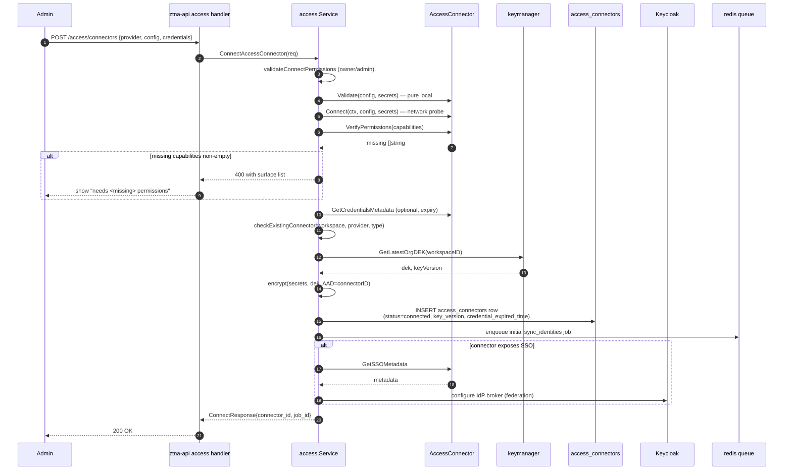
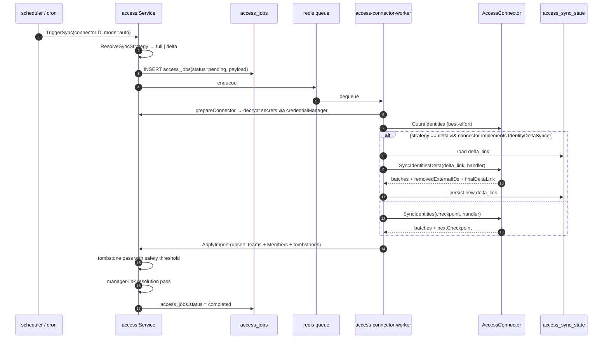
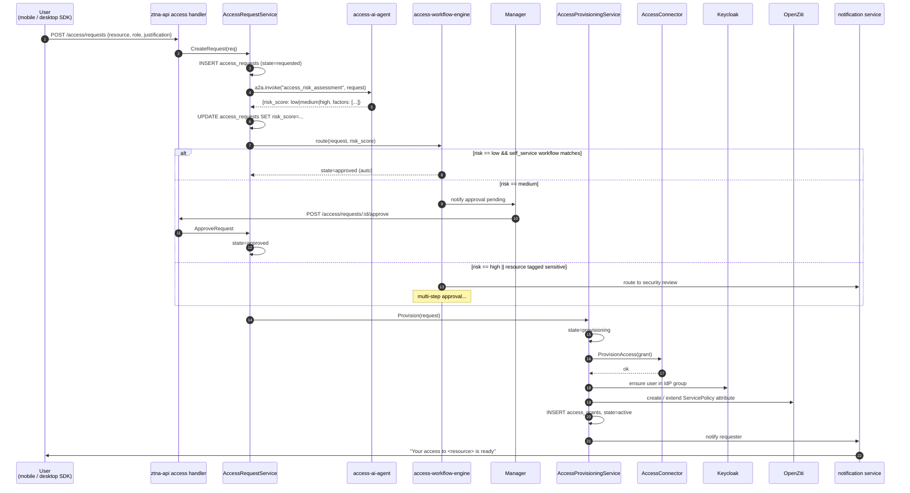
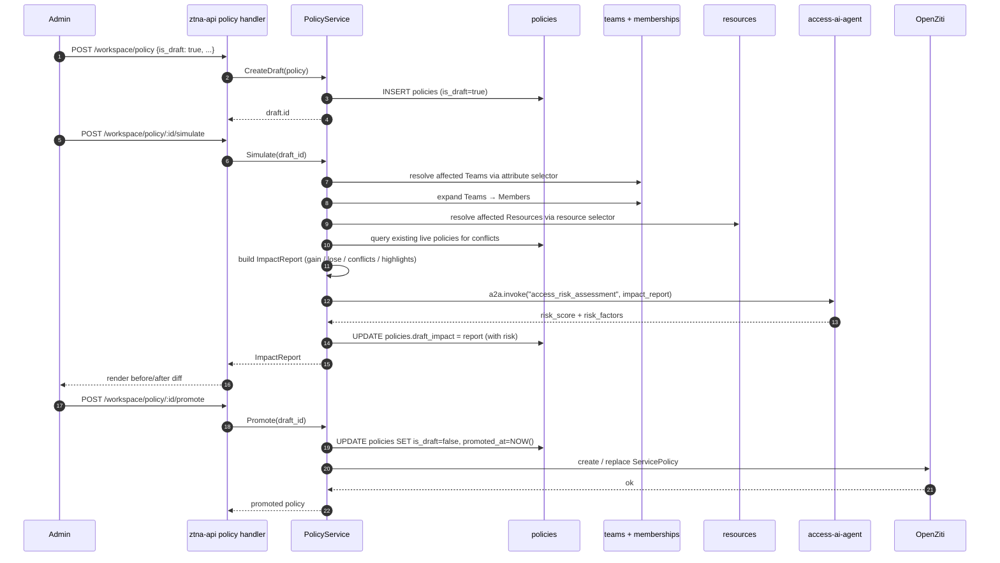
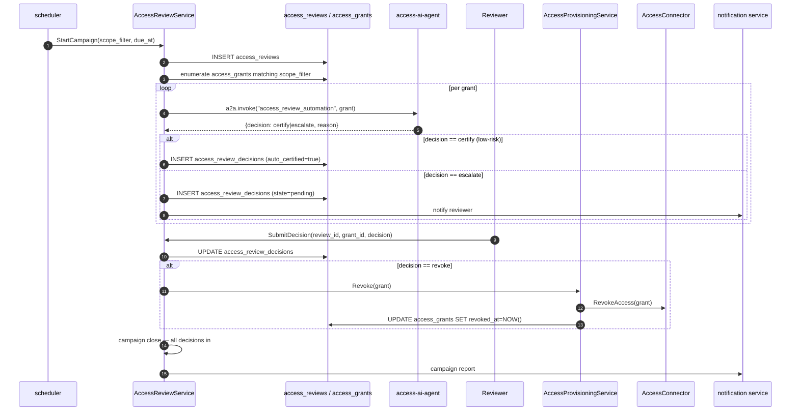
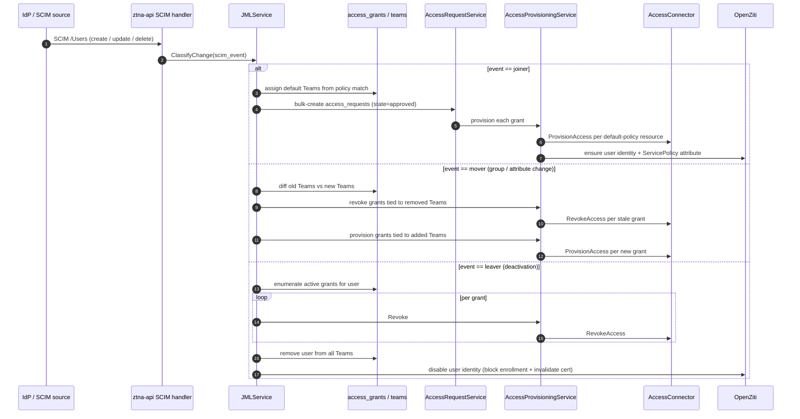
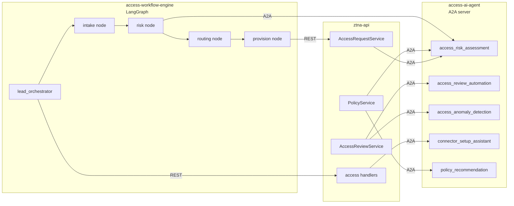
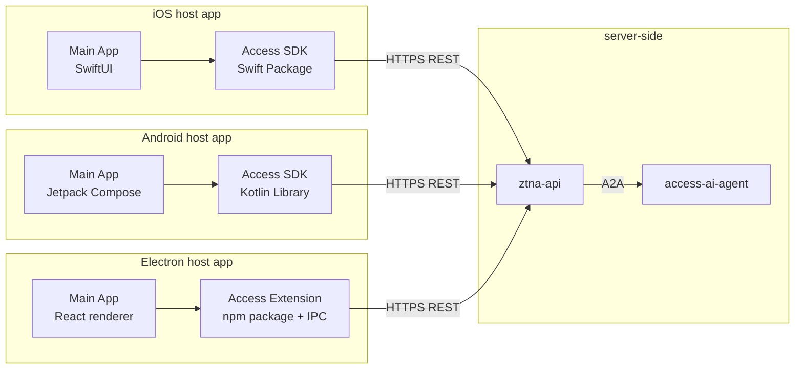

# ShieldNet 360 Access Platform — Architecture & Data Flow

This document captures the *target* architecture for the access platform. It is aspirational (what we are building) rather than descriptive — see `PROGRESS.md` for what is and isn't implemented yet. For the design contract see `PROPOSAL.md`.

The diagrams below use Mermaid and intentionally avoid colors so they render identically across GitHub, VS Code, and most IDE preview panes.

---

## 1. High-level component map

```mermaid
flowchart LR
    subgraph Browser
        UI[Admin UI<br/>React / Next.js]
    end

    subgraph Mobile
        IOS[iOS App + Access SDK]
        AND[Android App + Access SDK]
    end

    subgraph Desktop
        DESK[Electron App + Access Extension]
    end

    subgraph ZTNAAPI["ztna-api<br/>Go service"]
        AH[access handlers]
        PH[policy handlers]
        SVC[access service]
        PSVC[policy service]
        REG[(access connector registry<br/>process-global map)]
        SVC -->|GetAccessConnector provider| REG
    end

    subgraph Connectors["internal/services/access/connectors"]
        M365[microsoft/]
        GW[google_workspace/]
        OKTA[okta/]
        AUTH0[auth0/]
        SAML[generic_saml/]
        OIDC[generic_oidc/]
        DUO[duo/]
        ONEPW[onepassword/]
        LASTPW[lastpass/]
        PING[ping_identity/]
        AWS[aws/]
        AZURE[azure/]
        GCP[gcp/]
        CF[cloudflare/]
        TS[tailscale/]
        DO[digitalocean/]
        HEROKU[heroku/]
        VERCEL[vercel/]
        NETLIFY[netlify/]
        VULTR[vultr/]
        LINODE[linode/]
        OVH[ovhcloud/]
        ALIBABA[alibaba/]
        CSIGMA[cloudsigma/]
        WASABI[wasabi/]
        SLACK[slack/]
        MSTEAMS[ms_teams/]
        ZOOM[zoom/]
        NOTION[notion/]
        ASANA[asana/]
        MONDAY[monday/]
        FIGMA[figma/]
        MIRO[miro/]
        TRELLO[trello/]
        AIRTABLE[airtable/]
        SMARTSHEET[smartsheet/]
        CLICKUP[clickup/]
        DROPBOX[dropbox/]
        BOX[box/]
        SF[salesforce/]
        HUBSPOT[hubspot/]
        ZOHO[zoho_crm/]
        PIPEDRIVE[pipedrive/]
        GH[github/]
        GL[gitlab/]
        JIRA[jira/]
        PD[pagerduty/]
        SENTRY[sentry/]
        ZD[zendesk/]
        FD[freshdesk/]
        HS[helpscout/]
        CS[crowdstrike/]
        S1[sentinelone/]
        SNYK[snyk/]
        BAMBOO[bamboohr/]
        GUSTO[gusto/]
        RIPPLING[rippling/]
        PERSONIO[personio/]
        HIBOB[hibob/]
        WORKDAY[workday/]
        QUICKBOOKS[quickbooks/]
        XERO[xero/]
        STRIPE[stripe/]
        FRESHBOOKS[freshbooks/]
        FUTURE[next provider]
    end

    subgraph Worker["access-connector-worker<br/>Go binary"]
        H_SI[sync_identities handler]
        H_PA[provision_access handler]
        H_RA[revoke_access handler]
        H_LE[list_entitlements handler]
        H_AUD[access_audit handler]
    end

    subgraph AI["access-ai-agent<br/>Python A2A server"]
        SK_RA[access_risk_assessment]
        SK_RV[access_review_automation]
        SK_AN[access_anomaly_detection]
        SK_CS[connector_setup_assistant]
        SK_PR[policy_recommendation]
    end

    subgraph WF["access-workflow-engine<br/>LangGraph"]
        ORCH[lead_orchestrator]
    end

    subgraph Storage["postgres / redis / kafka"]
        PG[(access_connectors<br/>access_requests<br/>access_grants<br/>access_reviews<br/>access_workflows<br/>policies)]
        REDIS[(redis<br/>queue + staging)]
        KAFKA[(kafka<br/>access_audit_logs)]
    end

    subgraph IDP["identity / dataplane"]
        KC[Keycloak]
        OZ[OpenZiti<br/>controller]
    end

    UI --> AH
    UI --> PH
    IOS --> AH
    AND --> AH
    DESK --> AH

    AH --> SVC
    PH --> PSVC
    SVC --> REG
    REG --- M365 & GW & OKTA & AUTH0 & SAML & OIDC & DUO & ONEPW & LASTPW & PING & FUTURE
    SVC --> PG
    PSVC --> PG
    SVC -->|enqueue| REDIS
    REDIS --> Worker
    H_SI --> SVC
    H_PA --> SVC
    H_RA --> SVC
    H_LE --> SVC
    H_AUD --> KAFKA

    SVC -->|A2A| AI
    PSVC -->|A2A| AI
    WF -->|A2A| AI
    WF -->|REST| SVC
    WF -->|REST| PSVC

    SVC --> KC
    PSVC --> OZ
```

Reference points:

- Registry + factory: `internal/services/access/factory.go` (implemented; mirrors `shieldnet360-backend/internal/services/connectors/factory.go:9-32`).
- AccessConnector interface: `internal/services/access/types.go` (implemented; extends `shieldnet360-backend/internal/services/connectors/types.go:21-145`).
- Optional capability interfaces: `internal/services/access/optional_interfaces.go` (implemented).
- Mock + registry-swap test helper: `internal/services/access/testing.go` (implemented).
- Phase 0–1 Tier 1 connectors (all 10 implemented — minimum capabilities): `internal/services/access/connectors/microsoft/`, `internal/services/access/connectors/google_workspace/`, `internal/services/access/connectors/okta/`, `internal/services/access/connectors/auth0/`, `internal/services/access/connectors/generic_saml/`, `internal/services/access/connectors/generic_oidc/`, `internal/services/access/connectors/duo/`, `internal/services/access/connectors/onepassword/`, `internal/services/access/connectors/lastpass/`, `internal/services/access/connectors/ping_identity/`. All ten now compose the generic `SCIMClient` via a per-package `scim.go` (`PushSCIMUser` / `PushSCIMGroup` / `DeleteSCIMResource` delegating to the shared `internal/services/access/scim_provisioner.go`); the tier-1 SCIM coverage closes the Phase 6 outbound exit criterion.
- Phase 7 Cloud Infrastructure connectors (9 implemented — minimum capabilities, PR #9): `internal/services/access/connectors/aws/` (hand-rolled SigV4 IAM `ListUsers` / `GetAccountSummary` / `ListAccessKeys`; `aws/sigv4.go` is the SigV4 helper), `internal/services/access/connectors/azure/` (Microsoft Graph `/users` + `$count` + app-secret expiry via OAuth2 client_credentials), `internal/services/access/connectors/gcp/` (`cloudresourcemanager.projects:getIamPolicy` flattening using JWT-from-service-account), `internal/services/access/connectors/cloudflare/` (`/accounts/{id}/members` page-numbered), `internal/services/access/connectors/tailscale/` (HTTP Basic with API key as username, `/api/v2/tailnet/{tailnet}/users`), `internal/services/access/connectors/digitalocean/` (`/v2/customers/my/teams/{uuid}/users` cursor-paginated), `internal/services/access/connectors/heroku/` (Heroku Platform API `/teams/{name}/members`), `internal/services/access/connectors/vercel/` (`/v2/teams/{teamId}/members` since-cursor pagination), `internal/services/access/connectors/netlify/` (`/api/v1/{account_slug}/members`).
- Phase 7 Collaboration connectors (10 of 10 implemented — minimum capabilities, PR #9 + PR #10): PR #9 ships `internal/services/access/connectors/slack/` (`auth.test` for credentials metadata, `users.list` cursor pagination, Enterprise-Grid SAML metadata when `enterprise_id != ""`), `internal/services/access/connectors/ms_teams/` (Graph `/teams/{id}/members` via OAuth2 client_credentials, Entra-ID SAML federation metadata URL), `internal/services/access/connectors/zoom/` (Server-to-Server OAuth `account_credentials` grant against `https://zoom.us/oauth/token` with TTL caching, `/users?status=active` page-token pagination), `internal/services/access/connectors/notion/` (`/v1/users` with `start_cursor` / `has_more` pagination, `Notion-Version: 2022-06-28` header, type=`bot` → `IdentityTypeServiceAccount`), `internal/services/access/connectors/asana/` (`/workspaces/{gid}/users?limit=100` with `offset` / `next_page.offset` pagination); PR #10 ships `internal/services/access/connectors/monday/` (GraphQL `query { users { id name email } }` with page-number pagination), `internal/services/access/connectors/figma/` (`/v1/teams/{team_id}/members` with `X-Figma-Token` header + cursor pagination), `internal/services/access/connectors/miro/` (`/v2/orgs/{org_id}/members` with cursor pagination), `internal/services/access/connectors/trello/` (`/1/organizations/{org_id}/members` with `key`/`token` query-string auth), `internal/services/access/connectors/airtable/` (`/v0/meta/enterpriseAccount/{enterprise_id}/users` with offset pagination).
- Phase 7 CRM connectors (4 of 4 implemented — minimum capabilities, PR #10): `internal/services/access/connectors/salesforce/` (SOQL `SELECT Id, Name, Email, IsActive FROM User` over `/services/data/v59.0/query` with `nextRecordsUrl` cursor pagination + Salesforce SAML metadata at `{instance_url}/identity/saml/metadata`), `internal/services/access/connectors/hubspot/` (`/settings/v3/users` with `paging.next.after` cursor), `internal/services/access/connectors/zoho_crm/` (`/crm/v5/users` with page/per_page pagination + `Authorization: Zoho-oauthtoken …`), `internal/services/access/connectors/pipedrive/` (`/v1/users` with `api_token` query-string auth + `additional_data.pagination.next_start`).
- Phase 7 DevOps connectors (5 of 5 implemented — minimum capabilities, PR #10): `internal/services/access/connectors/github/` (`/orgs/{org}/members` with RFC 5988 `Link rel="next"` pagination + GitHub Enterprise SAML metadata at `https://github.com/organizations/{org}/saml/metadata`), `internal/services/access/connectors/gitlab/` (`/api/v4/groups/{group_id}/members/all` with `X-Next-Page` header pagination + optional self-hosted `base_url` + GitLab group SAML metadata at `{base_url}/groups/{group_id}/-/saml/metadata`), `internal/services/access/connectors/jira/` (Atlassian Cloud `/rest/api/3/users/search` over `https://api.atlassian.com/ex/jira/{cloud_id}` with `email:api_token` Basic auth + `startAt`/`maxResults` pagination + Atlassian Access SAML metadata at `{site_url}/admin/saml/metadata`), `internal/services/access/connectors/pagerduty/` (`/users` with `Authorization: Token token=…` + offset/limit pagination + `more` flag), `internal/services/access/connectors/sentry/` (`/api/0/organizations/{org_slug}/members/` with `Link rel="next"; results="true"` cursor pagination).
- Phase 7 Support connectors (3 of 3 implemented — minimum capabilities, PR #10): `internal/services/access/connectors/zendesk/` (`/api/v2/users.json` with `email/token:api_token` Basic auth + `next_page` URL pagination + Zendesk SAML metadata at `https://{subdomain}.zendesk.com/access/saml/metadata`), `internal/services/access/connectors/freshdesk/` (`/api/v2/agents` with `api_key:X` Basic auth + page-size-as-EOF pagination), `internal/services/access/connectors/helpscout/` (`/v2/users` with bearer token + HAL `_embedded.users` + `page.totalPages` pagination).
- Phase 7 Security / Vertical connectors (3 of 3 implemented — minimum capabilities, PR #10): `internal/services/access/connectors/crowdstrike/` (OAuth2 `client_credentials` at `/oauth2/token` then Falcon "query then hydrate" via `GET /user-management/queries/users/v1` + `POST /user-management/entities/users/GET/v1` with offset/limit pagination), `internal/services/access/connectors/sentinelone/` (`/web/api/v2.1/users` with `Authorization: ApiToken …` + `pagination.nextCursor`), `internal/services/access/connectors/snyk/` (`/rest/orgs/{org_id}/members?version=2024-08-25` with `Authorization: token …` + `links.next` cursor + relative-URL rewrite for hosted/test base URLs).
- Phase 7 Cloud Infra Tier 2 completion connectors (6 of 6 implemented — minimum capabilities, PR #11): `internal/services/access/connectors/vultr/` (`/v2/users` with `Authorization: Bearer …` + cursor `meta.links.next`), `internal/services/access/connectors/linode/` (`/v4/account/users` with `Authorization: Bearer …` + page/page_size and `pages` total pagination), `internal/services/access/connectors/ovhcloud/` (`/1.0/me/identity/user` with OVH application-key/consumer-key/secret signature headers + endpoint switch eu/ca/us), `internal/services/access/connectors/alibaba/` (RAM `ListUsers` action over `https://ram.aliyuncs.com/?Action=ListUsers` with HMAC-SHA1 signed querystring + `Marker`/`IsTruncated`), `internal/services/access/connectors/cloudsigma/` (`/api/2.0/profile/` HTTP Basic over `https://{region}.cloudsigma.com` — single-user identity), `internal/services/access/connectors/wasabi/` (IAM-compatible `ListUsers` at `https://iam.wasabisys.com/?Action=ListUsers` with AWS SigV4 signing — re-uses `internal/services/access/connectors/aws/sigv4.go`).
- Phase 7 Finance connectors (4 of 4 implemented — minimum capabilities, PR #11): `internal/services/access/connectors/quickbooks/` (`/v3/company/{realm_id}/query` with `SELECT * FROM Employee STARTPOSITION/MAXRESULTS` + OAuth2 bearer), `internal/services/access/connectors/xero/` (`/api.xro/2.0/Users` with `Authorization: Bearer …` + `Xero-Tenant-Id` header + offset pagination), `internal/services/access/connectors/stripe/` (`/v1/team_members` with `Authorization: Bearer {secret_key}` + `starting_after` cursor + `has_more`), `internal/services/access/connectors/freshbooks/` (`/accounting/account/{account_id}/users/staffs` with `Authorization: Bearer …` + page/per_page pagination).
- Phase 7 HR connectors (6 of 6 implemented — minimum capabilities, PR #11): `internal/services/access/connectors/bamboohr/` (`/api/gateway.php/{subdomain}/v1/employees/directory` with HTTP Basic `api_key:x` + Bamboo SAML metadata at `{subdomain}.bamboohr.com/saml/metadata`), `internal/services/access/connectors/gusto/` (`/v1/companies/{company_id}/employees` with `Authorization: Bearer …` + page/per pagination), `internal/services/access/connectors/rippling/` (`/platform/api/employees` with cursor `nextCursor`/`next` + `/platform/api/me` probe), `internal/services/access/connectors/personio/` (OAuth2 client_credentials at `/v1/auth` -> `/v1/company/employees` with offset/limit + Personio attribute-wrapped JSON unwrap helpers), `internal/services/access/connectors/hibob/` (`/v1/people?showInactive=true` with `Authorization: Basic {api_token}`), `internal/services/access/connectors/workday/` (`/ccx/api/v1/{tenant}/workers` with offset/limit + `total` field + Workday SAML metadata at `/{tenant}/saml2/metadata`).
- Phase 7 Tier 3 SaaS connectors batch B (4 of 4 implemented — minimum capabilities, PR #11): `internal/services/access/connectors/smartsheet/` (`/2.0/users` with `Authorization: Bearer …` + page/pageSize/totalPages pagination), `internal/services/access/connectors/clickup/` (`/api/v2/team/{team_id}/member` with raw API token in `Authorization` header), `internal/services/access/connectors/dropbox/` (POST `/2/team/members/list_v2` then `/2/team/members/list/continue_v2` with `has_more`/`cursor` + `Authorization: Bearer …` + Dropbox Business SAML metadata at `https://www.dropbox.com/saml_login/metadata`), `internal/services/access/connectors/box/` (`/2.0/users?user_type=all` with `Authorization: Bearer …` + offset/limit + `total_count`).
- Phase 2 request lifecycle (implemented):
  - Request lifecycle FSM: `internal/services/access/request_state_machine.go` (pure logic, mirrors `ztna-business-layer/internal/state_machine/`).
  - `AccessRequestService` (`CreateRequest` / `ApproveRequest` / `DenyRequest` / `CancelRequest`, transactional state-history): `internal/services/access/request_service.go`.
  - `AccessProvisioningService` (`Provision` / `Revoke`, connector-backed, with `provision_failed` retry path): `internal/services/access/provisioning_service.go`.
  - `WorkflowService` (`ResolveWorkflow` + `ExecuteWorkflow` for self-service / manager-approval): `internal/services/access/workflow_service.go`.
  - Models: `internal/models/access_request.go`, `internal/models/access_request_state_history.go`, `internal/models/access_grant.go`, `internal/models/access_workflow.go`.
  - Migration: `internal/migrations/002_create_access_request_tables.go`.
- HTTP handler layer (Phase 2–5, implemented):
  - Gin router + dependency injection: `internal/handlers/router.go` (returns a fully-wired `*gin.Engine`).
  - Helper functions enforcing the cross-cutting "no `c.Param` / `c.Query`" rule: `internal/handlers/helpers.go` (`GetStringParam`, `GetPtrStringQuery`).
  - Service-error → HTTP-status mapping: `internal/handlers/errors.go`.
  - Phase 2 handlers: `internal/handlers/access_request_handler.go`, `internal/handlers/access_grant_handler.go`.
  - Phase 3 handlers: `internal/handlers/policy_handler.go`.
  - Phase 5 handlers: `internal/handlers/access_review_handler.go`.
  - Phase 4 AI handlers: `internal/handlers/ai_handler.go` (`POST /access/explain`, `POST /access/suggest`).
  - HTTP server boot: `cmd/ztna-api/main.go` (binds `ZTNA_API_LISTEN_ADDR`, default `:8080`).
- Phase 4 AI integration (Go-side, implemented; Python skill deferred):
  - A2A client: `internal/pkg/aiclient/client.go` (POSTs `{baseURL}/a2a/invoke` with `X-API-Key`).
  - Fallback helper: `internal/pkg/aiclient/fallback.go` (`AssessRiskWithFallback` returns `risk_score=medium` per PROPOSAL §5.3 when AI is unreachable).
  - Adapter satisfying `access.RiskAssessor`: `internal/pkg/aiclient/fallback.go::RiskAssessmentAdapter`.
  - Env-driven config: `internal/config/access.go` (`ACCESS_AI_AGENT_BASE_URL`, `ACCESS_AI_AGENT_API_KEY`, `ACCESS_WORKFLOW_ENGINE_BASE_URL`, `ACCESS_FULL_RESYNC_INTERVAL` default 7d, `ACCESS_REVIEW_DEFAULT_FREQUENCY` default 90d, `ACCESS_DRAFT_POLICY_STALE_AFTER` default 14d).
  - Risk-scoring integration: `AccessRequestService.CreateRequest` and `PolicyService.Simulate` both consult a `RiskAssessor` and persist `risk_score` / `risk_factors`.
- Phase 5 scheduled campaigns (implemented):
  - Schedule model: `internal/models/access_campaign_schedule.go` (table `access_campaign_schedules`).
  - Migration: `internal/migrations/005_create_access_campaign_schedules.go`.
  - Cron worker: `internal/cron/campaign_scheduler.go` (`CampaignScheduler.Run` scans for due rows, calls `StartCampaign`, bumps `NextRunAt` by `FrequencyDays`; idempotent on partial failure — failed rows do not bump `NextRunAt` so the next pass retries).
- Service entry: `internal/services/access/service.go` (target; parallels `shieldnet360-backend/internal/services/integration/service.go:188-262`).

---

## 2. Connector setup flow

What happens when an admin clicks **Connect a new app** in the marketplace.

Notes:

- `Validate` is contractually pure-local (no I/O). Errors here surface as 4xx without ever touching the DB.
- `Connect` failures abort the row insert. The connector is never persisted in a half-configured state.
- Initial identity sync is **best-effort** — failure to enqueue the job does not undo the connect.
- Keycloak federation is a side-effect of connect; failures are surfaced as warnings on the connector page (the connector is still "connected", just not yet federated).

---

## 3. Identity sync flow

How users and groups get pulled into ZTNA Teams.

Reference points (target):

- Trigger entry: `internal/services/access/service.go::TriggerSync` (mirror of `shieldnet360-backend/internal/services/integration/service.go:438-485`).
- Strategy resolution: `internal/services/access/sync_state.go` (mirror of SN360 `sync_state.go:23-95`).
- Worker handlers: `internal/workers/handlers/access_sync_identities.go`.

A separate fan-out path applies for group membership when the connector implements `GroupSyncer`: the parent `sync_identities` job upserts groups, and one child `sync_group_members` job is enqueued per group, each reconciling membership directly to the DB. Same pattern as SN360 Phase 2.4.

Tombstone safety threshold (default 30 %) is preserved from SN360: a single sync that would tombstone ≥ threshold % of rows aborts the tombstone pass and surfaces `tombstone_safety_skipped: true` in the report.

---

## 4. Access request lifecycle flow

The end-to-end happy path for a self-service access request from a mobile / desktop user.

Failure-mode notes:

- **AI agent unreachable.** `risk_score` defaults to `medium`, request is routed through `manager_approval`. Alert emitted but the request is not blocked.
- **`ProvisionAccess` returns 4xx.** `state=provision_failed`, surfaced to the operator (not the requester) for credential / scope troubleshooting.
- **`ProvisionAccess` returns 5xx.** Retried with exponential backoff. After `N` failures the job moves to `provision_failed` with the last error preserved.
- **OpenZiti unreachable.** Connector-side grant succeeds; OpenZiti reconciliation runs in a background job. The grant is "provisioned but not enforceable" until OpenZiti catches up; surfaced as a warning on the grant.

---

## 5. Policy simulation flow

Draft a policy, see the impact, then promote.

Crucially: **drafts never touch OpenZiti.** Promotion is the only path that creates a `ServicePolicy`. There is no "create live policy directly" code path — every live policy was a draft for at least one transaction.

### Phase 3 reference points (current backend implementation)

| Concern | File |
|---------|------|
| Policy model + lifecycle helpers | `internal/models/policy.go` |
| Team / membership stub model | `internal/models/team.go` |
| Resource stub model | `internal/models/resource.go` |
| Migration (creates `policies`, `teams`, `team_members`, `resources`) | `internal/migrations/003_create_policy_tables.go` |
| `PolicyService` (`CreateDraft` / `GetDraft` / `ListDrafts` / `GetPolicy` / `Simulate` / `Promote` / `TestAccess`) | `internal/services/access/policy_service.go` |
| `ImpactResolver` (selector → affected teams / members / resources) | `internal/services/access/impact_resolver.go` |
| `ConflictDetector` (redundant / contradictory classification) | `internal/services/access/conflict_detector.go` |
| HTTP handlers (`POST /workspace/policy`, `GET /workspace/policy/drafts`, `GET /workspace/policy/:id`, `POST /workspace/policy/:id/simulate|promote`, `POST /workspace/policy/test-access`) | `internal/handlers/policy_handler.go` |
| "Drafts do not call OpenZiti" integration test | `internal/services/access/policy_service_test.go::TestPromote_DoesNotInvokeOpenZiti` |

The OpenZiti `ServicePolicy` write that appears in the sequence diagram above (step 23) is **not** implemented in this repo — that integration lives in the `ztna-business-layer`. `PolicyService.Promote` flips the DB state (`is_draft=false`, `promoted_at`, `promoted_by`); the ZTNA layer subscribes to promoted policies and reconciles them with OpenZiti.

---

## 6. Access review campaign flow

Periodic access check-ups with AI auto-certification of low-risk grants.

Auto-certification rate is observable as a campaign-level metric. Operators can disable auto-certification per resource category if they want full human-in-the-loop review.

### Phase 5 reference points (current backend implementation)

| Concern | File |
|---------|------|
| `AccessReview` campaign model | `internal/models/access_review.go` |
| `AccessReviewDecision` per-grant decision model | `internal/models/access_review_decision.go` |
| `AccessCampaignSchedule` recurring-campaign model | `internal/models/access_campaign_schedule.go` |
| Migration (creates `access_reviews`, `access_review_decisions`) | `internal/migrations/004_create_access_review_tables.go` |
| Migration (creates `access_campaign_schedules`) | `internal/migrations/005_create_access_campaign_schedules.go` |
| `AccessReviewService` (`StartCampaign` / `SubmitDecision` / `CloseCampaign` / `AutoRevoke` / `GetCampaignMetrics` / `SetAutoCertifyEnabled`) | `internal/services/access/review_service.go` |
| HTTP handlers (`POST /access/reviews`, `POST /access/reviews/:id/decisions|close|auto-revoke`, `GET /access/reviews/:id/metrics`, `PATCH /access/reviews/:id`) | `internal/handlers/access_review_handler.go` |
| Cron worker driving scheduled campaigns | `internal/cron/campaign_scheduler.go` |
| `NotificationService` (best-effort fan-out) | `internal/services/notification/service.go` |
| `Notifier` interface + `InMemoryNotifier` for dev / tests | `internal/services/notification/service.go` |
| `ReviewNotifier` adapter wrapping `NotificationService` | `internal/services/access/notification_adapter.go` |
| Composes `AccessProvisioningService` to revoke grants | `internal/services/access/provisioning_service.go` |

The AI auto-certification path in the sequence diagram above (steps 4–7) is **not yet wired** — the Python `access_review_automation` skill stub now ships under `cmd/access-ai-agent/skills/access_review_automation.py` but the Go-side wire-in that flips pending → certify is still ⏳. `SubmitDecision` decouples DB writes from the upstream `Revoke` call (decision row commits first, then the connector revoke runs); `AutoRevoke` is the idempotent catch-up that reconciles revoke decisions whose upstream side-effect has not yet executed.

The Phase 5 notification scaffold is already exercised: `AccessReviewService.SetNotifier(notifier, resolver)` accepts a `ReviewNotifier` (the access package's narrow contract that the `notification.NotificationService` adapter satisfies) plus a `ReviewerResolver` that maps committed decisions onto reviewer-user-IDs. `StartCampaign` resolves and dispatches **after the transaction commits**; any error from either step is logged and never rolled back per PHASES Phase 5.

---

## 7. JML (joiner-mover-leaver) automation flow

SCIM-driven user lifecycle, fully automated end-to-end.

Mover events are the trickiest: the diff between old and new Team membership is computed against the **post-update** SCIM state, and the revoke / provision steps run as a single atomic batch so the user never sees a partial-access window.

### Phase 6 reference points (current backend implementation)

| Concern | File |
|---------|------|
| `JMLService` (`ClassifyChange` / `HandleJoiner` / `HandleMover` / `HandleLeaver`) | `internal/services/access/jml_service.go` |
| Inbound SCIM HTTP handler (`POST /scim/Users`, `PATCH /scim/Users/:id`, `DELETE /scim/Users/:id`) | `internal/handlers/scim_handler.go` |
| Outbound SCIM v2.0 client (`SCIMClient.PushSCIMUser` / `PushSCIMGroup` / `DeleteSCIMResource`) | `internal/services/access/scim_provisioner.go` |
| SCIM sentinel errors (`ErrSCIMRemoteConflict` / `ErrSCIMRemoteNotFound` / `ErrSCIMRemoteUnauthorized` / `ErrSCIMRemoteServer` / `ErrSCIMConfigInvalid`) | `internal/services/access/scim_provisioner.go` |
| Go-side anomaly stub (`AIClient.DetectAnomalies` + `DetectAnomaliesWithFallback`) | `internal/pkg/aiclient/client.go`, `internal/pkg/aiclient/fallback.go` |
| `AnomalyDetectionService.ScanWorkspace` | `internal/services/access/anomaly_service.go` |
| `SCIMProvisioner` optional interface (composed by per-connector implementations) | `internal/services/access/optional_interfaces.go` |
| `SCIMUser` / `SCIMGroup` resource shapes | `internal/services/access/scim_provisioner.go` |
| Composes `AccessRequestService` + `AccessProvisioningService` for joiner / mover / leaver | `internal/services/access/jml_service.go` |

The leaver flow's "disable user identity" step (the OZ leg in the sequence diagram) is **not yet wired** — `HandleLeaver` revokes every active grant and removes Team memberships but the OpenZiti identity is left enrolled until the per-connector `RevokeIdentity` paths land.

The outbound SCIM client treats 404-on-DELETE as idempotent success and maps 409 / 401 / 403 / 5xx onto sentinel errors; per-connector composition (e.g. `okta`, `onepassword`) is the next step — the underlying client is generic over `BaseURL` + `AuthHeader` + `Timeout`.

---

## 8. AI agent integration

How `ztna-api`, the workflow engine, and the A2A skill server fit together.

A2A protocol is the same one `aisoc-ai-agents` uses for SOC agents. Skills are registered on a single `access_agent` server and routed by skill name. The workflow engine is a separate Python service that orchestrates multi-step flows by invoking skills in sequence.

---

## 9. Client SDK / extension architecture

Mobile and desktop clients are integration packages, not standalone apps. All AI calls are REST.

Note explicitly: **all AI inference happens server-side**. The SDKs / extension are thin REST clients. There is no model file bundled into the SDK, no `CoreML` import on iOS, no `TensorFlow Lite` on Android, no `onnxruntime` in the Electron extension. Future on-device inference is deferred (see PROPOSAL §12.1).

---

## 10. Storage schema summary

| Table | Purpose | Key columns |
|-------|---------|-------------|
| `access_connectors` | Per-workspace connector instances | `id ULID`, `workspace_id`, `provider`, `connector_type`, `config jsonb`, `credentials text`, `key_version`, `status`, `credential_expired_time`, `deleted_at` |
| `access_jobs` | One row per sync / provision / revoke / list-entitlements job run | `id`, `connector_id`, `job_type`, `status`, `payload jsonb`, `started_at`, `completed_at`, `last_error` |
| `access_requests` | Lifecycle row per access ask | `id`, `workspace_id`, `requester_user_id`, `target_user_id`, `resource_external_id`, `role`, `state`, `risk_score`, `risk_factors jsonb`, `workflow_id`, `created_at` |
| `access_request_state_history` | Audit trail of state transitions | `request_id`, `from_state`, `to_state`, `actor_user_id`, `reason`, `created_at` |
| `access_grants` | Active entitlements (one row per `(user, resource, role)`) | `id`, `workspace_id`, `user_id`, `connector_id`, `resource_external_id`, `role`, `granted_at`, `expires_at`, `last_used_at`, `revoked_at` |
| `access_reviews` | Periodic certification campaigns | `id`, `workspace_id`, `name`, `scope_filter jsonb`, `due_at`, `state` |
| `access_review_decisions` | Per-grant decision in a campaign | `review_id`, `grant_id`, `decision`, `decided_by`, `auto_certified bool`, `reason`, `decided_at` |
| `access_campaign_schedules` | Recurring access check-up cadence | `id`, `workspace_id`, `name`, `scope_filter jsonb`, `frequency_days`, `next_run_at`, `is_active` |
| `access_workflows` | Configurable approval chains | `id`, `workspace_id`, `name`, `match_rule jsonb`, `steps jsonb` |
| `access_sync_state` | Delta-link / checkpoint store per `(connector_id, kind)` | `connector_id`, `kind`, `delta_link`, `updated_at` |
| `policies` | Existing table — new columns | `is_draft bool`, `draft_impact jsonb`, `promoted_at timestamp` |

Per the SN360 database-index rule, none of the model relationships create real `FOREIGN KEY` constraints. Referential integrity is enforced in application code (delete paths, disconnect paths). Indexes are added only for proven query patterns (see PROPOSAL §9.3).

---

## 11. Where things run

| Process | Binary | Responsibilities |
|---------|--------|------------------|
| ZTNA API | `cmd/ztna-api` (extended) | `/access/*` routes, `/workspace/policy/*` routes (incl. draft / simulate / promote / test-access), SCIM inbound, AI delegation |
| Admin UI | served by `ztna-frontend` | Connector marketplace, access requests, policy simulator, access reviews, AI assistant chat |
| Access connector worker | `cmd/access-connector-worker` | Runs `SyncIdentities`, `ProvisionAccess`, `RevokeAccess`, `ListEntitlements`, `FetchAccessAuditLogs` jobs from Redis queue |
| Access AI agent | `cmd/access-ai-agent` (Python) | A2A skill server hosting the five Tier-1 skills |
| Access workflow engine | `cmd/access-workflow-engine` (Go + LangGraph) | Multi-step orchestration; risk-based routing; escalations |
| Cron | `internal/cron/access` (embedded in `cmd/access-connector-worker`) | Periodic identity sync, scheduled review campaigns, draft-policy stale check |
| Keycloak | existing | Federated SSO broker; receives IdP configurations from connector setup |
| OpenZiti controller | existing | Receives `ServicePolicy` writes only on draft promotion (Section 5) |
| PostgreSQL / Redis / Kafka | existing | Storage, queue, audit envelope |

Per-runtime profile (carried over from the SN360 standard): API services target `cpu=200m mem=1Gi` with `GOMEMLIMIT=900MiB GOGC=100`; worker targets `cpu=2 mem=400Mi` with `GOMEMLIMIT=360MiB GOGC=75`; AI agent server is sized per model load and scales horizontally.
