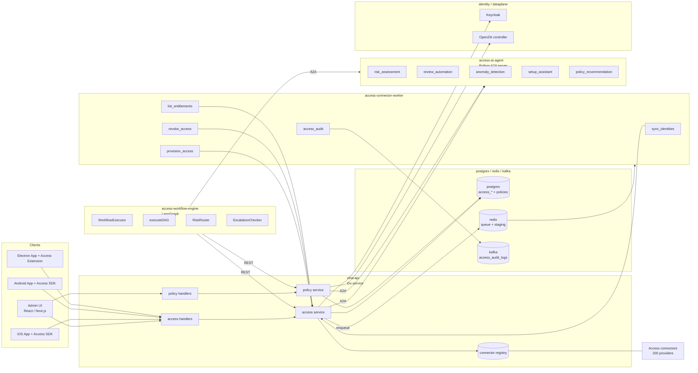
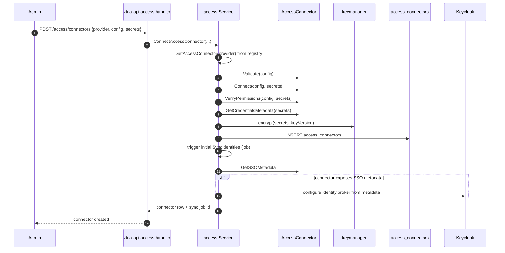
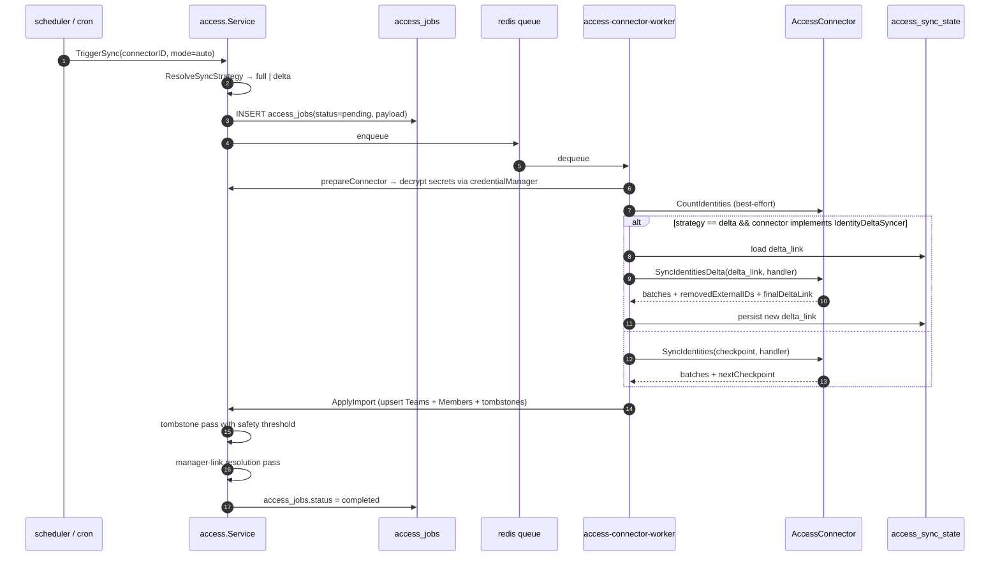
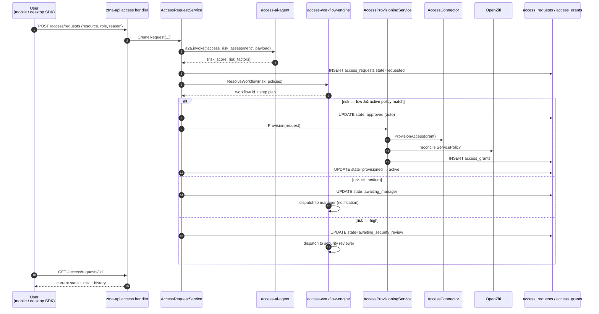
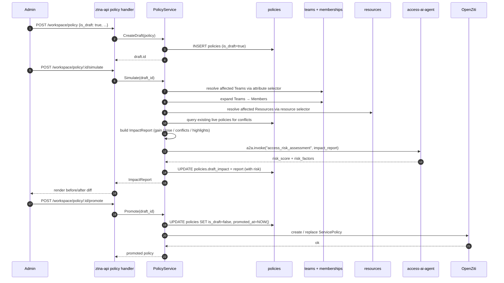
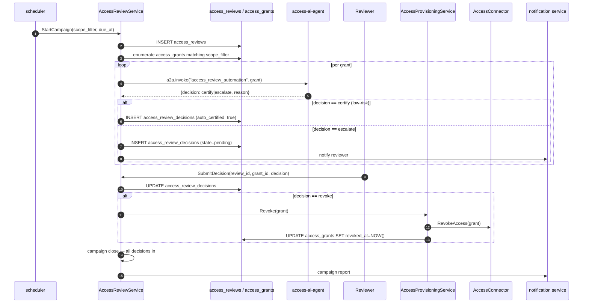
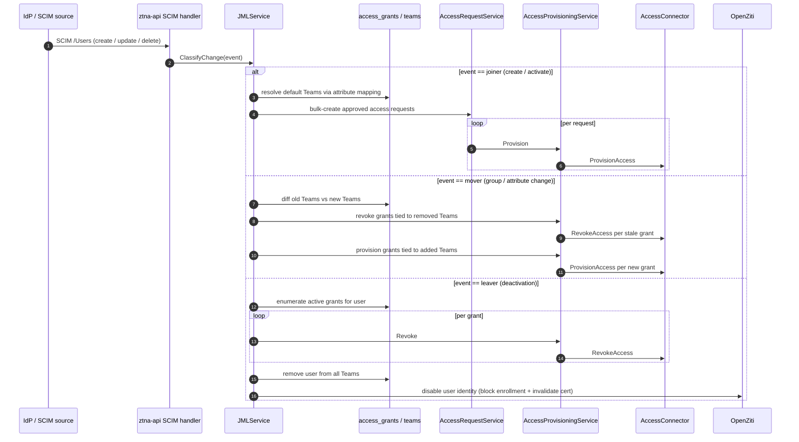
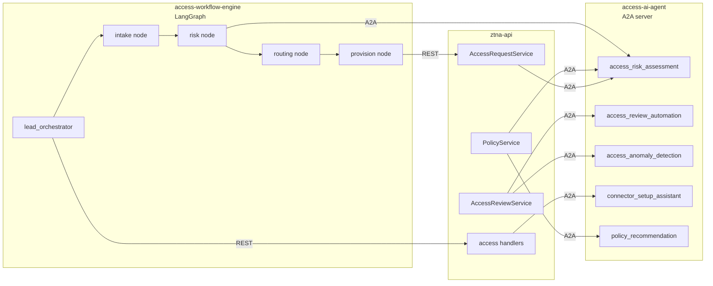
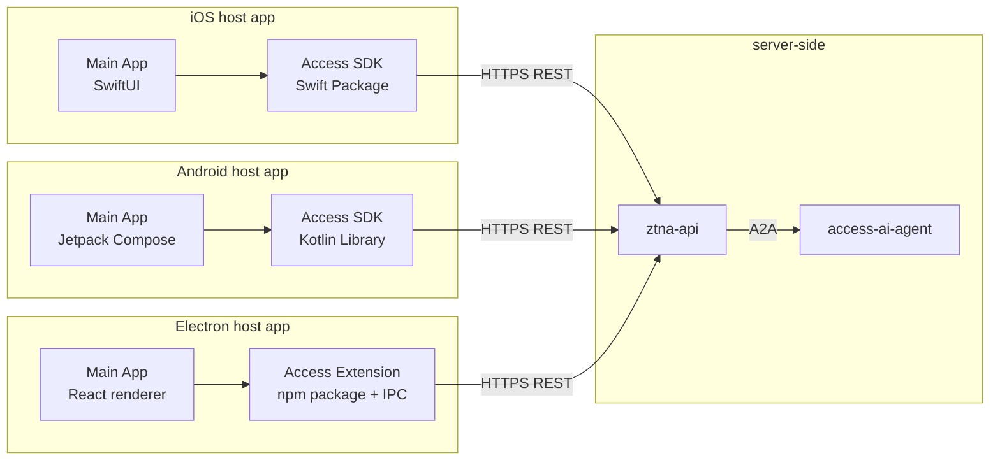

# ShieldNet 360 Access Platform — Architecture & Data Flow

This document captures the *target* architecture for the access platform. It is aspirational — see [`PROGRESS.md`](PROGRESS.md) for what's implemented. For the design contract see [`PROPOSAL.md`](PROPOSAL.md). For the per-provider connector catalogue see [`LISTCONNECTORS.md`](LISTCONNECTORS.md).

Diagrams use Mermaid and intentionally avoid colors so they render identically across GitHub, VS Code, and most IDE preview panes.

---

## 1. High-level component map



### Reference points

| Concern | Key file |
|---------|----------|
| Connector interface | `internal/services/access/types.go` |
| Registry + factory | `internal/services/access/factory.go` |
| Optional interfaces (`IdentityDeltaSyncer`, `GroupSyncer`, `AccessAuditor`, `SCIMProvisioner`) | `internal/services/access/optional_interfaces.go` |
| Mock + registry-swap test helper | `internal/services/access/testing.go` |
| Connector management lifecycle | `internal/services/access/connector_management_service.go` |
| Credential encryption (AES-GCM) | `internal/services/access/credential_encryptor.go` |
| SSO federation service | `internal/services/access/sso_federation_service.go` |
| SSO metadata helper | `internal/services/access/sso_metadata_helpers.go` |
| Connector health endpoint | `internal/handlers/connector_health_handler.go` |
| Kafka audit producer | `internal/services/access/audit_producer.go` |
| Audit worker handler | `internal/workers/handlers/access_audit.go` |
| Schedule model + cron worker | `internal/models/access_campaign_schedule.go`, `internal/cron/campaign_scheduler.go` |
| Access service entry point | `internal/services/access/service.go` |

Connector packages live under `internal/services/access/connectors/`. See [`LISTCONNECTORS.md`](LISTCONNECTORS.md) for the catalogue.

---

## 2. Connector setup flow

What happens when an admin clicks **Connect a new app** in the marketplace.



Keycloak federation is a side-effect of connect; failures surface as warnings on the connector page (the connector is still "connected", just not yet federated).

### Reference points

| Concern | Key file |
|---------|----------|
| Connector management API | `internal/handlers/connector_management_handler.go` |
| Connect lifecycle | `internal/services/access/connector_management_service.go` |
| Keycloak SSO broker wiring | `internal/services/access/sso_federation_service.go` |

---

## 3. Identity sync flow

How users and groups get pulled into ZTNA Teams.



A separate fan-out path applies for group membership when the connector implements `GroupSyncer`: the parent `sync_identities` job upserts groups, and one child `sync_group_members` job is enqueued per group, each reconciling membership directly.

Tombstone safety threshold (default 30 %): a single sync that would tombstone ≥ threshold % of rows aborts the tombstone pass and surfaces `tombstone_safety_skipped: true` in the report.

### Reference points

| Concern | Key file |
|---------|----------|
| Trigger entry / strategy resolution | `internal/services/access/service.go`, `internal/services/access/sync_state.go` |
| Identity sync worker handler | `internal/workers/handlers/access_sync_identities.go` |
| Entitlements worker handler | `internal/workers/handlers/access_list_entitlements.go` |
| Identity-sync scheduler | `internal/cron/identity_sync_scheduler.go` |
| Grant-expiry enforcer | `internal/cron/grant_expiry_enforcer.go` (Phase 11 batch 6 adds notification + warning sweep + audit) |
| Orphan reconciler | `internal/services/access/orphan_reconciler.go` + `internal/cron/orphan_reconciler_scheduler.go` |
| Draft-policy staleness checker | `internal/cron/draft_staleness_checker.go` |

---

## 4. Access request lifecycle flow

End-to-end happy path for a self-service access request from a mobile / desktop user.



Failure modes:

- **AI unavailable.** `risk_score` defaults to `medium` (PROPOSAL §5.3). Workflow proceeds.
- **`ProvisionAccess` returns 4xx.** `state=provision_failed`, surfaced to the operator for credential / scope troubleshooting.
- **`ProvisionAccess` returns 5xx.** Retried with exponential backoff. After `N` failures the job moves to `provision_failed` with the last error preserved.
- **OpenZiti unreachable.** Connector-side grant succeeds; OpenZiti reconciliation runs in a background job.

### Reference points

| Concern | Key file |
|---------|----------|
| `AccessRequestService` | `internal/services/access/request_service.go` |
| `AccessProvisioningService` | `internal/services/access/provisioning_service.go` |
| Request state machine | `internal/services/access/request_state_machine.go` |
| Workflow service (routing) | `internal/services/access/workflow_service.go` |
| HTTP handlers | `internal/handlers/access_request_handler.go`, `internal/handlers/access_grant_handler.go` |
| AI client + fallback | `internal/pkg/aiclient/client.go`, `internal/pkg/aiclient/fallback.go` |

---

## 5. Policy simulation flow

Draft a policy, see the impact, then promote.



**Drafts never touch OpenZiti.** Promotion is the only path that creates a `ServicePolicy` — there is no "create live policy directly" code path. The OpenZiti reconciliation itself lives in the broader `ztna-business-layer`; `PolicyService.Promote` flips DB state and the ZTNA layer subscribes and writes to OpenZiti.

### Reference points

| Concern | Key file |
|---------|----------|
| `PolicyService` | `internal/services/access/policy_service.go` |
| `ImpactResolver` | `internal/services/access/impact_resolver.go` |
| `ConflictDetector` | `internal/services/access/conflict_detector.go` |
| HTTP handlers | `internal/handlers/policy_handler.go` |
| "Drafts never touch OpenZiti" test | `internal/services/access/policy_service_test.go::TestPromote_DoesNotInvokeOpenZiti` |

---

## 6. Access review campaign flow

Periodic access check-ups with AI auto-certification of low-risk grants.



Auto-certification rate is observable as a campaign-level metric. Operators can disable auto-certification per resource category if they want full human-in-the-loop review.

### Reference points

| Concern | Key file |
|---------|----------|
| `AccessReviewService` | `internal/services/access/review_service.go` |
| HTTP handlers | `internal/handlers/access_review_handler.go` |
| Campaign cron worker | `internal/cron/campaign_scheduler.go` |
| Notification service | `internal/services/notification/service.go` |
| Review notifier adapter | `internal/services/access/notification_adapter.go` |

---

## 7. JML (joiner-mover-leaver) automation flow

SCIM-driven user lifecycle, fully automated end-to-end.



Mover events are the trickiest: the diff between old and new Team membership is computed against the **post-update** SCIM state, and the revoke / provision steps run as a single atomic batch so the user never sees a partial-access window.

### Reference points

| Concern | Key file |
|---------|----------|
| `JMLService` | `internal/services/access/jml_service.go` |
| Inbound SCIM HTTP handler | `internal/handlers/scim_handler.go` |
| Outbound SCIM v2.0 client | `internal/services/access/scim_provisioner.go` |
| Anomaly detection service | `internal/services/access/anomaly_service.go` |
| AI client (`DetectAnomalies` + fallback) | `internal/pkg/aiclient/client.go`, `internal/pkg/aiclient/fallback.go` |

---

## 8. AI agent integration

How `ztna-api`, the workflow engine, and the A2A skill server fit together.



A2A protocol is the same one `aisoc-ai-agents` uses for SOC agents. Skills are registered on a single `access_agent` server and routed by skill name. The workflow engine is a separate Python service that orchestrates multi-step flows by invoking skills in sequence.

---

## 9. Client SDK / extension architecture

Mobile and desktop clients are integration packages, not standalone apps. All AI calls are REST.



**All AI inference happens server-side.** SDKs and the desktop extension are thin REST clients — no model file bundled, no `CoreML` on iOS, no TensorFlow Lite on Android, no `onnxruntime` in Electron. The rule is enforced by [`scripts/check_no_model_files.sh`](../scripts/check_no_model_files.sh). See [`SDK_CONTRACTS.md`](SDK_CONTRACTS.md) for the canonical reference.

In-tree contracts live under [`sdk/`](../sdk):

- [`sdk/ios/`](../sdk/ios) — Swift Package with the `AccessSDKClient` protocol, models, and contract-conformance tests.
- [`sdk/android/`](../sdk/android) — Kotlin library with the `AccessSDKClient` interface, data classes, and contract test.
- [`sdk/desktop/`](../sdk/desktop) — Electron extension with `AccessIPC` interface, channel constants, and contract test.

---

## 10. Storage schema summary

| Table | Purpose | Key columns |
|-------|---------|-------------|
| `access_connectors` | Per-workspace connector instances | `id ULID`, `workspace_id`, `provider`, `connector_type`, `config jsonb`, `credentials text`, `key_version`, `status`, `credential_expired_time`, `deleted_at` |
| `access_jobs` | One row per sync / provision / revoke / list-entitlements job run | `id`, `connector_id`, `job_type`, `status`, `payload jsonb`, `started_at`, `completed_at`, `last_error` |
| `access_requests` | Lifecycle row per access ask | `id`, `workspace_id`, `requester_user_id`, `target_user_id`, `resource_external_id`, `role`, `state`, `risk_score`, `risk_factors jsonb`, `workflow_id`, `created_at` |
| `access_request_state_history` | Audit trail of state transitions | `request_id`, `from_state`, `to_state`, `actor_user_id`, `reason`, `created_at` |
| `access_grants` | Active entitlements (one row per `(user, resource, role)`) | `id`, `workspace_id`, `user_id`, `connector_id`, `resource_external_id`, `role`, `granted_at`, `expires_at`, `last_used_at`, `revoked_at` |
| `access_reviews` | Periodic certification campaigns | `id`, `workspace_id`, `name`, `scope_filter jsonb`, `due_at`, `state` |
| `access_review_decisions` | Per-grant decision in a campaign | `review_id`, `grant_id`, `decision`, `decided_by`, `auto_certified bool`, `reason`, `decided_at` |
| `access_campaign_schedules` | Recurring access check-up cadence | `id`, `workspace_id`, `name`, `scope_filter jsonb`, `frequency_days`, `next_run_at`, `is_active` |
| `access_workflows` | Configurable approval chains | `id`, `workspace_id`, `name`, `match_rule jsonb`, `steps jsonb` |
| `access_sync_state` | Delta-link / checkpoint store per `(connector_id, kind)` | `connector_id`, `kind`, `delta_link`, `updated_at` |
| `policies` | Existing table — new columns for drafts | `is_draft bool`, `draft_impact jsonb`, `promoted_at timestamp` |

Per the SN360 database-index rule, none of the model relationships create real `FOREIGN KEY` constraints. Referential integrity is enforced in application code. Indexes are added only for proven query patterns (see [`PROPOSAL.md`](PROPOSAL.md) §9.3).

---

## 11. Where things run

| Process | Binary | Responsibilities |
|---------|--------|------------------|
| ZTNA API | `cmd/ztna-api` | `/access/*` routes, `/workspace/policy/*` routes, SCIM inbound, AI delegation |
| Admin UI | external `ztna-frontend` | Connector marketplace, access requests, policy simulator, access reviews, AI assistant chat |
| Connector worker | `cmd/access-connector-worker` | Runs `SyncIdentities`, `ProvisionAccess`, `RevokeAccess`, `ListEntitlements`, `FetchAccessAuditLogs` jobs from the Redis queue |
| Access AI agent | `cmd/access-ai-agent` (Python) | A2A skill server hosting the five Tier-1 skills |
| Workflow engine | `cmd/access-workflow-engine` (Go + LangGraph) | Multi-step orchestration, risk-based routing, escalations |
| Cron | embedded in `cmd/access-connector-worker` | Periodic identity sync, scheduled review campaigns, draft-policy stale check, grant-expiry enforcer, credential checker, anomaly scanner |
| Keycloak | existing | Federated SSO broker; receives IdP configurations from connector setup |
| OpenZiti controller | existing | Receives `ServicePolicy` writes only on draft promotion (§5) |
| PostgreSQL / Redis / Kafka | existing | Storage, queue, audit envelope |

Per-runtime profile (SN360 standard): API services target `cpu=200m mem=1Gi` with `GOMEMLIMIT=900MiB GOGC=100`; worker targets `cpu=2 mem=400Mi` with `GOMEMLIMIT=360MiB GOGC=75`; AI agent server scales horizontally per skill load.

**Local dev.** The same six processes can be brought up locally via `docker compose up --build --wait` against the repo-root `docker-compose.yml`. Each Go service builds from `docker/Dockerfile.*` (multi-stage `golang:1.25-alpine` → `gcr.io/distroless/static-debian12:nonroot`); the Python `access-ai-agent` builds from `cmd/access-ai-agent/Dockerfile`. Healthchecks wire `pg_isready` / `redis-cli ping` / the in-binary `/health` (Go) / `/healthz` (Python), so `--wait` blocks until the stack is responsive. The dev stack is not a substitute for the per-runtime resource profile — it exists so contributors can exercise the full request flow end-to-end without a Kubernetes cluster.

**Kubernetes deployment.** The four runtime services are packaged under `deploy/k8s/` (raw manifests + Kustomize) and `deploy/helm/shieldnet-access/` (Helm chart). Both render the same 21-resource bundle: a `shieldnet-access` namespace, four Deployments, four ConfigMaps + Secrets, four ServiceAccounts, three Services (`ztna-api`, `access-workflow`, `access-ai-agent` — the worker is a headless queue consumer), and an HPA for `ztna-api` (2–10 replicas, 70 % CPU target). Per [`PROPOSAL.md`](PROPOSAL.md) §10.3, only `ztna-api` is exposed publicly; the workflow engine and AI agent stay cluster-internal and authenticate via a shared `X-API-Key` header.

---

## 12. Hybrid Access Model (Phase 11)

Phase 11 adds three runtime concepts to the architecture: an
access-mode classifier, an unused-app-account reconciler, and a
five-layer leaver kill switch. Together they let SN360 run a hybrid
on-prem + SaaS estate without paying OpenZiti tunnel overhead on every
SaaS app and without leaving stale upstream sessions behind when
someone leaves the org.

### 12.1 Access mode classification

Every `access_connectors` row carries an `access_mode` column with one
of three values:

```
                    +---------------------------+
GetSSOMetadata --->| ssoMetadata != nil &&     |---> sso_only
                    |  Keycloak federation OK   |
                    +---------------------------+
                                 |
                                 v
                    +---------------------------+
connector_type ---->| is_private == true        |---> tunnel
                    +---------------------------+
                                 |
                                 v
                    +---------------------------+
                    |  default                  |---> api_only
                    +---------------------------+
```

`PolicyService.Promote` ships the mode in its event payload so the
`ztna-business-layer` can skip the OpenZiti `ServicePolicy` write for
`sso_only` / `api_only` connectors.

### 12.2 Unused-app-account reconciliation

`OrphanReconciler` runs daily via `OrphanReconcilerScheduler` inside
`access-connector-worker`. For each connector in each workspace it:

1. Calls `connector.SyncIdentities` for the current upstream user set.
2. Cross-references the result against `team_members.external_id`.
3. Persists every upstream user with no IdP pivot to
   `access_orphan_accounts` (status `detected`).
4. Notifies operators through `NotificationService`.

**Phase 11 batch 6 hardening:**

- `OrphanReconciler.DryRun` (settable via `SetDryRun(true)` or via
  `POST /access/orphans/reconcile` body `dry_run: true`) detects
  unused app accounts but skips the persist step — the caller gets
  the detected rows back for review without committing them.
- Per-connector throttle
  (`ACCESS_ORPHAN_RECONCILE_DELAY_PER_CONNECTOR`, default `1s`)
  paces the reconciler between connector iterations so upstream
  rate limits are respected.
- `OrphanReconcilerScheduler` emits a structured JSON
  `orphan_reconcile_summary` log line per workspace with
  `orphans_detected`, `orphans_new`, `connectors_scanned`,
  `connectors_failed`, and `duration_ms` so log aggregators can
  ingest scheduler stats without grepping free-form messages.

Operators dispose of each row via the
`/access/orphans/:id/{revoke,dismiss,acknowledge}` endpoints. New
schema:

| Table | New | Columns |
|-------|-----|---------|
| `access_orphan_accounts` | yes | `id`, `workspace_id`, `connector_id`, `user_external_id`, `email`, `display_name`, `status`, `detected_at`, `resolved_at`, `created_at`, `updated_at`, `deleted_at` |

Indexes: `(workspace_id, status)` and `(connector_id, user_external_id)`.

### 12.3 Five-layer leaver kill switch

The Phase 4 leaver flow used to do two things. Phase 11 extends it to
six (the kill switch counts the existing two plus the four new
layers):

```
HandleLeaver(userID)
    |
    v
1. snapshot connector_id -> external_id pivot (BEFORE step 2)
2. revoke all active access_grants                    (existing)
3. remove team memberships                            (existing)
4. SSOFederationService.DisableKeycloakUser           (NEW)
5. for each connector: SessionRevoker.RevokeUserSessions (NEW)
6. for each connector: SCIMProvisioner.DeleteSCIMResource (NEW)
7. OpenZitiClient.DisableIdentity                     (existing)
```

Every step is best-effort: a failure in step N does NOT prevent steps
N+1..7 from running. The flow is idempotent — replaying it on a half-
applied leaver is safe.

### 12.4 Automatic grant expiry

`GrantExpiryEnforcer` ticks every `ACCESS_GRANT_EXPIRY_CHECK_INTERVAL`
(default 1h) inside `access-connector-worker`. It selects
`access_grants` rows with `expires_at < now AND revoked_at IS NULL`
and replays the same `AccessProvisioningService.Revoke` path the Phase
5 reviewer flow uses, so the upstream side-effects and audit envelope
are identical regardless of trigger.

**Phase 11 batch 6 extensions** (all best-effort, none of which can
block the revoke path):

- On every successful revoke the enforcer fires
  `GrantExpiryNotifier.SendGrantRevokedNotification` so the affected
  user is told their access has expired and been revoked.
- A separate `RunWarning` sweep finds grants whose `expires_at`
  falls in the next `ACCESS_GRANT_EXPIRY_WARNING_HOURS` window
  (default `24h`) and emits
  `GrantExpiryNotifier.SendGrantExpiryWarning` so users can request
  renewal before access goes dark.
- Every revoke / warning emits a `GrantExpiryEvent` onto the
  optional `access.AuditProducer` (`access.grant.expiry` event-type,
  `auto_revoked` / `warned` action). Nil producer is a no-op so
  dev / test binaries keep working without Kafka.

### 12.5 Kill-switch audit trail

Every layer of the leaver kill switch in `JMLService.HandleLeaver`
emits a structured `LeaverKillSwitchEvent` envelope onto the same
`ShieldnetLogEvent v1` Kafka pipeline the rest of the audit
infrastructure uses (`audit_producer.go`). Layers:

```
LeaverLayerGrantRevoke      grant_revoke
LeaverLayerTeamRemove       team_remove
LeaverLayerKeycloakDisable  keycloak_disable
LeaverLayerSessionRevoke    session_revoke      (per connector)
LeaverLayerSCIMDeprovision  scim_deprovision    (per connector)
LeaverLayerOpenZitiDisable  openziti_disable
```

Status is one of `success` / `failed` / `skipped`. The
`AuditProducer` is wired via `JMLService.SetAuditProducer`; nil
producer is a no-op so dev / test binaries keep working without
Kafka. Per-connector layers carry `connector_id` so SIEM consumers
can stitch a leaver across upstream providers.
