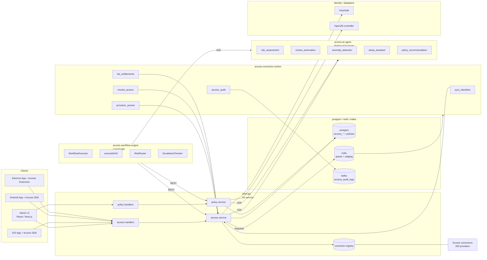
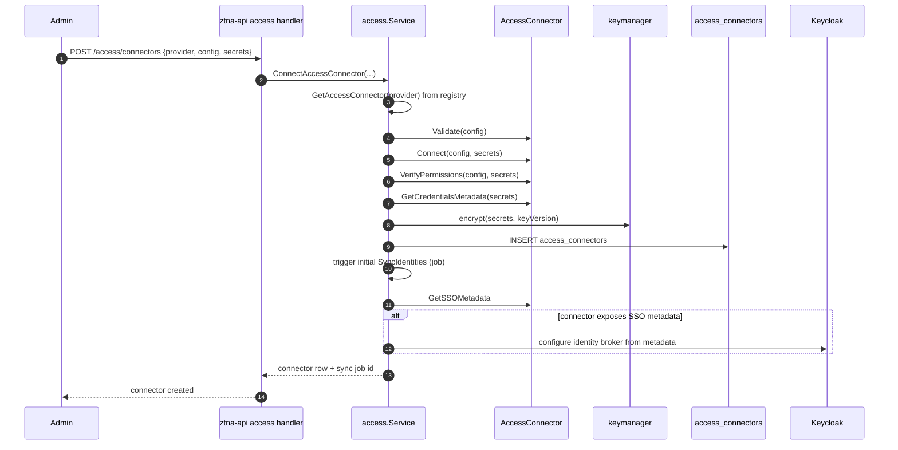
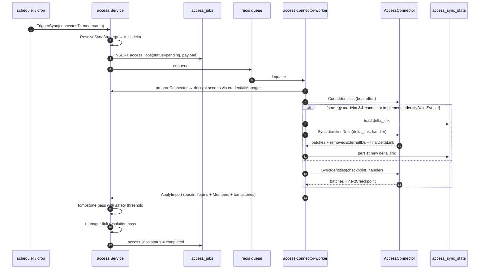
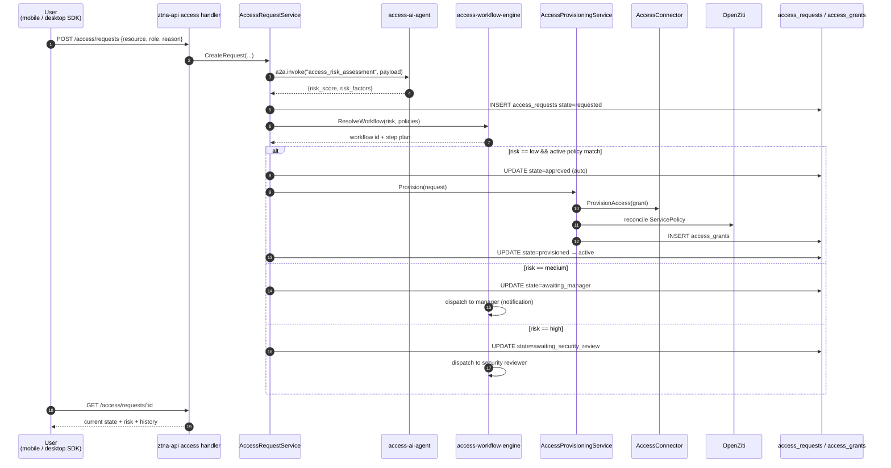
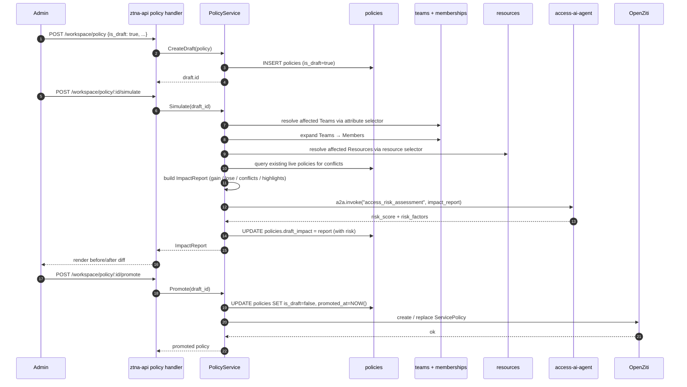
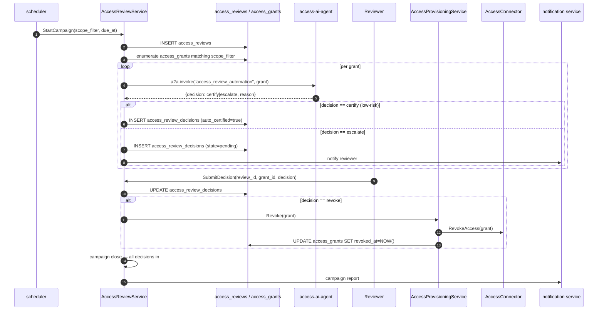
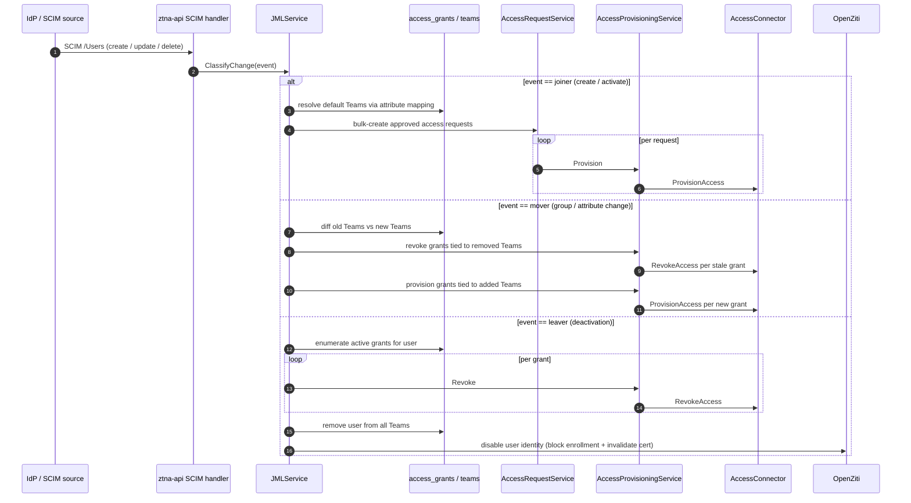
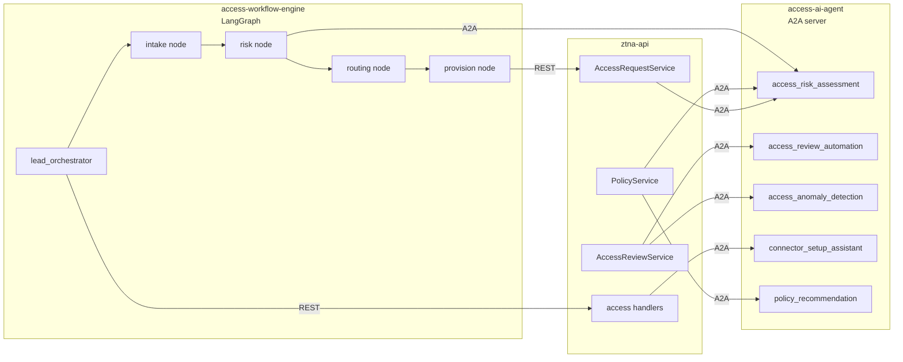
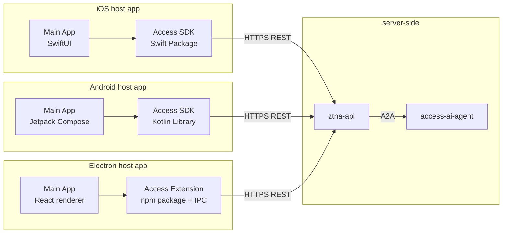

# Architecture

This document describes the runtime topology, service contracts, request flows, and data model of the ShieldNet 360 Access Platform. For the product tour see [`overview.md`](overview.md); for the local quick start see [`getting-started.md`](getting-started.md); for the per-provider connector matrix see [`connectors.md`](connectors.md); for the SDK contract see [`sdk.md`](sdk.md).

Diagrams use Mermaid and intentionally avoid color so they render identically across GitHub, VS Code, and most IDE preview panes.

## 1. High-level component map



### Reference points

| Concern                                                                                          | File                                                                                            |
|--------------------------------------------------------------------------------------------------|-------------------------------------------------------------------------------------------------|
| Connector interface                                                                              | `internal/services/access/types.go`                                                             |
| Registry + factory                                                                               | `internal/services/access/factory.go`                                                           |
| Optional interfaces (`IdentityDeltaSyncer`, `GroupSyncer`, `AccessAuditor`, `SCIMProvisioner`)   | `internal/services/access/optional_interfaces.go`                                               |
| Mock + registry-swap test helper                                                                 | `internal/services/access/testing.go`                                                           |
| Connector management lifecycle                                                                   | `internal/services/access/connector_management_service.go`                                      |
| Credential encryption (AES-GCM)                                                                  | `internal/services/access/aesgcm_encryptor.go`, `internal/pkg/credentials/manager.go`           |
| SSO federation service                                                                           | `internal/services/access/sso_federation_service.go`                                            |
| Connector health endpoint                                                                        | `internal/handlers/connector_health_handler.go`                                                 |
| Kafka audit producer                                                                             | `internal/services/access/audit_producer.go`                                                    |
| Audit worker handler                                                                             | `internal/workers/handlers/access_audit.go`                                                     |
| Schedule model + cron worker                                                                     | `internal/models/access_campaign_schedule.go`, `internal/cron/campaign_scheduler.go`            |
| Access service entry point                                                                       | `internal/services/access/service.go`                                                           |

## 2. AccessConnector contract

Every upstream integration implements one interface and opts into capability-specific extensions.

```go
type AccessConnector interface {
    // Lifecycle
    Validate(ctx, config, secrets) error
    Connect(ctx, config, secrets) error
    VerifyPermissions(ctx, config, secrets, capabilities) (missing []string, err error)

    // Identity sync
    CountIdentities(ctx, config, secrets) (int, error)
    SyncIdentities(ctx, config, secrets, checkpoint, handler) error

    // Access provisioning (idempotent on (UserExternalID, ResourceExternalID))
    ProvisionAccess(ctx, config, secrets, grant) error
    RevokeAccess(ctx, config, secrets, grant) error

    // Entitlements and SSO metadata
    ListEntitlements(ctx, config, secrets, userExternalID) ([]Entitlement, error)
    GetSSOMetadata(ctx, config, secrets) (*SSOMetadata, error)

    // Credential metadata (expiry, scope, fingerprint)
    GetCredentialsMetadata(ctx, config, secrets) (map[string]interface{}, error)
}
```

| Method                    | I/O                                                            | Failure semantics                                                       |
|---------------------------|----------------------------------------------------------------|-------------------------------------------------------------------------|
| `Validate`                | MUST NOT perform network I/O                                   | Error → 4xx during connect; nothing persisted.                          |
| `Connect`                 | Network probe to the provider                                  | Error → connect aborts; nothing persisted.                              |
| `VerifyPermissions`       | Network probe per requested capability                         | Returns `missing []string`; surfaced to the operator UI.                |
| `CountIdentities`         | Cheap header-only request when possible                        | Best-effort; logged but does not fail the sync.                         |
| `SyncIdentities`          | Streams pages via callback                                     | Non-nil handler error aborts the sync.                                  |
| `ProvisionAccess`         | One-shot RPC, idempotent on `(user, resource)`                 | 4xx → permanent fail surfaced to operator; 5xx → retry with backoff.    |
| `RevokeAccess`            | Same shape as `ProvisionAccess`                                | Same retry semantics.                                                   |
| `ListEntitlements`        | Network call per user                                          | Per-user failures do not fail the campaign.                             |
| `GetSSOMetadata`          | Usually a metadata-URL fetch                                   | Error → SSO federation cannot be configured; surfaced to operator.      |
| `GetCredentialsMetadata`  | Optional metadata response                                     | Drives expiry alerts and the renewal cron.                              |

### Optional capability interfaces

| Interface              | Methods                                                                              | Used for                                                                                     |
|------------------------|--------------------------------------------------------------------------------------|----------------------------------------------------------------------------------------------|
| `IdentityDeltaSyncer`  | `SyncIdentitiesDelta(deltaLink, handler) → batch + removedExternalIDs + nextLink`    | Incremental identity sync (Microsoft Graph, Okta, Auth0).                                    |
| `GroupSyncer`          | `CountGroups`, `SyncGroups`, `SyncGroupMembers`                                      | Connectors that expose groups as separate entities from users.                               |
| `AccessAuditor`        | `FetchAccessAuditLogs(since, handler)`                                               | Connectors that expose sign-in or permission-change logs.                                    |
| `SCIMProvisioner`      | `PushSCIMUser`, `PushSCIMGroup`, `DeleteSCIMResource`                                | Outbound SCIM v2.0 push to SaaS.                                                             |
| `SessionRevoker`       | `RevokeUserSessions`                                                                 | Kill live upstream sessions on leaver flows.                                                 |
| `SSOEnforcementChecker`| `CheckSSOEnforcement`                                                                | Detect when an SSO-federated provider still permits password fallback.                       |

Delta semantics: the handler is invoked once per provider page; the last page sets `finalDeltaLink` and an empty `nextLink`. A 410 Gone response MUST be surfaced as `access.ErrDeltaTokenExpired` — the service drops the stored delta link and falls back to a full enumeration.

### Canonical record shapes

`Identity`, `AccessGrant`, `Entitlement`, and `SSOMetadata` are minimal by design — provider-specific extras live in `RawData map[string]interface{}` (allowed but not required).

```go
type Identity struct {
    ExternalID  string
    Type        IdentityType  // user | group | service_account
    DisplayName string
    Email       string
    ManagerID   string        // provider-side external ID; resolved post-import
    Status      string        // active | disabled | suspended
    GroupIDs    []string
    RawData     map[string]interface{}
}

type AccessGrant struct {
    UserExternalID     string
    ResourceExternalID string
    Role               string   // provider-specific role / SKU / license
    Scope              map[string]interface{}
    GrantedAt          time.Time
    ExpiresAt          *time.Time
}

type Entitlement struct {
    ResourceExternalID string
    Role               string
    Source             string   // direct | group | inherited
    LastUsedAt         *time.Time
    RiskScore          *int     // populated by the AI agent later, not by the connector
}
```

### Registry and wiring

- A process-global `map[string]AccessConnector` is populated by `init()` blocks in each provider package under `internal/services/access/connectors/`.
- Provider keys are lowercase snake_case (`microsoft`, `google_workspace`, `okta`, `auth0`, `ping_identity`). Generic protocol connectors are prefixed `generic_` (`generic_saml`, `generic_oidc`, `generic_scim`).
- Every binary that needs a connector at runtime blank-imports the package for its side effect: `_ "ztna-business-layer/internal/services/access/connectors/microsoft"`.
- Tests legitimately swap registry entries — see the `t.Cleanup` patterns in `*_flow_test.go`. Production code never re-registers.

### Credentials at rest

```
access_connectors.config         jsonb   plaintext, operator-visible
access_connectors.credentials    text    AES-GCM ciphertext over secrets JSON
access_connectors.key_version    int     which org DEK version was used
```

The DEK is per-organization and fetched via `keymanager.KeyManager.GetLatestOrgDEK(orgID)`. In production each binary reads `ACCESS_CREDENTIAL_DEK` (base64 32-byte key) and wires `AESGCMEncryptor`; if the env var is unset, the binary falls back to `PassthroughEncryptor` with a loud warning log — so dev / CI without a DEK still boots, but production refuses to silently store plaintext.

## 3. Connector setup flow

What happens when an admin clicks **Connect a new app**:



Keycloak federation is a side-effect of connect — failures surface as warnings on the connector page (the connector is still "connected", just not yet federated).

### Reference points

| Concern                       | File                                                            |
|-------------------------------|-----------------------------------------------------------------|
| Connector management API      | `internal/handlers/connector_management_handler.go`             |
| Connect lifecycle             | `internal/services/access/connector_management_service.go`      |
| Keycloak SSO broker wiring    | `internal/services/access/sso_federation_service.go`            |

## 4. Identity sync flow



When a connector implements `GroupSyncer`, the parent `sync_identities` job upserts groups and enqueues one `sync_group_members` job per group.

Tombstone safety threshold defaults to 30 %: a single sync that would tombstone ≥ threshold % of rows aborts the tombstone pass and surfaces `tombstone_safety_skipped: true` in the report.

### Reference points

| Concern                            | File                                                                  |
|------------------------------------|-----------------------------------------------------------------------|
| Trigger entry / strategy resolution| `internal/services/access/service.go`, `.../sync_state.go`            |
| Identity sync worker handler       | `internal/workers/handlers/access_sync_identities.go`                 |
| Entitlements worker handler        | `internal/workers/handlers/access_list_entitlements.go`               |
| Identity-sync scheduler            | `internal/cron/identity_sync_scheduler.go`                            |
| Grant-expiry enforcer              | `internal/cron/grant_expiry_enforcer.go`                              |
| Orphan reconciler                  | `internal/services/access/orphan_reconciler.go`, `.../orphan_reconciler_scheduler.go` |
| Draft-policy staleness checker     | `internal/cron/draft_staleness_checker.go`                            |

## 5. Access request lifecycle

End-to-end happy path for a self-service request from a mobile or desktop user.



Failure modes:

- **AI unavailable.** `risk_score` defaults to `medium`. Workflow proceeds.
- **`ProvisionAccess` returns 4xx.** `state=provision_failed`, surfaced to the operator for credential / scope troubleshooting.
- **`ProvisionAccess` returns 5xx.** Retried with exponential backoff. After `N` failures the job moves to `provision_failed` with the last error preserved.
- **OpenZiti unreachable.** Connector-side grant succeeds; OpenZiti reconciliation runs in a background job.

### Reference points

| Concern                       | File                                                              |
|-------------------------------|-------------------------------------------------------------------|
| `AccessRequestService`        | `internal/services/access/request_service.go`                     |
| `AccessProvisioningService`   | `internal/services/access/provisioning_service.go`                |
| Request state machine         | `internal/services/access/request_state_machine.go`               |
| Workflow service (routing)    | `internal/services/access/workflow_service.go`                    |
| HTTP handlers                 | `internal/handlers/access_request_handler.go`, `.../access_grant_handler.go` |
| AI client + fallback          | `internal/pkg/aiclient/client.go`, `.../fallback.go`              |

## 6. Access rule simulation

Draft a rule, see the impact, then promote.



**Drafts never touch OpenZiti.** Promotion is the only path that creates a `ServicePolicy`. There is no "create live rule directly" code path. OpenZiti reconciliation itself lives in the broader `ztna-business-layer` — `PolicyService.Promote` flips DB state and the ZTNA layer subscribes and writes to the controller.

### Impact report shape

```jsonc
{
  "members_gaining_access": 47,
  "members_losing_access": 3,
  "new_resources_granted": 12,
  "resources_revoked": 0,
  "conflicts_with_existing_rules": [
    { "rule_id": "...", "rule_name": "Engineering — Production Database", "kind": "redundant" }
  ],
  "affected_teams": ["..."],
  "highlights": [
    "47 new people will gain SSH access to prod-db-01",
    "3 people will lose access to staging-finance-app"
  ]
}
```

### Reference points

| Concern                                       | File                                                                                       |
|-----------------------------------------------|--------------------------------------------------------------------------------------------|
| `PolicyService`                               | `internal/services/access/policy_service.go`                                               |
| `ImpactResolver`                              | `internal/services/access/impact_resolver.go`                                              |
| `ConflictDetector`                            | `internal/services/access/conflict_detector.go`                                            |
| HTTP handlers                                 | `internal/handlers/policy_handler.go`                                                      |
| "Drafts never touch OpenZiti" regression test | `internal/services/access/policy_service_test.go::TestPromote_DoesNotInvokeOpenZiti`       |

## 7. Access review campaigns

Periodic access check-ups with AI auto-certification of low-risk grants.



Auto-certification rate is observable as a campaign-level metric. Operators can disable auto-certification per resource category if they want full human-in-the-loop review.

### Reference points

| Concern                       | File                                                              |
|-------------------------------|-------------------------------------------------------------------|
| `AccessReviewService`         | `internal/services/access/review_service.go`                      |
| HTTP handlers                 | `internal/handlers/access_review_handler.go`                      |
| Campaign cron worker          | `internal/cron/campaign_scheduler.go`                             |
| Notification service          | `internal/services/notification/service.go`                       |
| Review notifier adapter       | `internal/services/access/notification_adapter.go`                |

## 8. Joiner / mover / leaver automation

SCIM-driven user lifecycle, end-to-end.



Mover events are the trickiest: the diff between old and new Team membership is computed against the post-update SCIM state, and the revoke / provision steps run as a single atomic batch so the user never sees a partial-access window.

### Six-layer leaver kill switch

A single off-boarding call locks the user out of every channel the platform knows about. Every step is best-effort: failure in step N does not prevent steps N+1..6 from running, and the flow is idempotent so replaying it on a half-applied leaver is safe.

```
HandleLeaver(userID)
    │
    ▼
1. Revoke all active access_grants                   (layer: grant_revoke)
2. Remove team memberships                           (layer: team_remove)
3. Disable the Keycloak user                         (layer: keycloak_disable)
4. SessionRevoker.RevokeUserSessions per connector   (layer: session_revoke)
5. SCIMProvisioner.DeleteSCIMResource per connector  (layer: scim_deprovision)
6. Disable the OpenZiti identity                     (layer: openziti_disable)
```

Every layer emits a structured `LeaverKillSwitchEvent` envelope onto the same `ShieldnetLogEvent v1` Kafka pipeline used elsewhere. Layer status is `success` / `failed` / `skipped`. Per-connector layers carry `connector_id` so SIEM consumers can stitch a single leaver across upstream providers.

### Reference points

| Concern                                  | File                                                                                       |
|------------------------------------------|--------------------------------------------------------------------------------------------|
| `JMLService`                             | `internal/services/access/jml_service.go`                                                  |
| Inbound SCIM HTTP handler                | `internal/handlers/scim_handler.go`                                                        |
| Outbound SCIM v2.0 client                | `internal/services/access/scim_provisioner.go`                                             |
| Anomaly detection service                | `internal/services/access/anomaly_service.go`                                              |
| AI client (`DetectAnomalies` + fallback) | `internal/pkg/aiclient/client.go`, `.../fallback.go`                                       |

## 9. AI integration

How `ztna-api`, the workflow engine, and the A2A skill server fit together.



Skills are registered on a single `access_agent` A2A server and routed by skill name. The workflow engine is a separate Python service that orchestrates multi-step flows by invoking skills in sequence.

## 10. Client SDK architecture

Mobile and desktop clients are integration packages, not standalone apps. All AI calls are REST.



All AI inference happens server-side. SDKs and the desktop extension are thin REST clients — no model file bundled, no `CoreML` on iOS, no TensorFlow Lite on Android, no `onnxruntime` in Electron. The rule is enforced in CI by [`scripts/check_no_model_files.sh`](../scripts/check_no_model_files.sh). The full contract lives in [`sdk.md`](sdk.md).

## 11. Data model

| Table                            | Purpose                                                              | Key columns                                                                                                          |
|----------------------------------|----------------------------------------------------------------------|----------------------------------------------------------------------------------------------------------------------|
| `access_connectors`              | Per-workspace connector instances                                    | `id ULID`, `workspace_id`, `provider`, `connector_type`, `config jsonb`, `credentials text`, `key_version`, `status` |
| `access_jobs`                    | One row per sync / provision / revoke / list-entitlements run        | `id`, `connector_id`, `job_type`, `status`, `payload jsonb`, `started_at`, `completed_at`, `last_error`              |
| `access_requests`                | Lifecycle row per access ask                                         | `id`, `requester_user_id`, `target_user_id`, `resource_external_id`, `role`, `state`, `risk_score`, `risk_factors`   |
| `access_request_state_history`   | Audit trail of state transitions                                     | `request_id`, `from_state`, `to_state`, `actor_user_id`, `reason`, `created_at`                                      |
| `access_grants`                  | Active entitlements (one row per `(user, resource, role)`)           | `id`, `user_id`, `connector_id`, `resource_external_id`, `role`, `granted_at`, `expires_at`, `last_used_at`, `revoked_at` |
| `access_reviews`                 | Periodic certification campaigns                                     | `id`, `name`, `scope_filter jsonb`, `due_at`, `state`                                                                |
| `access_review_decisions`        | Per-grant decision in a campaign                                     | `review_id`, `grant_id`, `decision`, `decided_by`, `auto_certified`, `reason`, `decided_at`                          |
| `access_campaign_schedules`      | Recurring access check-up cadence                                    | `id`, `name`, `scope_filter jsonb`, `frequency_days`, `next_run_at`, `is_active`                                     |
| `access_workflows`               | Configurable approval chains                                         | `id`, `name`, `match_rule jsonb`, `steps jsonb`                                                                      |
| `access_sync_state`              | Delta-link / checkpoint store per `(connector_id, kind)`             | `connector_id`, `kind`, `delta_link`, `updated_at`                                                                   |
| `access_orphan_accounts`         | Upstream users with no IdP pivot                                     | `id`, `connector_id`, `user_external_id`, `email`, `display_name`, `status`, `detected_at`, `resolved_at`            |
| `policies`                       | Existing table — new columns for drafts                              | `is_draft bool`, `draft_impact jsonb`, `promoted_at timestamp`                                                       |

Per the SN360 database convention, none of the model relationships create real `FOREIGN KEY` constraints — referential integrity is enforced in application code. Indexes are added only for proven query patterns.

## 12. Where things run

| Process                  | Binary                                       | Responsibilities                                                                                              |
|--------------------------|----------------------------------------------|---------------------------------------------------------------------------------------------------------------|
| ZTNA API                 | `cmd/ztna-api`                               | `/access/*`, `/workspace/policy/*`, `/pam/*`, inbound SCIM, AI delegation.                                    |
| Admin UI                 | External `ztna-frontend`                     | Connector marketplace, access requests, policy simulator, access reviews, AI assistant chat, PAM admin pages. |
| Connector worker         | `cmd/access-connector-worker`                | Runs `SyncIdentities`, `ProvisionAccess`, `RevokeAccess`, `ListEntitlements`, `FetchAccessAuditLogs` jobs.    |
| Access AI agent          | `cmd/access-ai-agent` (Python)               | A2A skill server hosting the five Tier-1 access skills plus the `pam_session_risk_assessment` skill.          |
| Workflow engine          | `cmd/access-workflow-engine` (Go + LangGraph)| Multi-step orchestration, risk-based routing, escalation; PAM lease workflow templates run here.              |
| PAM gateway              | `cmd/pam-gateway`                            | Data-plane broker for SSH (port 2222), `kubectl exec` over WebSocket (8443), PG (5432) / MySQL (3306) wire-protocol proxies; teed through recorder + command parser + policy evaluator; `/health` on 8081. |
| Cron                     | Embedded in `cmd/access-connector-worker`    | Identity sync, campaigns, draft-policy staleness, grant-expiry enforcer, credential checker, anomaly scanner, PAM lease-expiry enforcer. |
| Keycloak                 | External                                     | Federated SSO broker; receives IdP configurations from connector setup.                                       |
| OpenZiti controller      | External                                     | Receives `ServicePolicy` writes only on draft promotion.                                                      |
| Postgres / Redis / Kafka | External                                     | Storage, queue, audit envelope (`access.*` + `pam.session.*` / `pam.secret.*` / `pam.lease.*` events).        |
| S3                       | External                                     | PAM session replay-bytes store (`sessions/{id}/replay.bin` with 15-min pre-signed GETs).                       |

Per-runtime profile: API services target `cpu=200m mem=1Gi` with `GOMEMLIMIT=900MiB GOGC=100`; worker targets `cpu=2 mem=400Mi` with `GOMEMLIMIT=360MiB GOGC=75`; AI agent scales horizontally per skill load. PAM gateway targets `cpu=500m mem=512Mi` with `GOMEMLIMIT=460MiB GOGC=100`, sized so a single replica can hold the session-recorder ring buffers for ~16 concurrent operator sessions before back-pressuring.

### Local development

The same processes can be brought up locally via `docker compose up --build --wait`. Each Go service builds from `docker/Dockerfile.*` (multi-stage `golang:1.25-alpine` → `gcr.io/distroless/static-debian12:nonroot`); the Python `access-ai-agent` builds from `cmd/access-ai-agent/Dockerfile`. Healthchecks wire `pg_isready` / `redis-cli ping` / the in-binary `/health` (Go) / `/healthz` (Python), so `--wait` blocks until the stack is responsive. The dev stack is not a substitute for the per-runtime resource profile — it exists so contributors can exercise the full request flow end-to-end without a Kubernetes cluster. The PAM gateway's PG / MySQL / K8s proxy listeners stay container-internal in the compose stack and are host-mapped on shifted ports (`15432` / `13306` / `18443`) so they cannot collide with the dev-stack `Postgres` on 5432; SSH (`2222`) and health + SQL-WS (`8081`) map 1:1.

### Kubernetes deployment

The runtime services are packaged under `deploy/k8s/` (raw manifests + Kustomize) and `deploy/helm/shieldnet-access/` (Helm chart). Both render the same bundle: a `shieldnet-access` namespace, Deployments / ConfigMaps / Secrets / ServiceAccounts per service, Services for the request-driven binaries (`ztna-api`, `access-workflow`, `access-ai-agent`, `pam-gateway` — the connector worker is a headless queue consumer), and an HPA for `ztna-api` (2–10 replicas, 70 % CPU target). Only `ztna-api` and the operator-facing pam-gateway listeners (mapped onto the dataplane LB) are exposed publicly; the workflow engine, AI agent, and pam-gateway's internal health surface stay cluster-internal and authenticate via a shared `X-API-Key` header. The pam-gateway Deployment mounts an `emptyDir` at `/var/lib/shieldnet/replay` for active-session replay buffering — the durable copy lands in S3 via `PAM_S3_BUCKET` / `PAM_S3_REGION`.

## 13. Hybrid access model

Three runtime concepts let an estate run a hybrid on-prem + SaaS posture without paying OpenZiti tunnel overhead on every SaaS app, and without leaving stale upstream sessions behind when someone leaves.

### Access-mode classification

Every `access_connectors` row carries an `access_mode` column with one of three values:

```
                    ┌───────────────────────────┐
GetSSOMetadata ────▶│ ssoMetadata != nil &&     │───▶ sso_only
                    │ Keycloak federation OK    │
                    └───────────────────────────┘
                                  │
                                  ▼
                    ┌───────────────────────────┐
connector_type ────▶│ is_private == true        │───▶ tunnel
                    └───────────────────────────┘
                                  │
                                  ▼
                    ┌───────────────────────────┐
                    │ default                   │───▶ api_only
                    └───────────────────────────┘
```

`PolicyService.Promote` ships the mode in its event payload so the `ztna-business-layer` can skip the OpenZiti `ServicePolicy` write for `sso_only` / `api_only` connectors.

### Unused-app-account reconciliation

`OrphanReconciler` runs daily via `OrphanReconcilerScheduler` inside `access-connector-worker`. For each connector in each workspace it:

1. Calls `connector.SyncIdentities` for the current upstream user set.
2. Cross-references the result against `team_members.external_id`.
3. Persists every upstream user with no IdP pivot to `access_orphan_accounts` (status `detected`).
4. Notifies operators through `NotificationService`.

A dry-run mode (`POST /access/orphans/reconcile` body `dry_run: true`) returns detections without persisting, threaded through as a per-call parameter so concurrent requests can't race on a shared flag. A configurable per-connector throttle (`ACCESS_ORPHAN_RECONCILE_DELAY_PER_CONNECTOR`, default `1s`) paces iterations to respect upstream rate limits. The scheduler emits a structured JSON `orphan_reconcile_summary` log line per workspace with `orphans_detected`, `orphans_new`, `connectors_scanned`, `connectors_failed`, and `duration_ms`.

Operators dispose of each row via `/access/orphans/:id/{revoke,dismiss,acknowledge}`.

### SSO-only enforcement verification

`SSOEnforcementChecker.CheckSSOEnforcement` runs against every connector that opts into the interface, reporting whether the upstream provider is actually configured to require SSO (vs. allowing fallback password / API-key login). The connector health endpoint surfaces `sso_enforcement_status` so the admin UI can render an "SSO-only mode is OFF" warning operators can remediate without leaving the dashboard. The orphan reconciler re-checks this status on every daily pass.

### Automatic grant expiry

`GrantExpiryEnforcer` ticks every `ACCESS_GRANT_EXPIRY_CHECK_INTERVAL` (default 1h) inside `access-connector-worker`. It selects `access_grants` rows with `expires_at < now AND revoked_at IS NULL` and replays the same `AccessProvisioningService.Revoke` path the reviewer flow uses, so upstream side-effects and audit envelopes are identical regardless of trigger.

- On every successful revoke the enforcer fires `GrantExpiryNotifier.SendGrantRevokedNotification`.
- A separate `RunWarning` sweep finds grants whose `expires_at` falls within `ACCESS_GRANT_EXPIRY_WARNING_HOURS` (default `24h`) and emits `SendGrantExpiryWarning` so users can request renewal before access goes dark.
- Every revoke and warning emits a `GrantExpiryEvent` onto the optional `access.AuditProducer` (event-type `access.grant.expiry`, action `auto_revoked` / `warned`). A nil producer is a no-op so dev / test binaries keep working without Kafka.

## 14. Where to read next

- [`overview.md`](overview.md) — product overview and design principles.
- [`getting-started.md`](getting-started.md) — local stack walkthrough.
- [`connectors.md`](connectors.md) — per-provider capability matrix.
- [`sdk.md`](sdk.md) — mobile + desktop SDK contract.
- [`guides/`](guides/) — platform integration walkthroughs.
