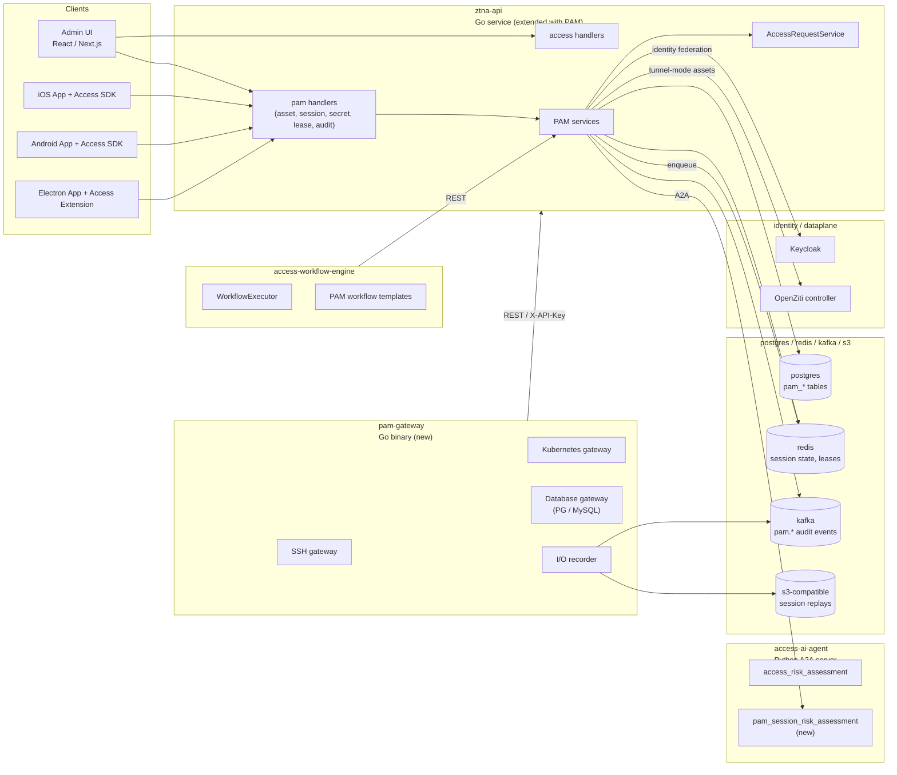
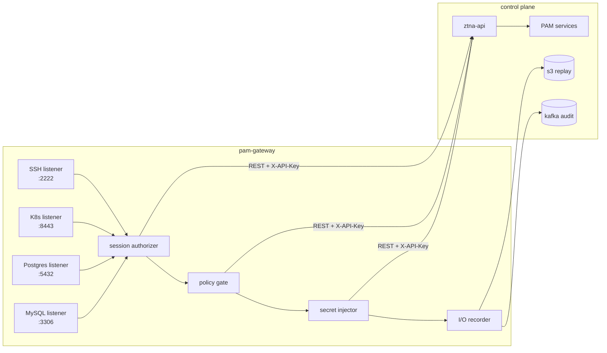
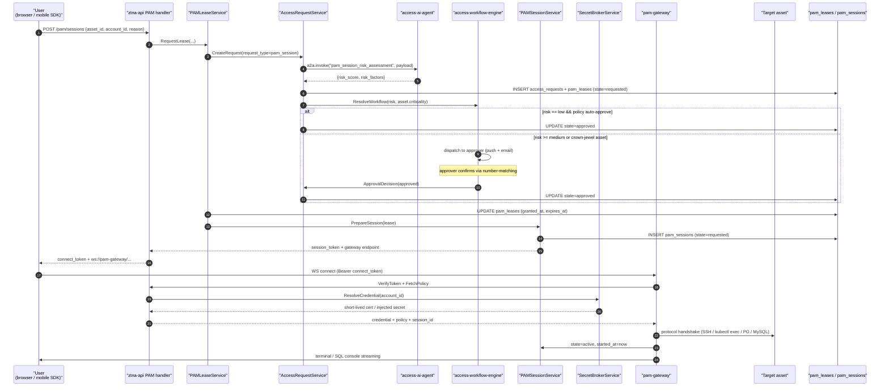
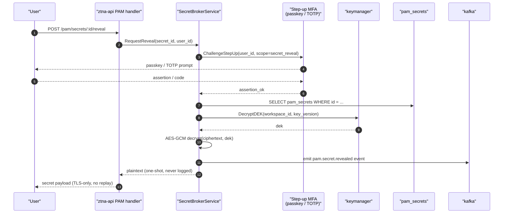
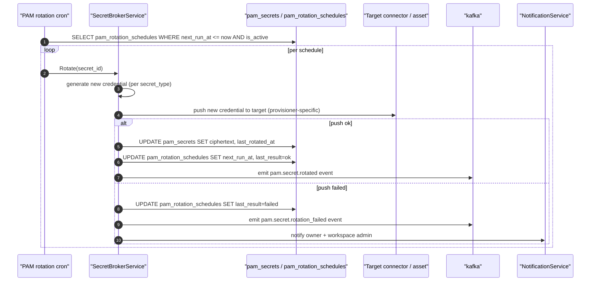
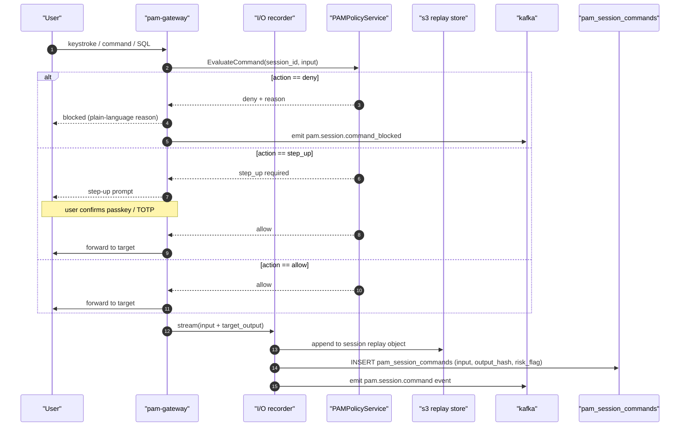

# ShieldNet PAM — Technical Architecture

This document describes the runtime topology, service contracts, request flows, and data model of the ShieldNet PAM module. For the module landing page see [`README.md`](README.md); for the feature scope see [`proposal.md`](proposal.md); for the milestone tracker see [`progress.md`](progress.md). The PAM module extends the broader platform architecture documented in [`../architecture.md`](../architecture.md).

Diagrams use Mermaid and intentionally avoid color so they render identically across GitHub, VS Code, and most IDE preview panes — matching the convention stated on line 5 of [`../architecture.md`](../architecture.md).

## 1. High-level component map



### Reference points

| Concern                                                                                       | File                                                                       |
|-----------------------------------------------------------------------------------------------|----------------------------------------------------------------------------|
| Connector contract + registry pattern PAM reuses                                              | [`internal/services/access/types.go`](../../internal/services/access/types.go) |
| Existing AES-GCM envelope encryption pattern PAM secrets extend                               | [`internal/services/access/aesgcm_encryptor.go`](../../internal/services/access/aesgcm_encryptor.go) |
| Existing access request state machine PAM leases plug into                                    | [`internal/services/access/request_service.go`](../../internal/services/access/request_service.go) |
| Existing audit producer PAM audit events extend                                               | [`internal/services/access/audit_producer.go`](../../internal/services/access/audit_producer.go)   |
| Existing router Dependencies wiring PAM services attach to                                    | [`internal/handlers/router.go`](../../internal/handlers/router.go)         |
| Existing workflow seed migration PAM templates follow                                         | [`internal/migrations/008_seed_workflow_templates.go`](../../internal/migrations/008_seed_workflow_templates.go) |

## 2. New service map

All new services are Go except the AI skill, which is Python and runs inside the existing `access-ai-agent` A2A server.

| Service                          | Package                                                       | Purpose                                                                                  |
|----------------------------------|---------------------------------------------------------------|------------------------------------------------------------------------------------------|
| `PAMAssetService`                | `internal/services/pam/asset_service.go`                      | Asset CRUD, protocol metadata, account mappings, criticality                             |
| `PAMSessionService`              | `internal/services/pam/session_service.go`                    | Session lifecycle — create, authorize, record, terminate                                 |
| `SecretBrokerService`            | `internal/services/pam/secret_broker.go`                      | Vault, rotate, check-out, inject, reveal with step-up                                    |
| `PAMAuditService`                | `internal/services/pam/audit_service.go`                      | Immutable event capture, replay metadata, evidence export                                |
| `PAMPolicyService`               | `internal/services/pam/policy_service.go`                     | Command allow/deny, session duration limits, approval rules                              |
| `PAMLeaseService`                | `internal/services/pam/lease_service.go`                      | JIT lease lifecycle — request, approve, auto-expire                                      |
| `pam_session_risk_assessment`    | `cmd/access-ai-agent/skills/pam_session_risk.py`              | AI risk scoring for privileged session requests                                          |

Every service follows the existing nil-safe wiring convention from [`internal/handlers/router.go`](../../internal/handlers/router.go): each new `Dependencies` field is optional at the type level, and handlers return 503 with a structured error when an unwired dependency is required.

## 3. PAM Gateway binary

A new binary at `cmd/pam-gateway/`. It is a Go service that handles protocol-level proxying so the browser, the SDK, or a CLI can broker a privileged session without the user ever holding a long-lived credential.

- **SSH Gateway** — listens on a configurable port, authenticates each session via a one-shot token exchange against `ztna-api`, fetches an injected credential or SSH CA cert from `SecretBrokerService`, proxies to the target, and streams I/O to the recorder.
- **Kubernetes Gateway** — `kubectl exec` proxy with per-command capture. Short-lived kubeconfig or service-account token is injected per session.
- **Database Gateway** — PostgreSQL and MySQL wire-protocol proxy for the browser SQL console. Query parsing for audit and optional command filtering.

`pam-gateway` authenticates every session against `ztna-api` (REST with the same `X-API-Key` pattern used by `access-workflow-engine` and `access-ai-agent` — see [`../architecture.md`](../architecture.md) §12), checks PAM policy via `PAMPolicyService`, fetches credentials from `SecretBrokerService`, then brokers the protocol connection. All session I/O is streamed to the audit pipeline and replay storage.



## 4. Data model

New tables follow the existing platform conventions: ULID primary keys, no real `FOREIGN KEY` constraints (referential integrity is enforced in application code, per [`../architecture.md`](../architecture.md) §11), and GORM models under `internal/models/pam_*.go`.

| Table                     | Purpose                                                | Key columns                                                                                                                                              |
|---------------------------|--------------------------------------------------------|----------------------------------------------------------------------------------------------------------------------------------------------------------|
| `pam_assets`              | Registered infrastructure assets                       | `id ULID`, `workspace_id`, `name`, `protocol` (ssh/rdp/k8s/postgres/mysql), `host`, `port`, `criticality` (low/medium/high/critical), `owner_user_id`, `config jsonb`, `status` |
| `pam_accounts`            | Privileged accounts on assets                          | `id ULID`, `asset_id`, `username`, `account_type` (shared/personal/service), `secret_id`, `is_default`, `status`                                          |
| `pam_secrets`             | Vaulted credentials                                    | `id ULID`, `workspace_id`, `secret_type` (password/ssh_key/certificate/token), `ciphertext text` (AES-GCM, same DEK pattern as `access_connectors.credentials`), `key_version`, `rotation_policy jsonb`, `last_rotated_at`, `expires_at` |
| `pam_sessions`            | Privileged session records                             | `id ULID`, `workspace_id`, `user_id`, `asset_id`, `account_id`, `protocol`, `state` (requested/active/completed/terminated/failed), `started_at`, `ended_at`, `replay_storage_key`, `command_count`, `risk_score` |
| `pam_session_commands`    | Per-command audit trail                                | `id ULID`, `session_id`, `sequence`, `input`, `output_hash`, `timestamp`, `risk_flag`                                                                    |
| `pam_leases`              | JIT access leases                                      | `id ULID`, `workspace_id`, `user_id`, `asset_id`, `account_id`, `request_id` (links to existing `access_requests`), `granted_at`, `expires_at`, `revoked_at`, `approved_by` |
| `pam_command_policies`    | Command allow/deny rules                               | `id ULID`, `workspace_id`, `asset_selector jsonb`, `account_selector jsonb`, `pattern`, `action` (allow/deny/step_up), `priority`                        |
| `pam_rotation_schedules`  | Automated rotation config                              | `id ULID`, `secret_id`, `frequency_days`, `next_run_at`, `last_result`, `is_active`                                                                      |

Per the SN360 database convention, none of the model relationships create real `FOREIGN KEY` constraints — referential integrity is enforced in application code. Indexes are added only for proven query patterns (asset/workspace lookups, session-by-user, lease expiry sweeps).

## 5. Secret encryption

PAM secret storage extends the existing AES-GCM envelope encryption pattern from [`internal/services/access/aesgcm_encryptor.go`](../../internal/services/access/aesgcm_encryptor.go) and the credential manager in [`internal/pkg/credentials/manager.go`](../../internal/pkg/credentials/manager.go). It uses:

- The same `ACCESS_CREDENTIAL_DEK` environment variable.
- The same `AESGCMEncryptor` for production and `PassthroughEncryptor` as the dev/CI fallback (with a loud warning log).
- The same per-organization DEK fetched via `keymanager.KeyManager.GetLatestOrgDEK(orgID)`.

`pam_secrets.ciphertext` and `pam_secrets.key_version` follow the identical scheme as `access_connectors.credentials` and `access_connectors.key_version`. There is no second key-management subsystem.

## 6. Session recording and replay

- Session I/O is captured by `pam-gateway` and streamed to S3-compatible object storage (Kafka large payloads stay out of the audit envelope — only metadata flows into Kafka).
- Replay metadata (storage key, duration, command count, file transfers) is persisted to `pam_sessions`.
- Replay playback is a React component in `ztna-frontend` that fetches the replay from S3 via a signed URL issued by `ztna-api`.
- Per-command audit rows in `pam_session_commands` carry an output hash rather than the raw output so the per-row index stays small; the full transcript is reconstructed from the S3 replay artefact when an investigator asks for it.

## 7. Integration with existing services

- **`AccessRequestService`** — PAM lease requests flow through the existing state machine in [`internal/services/access/request_service.go`](../../internal/services/access/request_service.go). A new `request_type: "pam_session"` field routes to PAM-specific workflow steps.
- **Workflow engine** — the existing `access-workflow-engine` handles PAM approval flows. New workflow templates are seeded for PAM in a migration that follows the [`internal/migrations/008_seed_workflow_templates.go`](../../internal/migrations/008_seed_workflow_templates.go) pattern.
- **AI agent** — a new `pam_session_risk_assessment` skill is added to `cmd/access-ai-agent/skills/`. It is invoked via A2A from `PAMSessionService`, the same pattern as the existing `access_risk_assessment` skill.
- **Notification service** — PAM reuses [`internal/services/notification/service.go`](../../internal/services/notification/service.go) for approval prompts, session alerts, rotation warnings.
- **Kafka audit** — PAM events use the existing `ShieldnetLogEvent v1` envelope (see [`internal/services/access/audit_producer.go`](../../internal/services/access/audit_producer.go)) with new event types prefixed `pam.session.*`, `pam.secret.*`, `pam.lease.*`.
- **Router wiring** — new `Dependencies` fields in [`internal/handlers/router.go`](../../internal/handlers/router.go): `PAMAssetService`, `PAMSessionService`, `SecretBrokerService`, `PAMAuditService`, `PAMLeaseService`, `PAMPolicyService`. Nil-safe — the routes are only registered when the corresponding service is wired, matching every existing field in the struct.

## 8. HTTP API surface

New routes under `/pam/*` on `ztna-api`:

```
POST   /pam/assets                    — register asset
GET    /pam/assets                    — list assets
GET    /pam/assets/:id                — asset detail
PUT    /pam/assets/:id                — update asset
DELETE /pam/assets/:id                — remove asset

POST   /pam/assets/:id/accounts       — add privileged account
GET    /pam/assets/:id/accounts       — list accounts on asset

POST   /pam/sessions                  — request session (creates lease + session)
GET    /pam/sessions                  — list sessions
GET    /pam/sessions/:id              — session detail + replay metadata
POST   /pam/sessions/:id/terminate    — force-terminate active session
GET    /pam/sessions/:id/replay       — signed replay URL
GET    /pam/sessions/:id/commands     — command audit trail

POST   /pam/secrets                   — vault a secret
GET    /pam/secrets/:id               — secret metadata (never plaintext)
POST   /pam/secrets/:id/reveal        — reveal with step-up MFA
POST   /pam/secrets/:id/rotate        — trigger rotation
GET    /pam/secrets/:id/history       — rotation history

GET    /pam/leases                    — list active leases
POST   /pam/leases/:id/revoke         — revoke lease early
```

All routes share the same middleware stack as the rest of `ztna-api` (request ID, JSON logger, metrics, rate limiter, JSON validation) and are registered through the same conditional pattern in `Router(deps Dependencies)`.

## 9. Deployment

- `pam-gateway` is a new Deployment in `deploy/k8s/pam-gateway/` and `deploy/helm/shieldnet-access/templates/pam-gateway.yaml`.
- Exposed on ports: 2222 (SSH), 3306 (MySQL proxy), 5432 (PG proxy), 8443 (K8s proxy) — configurable.
- `ztna-api` PAM routes are part of the existing `ztna-api` deployment — no separate API service.
- A new ConfigMap holds PAM-specific env vars (`PAM_GATEWAY_SSH_HOST_KEY`, `PAM_S3_BUCKET`, `PAM_S3_REGION`, `PAM_GATEWAY_API_KEY`, etc.). Secrets continue to flow through the existing IRSA + `ExternalEnvFromAWS` pattern used by `ztna-business-layer`.
- Docker: a new `docker/Dockerfile.pam-gateway` follows the same multi-stage pattern as the other Go services (`golang:1.25-alpine` builder → `gcr.io/distroless/static-debian12:nonroot` runtime).
- `docker-compose.yml`: a new `pam-gateway` service is added so the local dev stack can broker a session end-to-end without a cluster.
- Per-runtime profile: `pam-gateway` targets `cpu=500m mem=512Mi` with `GOMEMLIMIT=460MiB GOGC=100`, scaled horizontally per concurrent-session load.

## 10. Sequence diagrams

### 10.1 PAM session request lifecycle



### 10.2 Secret reveal with step-up MFA



### 10.3 Automated secret rotation



### 10.4 Session recording flow



## 11. Where to read next

- [README.md](README.md) — module landing page.
- [proposal.md](proposal.md) — feature scope and design constraints.
- [progress.md](progress.md) — milestone tracker.
- [`../architecture.md`](../architecture.md) — broader platform architecture that PAM extends.
- [`../overview.md`](../overview.md) — product overview and the canonical product-language table.
